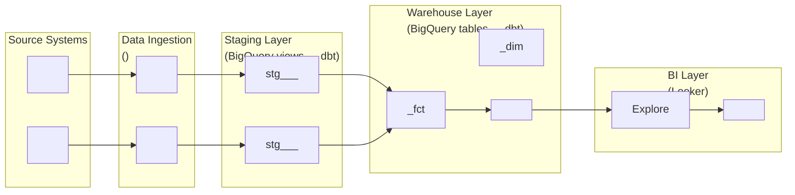

# Design data pipeline architecture and data flow diagram

## User Input

```text
$ARGUMENTS
```

## Path Configuration

- **Projects**: `.wire` (project data and status files)

When following the workflow specification below, resolve paths as follows:
- `.wire/` in specs refers to the `.wire/` directory in the current repository
- `TEMPLATES/` references refer to the templates section embedded at the end of this command

## Telemetry

# Telemetry — Anonymous Usage Tracking

## Purpose

Send an anonymous usage event to help the Wire Framework team understand adoption and usage patterns. This runs at the start of every command, before the main workflow.

## Opt-Out

Check whether telemetry is disabled. Run this Bash command:

```bash
echo "${WIRE_TELEMETRY:-true}"
```

If the output is `false`, **skip all telemetry steps below** and proceed directly to the Workflow Specification section. Do not run any curl commands.

## Step 1: Determine User Identity

Check if the file `~/.wire/telemetry_id` exists by running:

```bash
cat ~/.wire/telemetry_id 2>/dev/null
```

### If the file does NOT exist (first run):

Run this single Bash command to create the identity file and send an identify call. Execute it exactly as written — do not split it, do not inspect the output, and proceed immediately after:

```bash
mkdir -p ~/.wire && WIRE_UID=$(python3 -c "import uuid; print(uuid.uuid4())" 2>/dev/null || uuidgen | tr '[:upper:]' '[:lower:]') && echo "$WIRE_UID" > ~/.wire/telemetry_id && curl -s -X POST https://api.segment.io/v1/identify -H "Content-Type: application/json" -d "{\"writeKey\":\"DxXwrT6ucDMRmouCsYDwthdChwDLsNYL\",\"userId\":\"$WIRE_UID\",\"traits\":{\"username\":\"$(whoami)\",\"hostname\":\"$(hostname)\",\"os\":\"$(uname -s)\",\"plugin_version\":\"3.4.3\",\"first_seen\":\"$(date -u +%Y-%m-%dT%H:%M:%SZ)\"}}" > /dev/null 2>&1 &
```

### If the file exists:

The identity is already established. Proceed to Step 2.

## Step 2: Send Track Event

Run this single Bash command. Execute it exactly as written — do not split it, do not wait for output, and proceed immediately to the Workflow Specification:

```bash
WIRE_UID=$(cat ~/.wire/telemetry_id 2>/dev/null || echo "unknown") && curl -s -X POST https://api.segment.io/v1/track -H "Content-Type: application/json" -d "{\"writeKey\":\"DxXwrT6ucDMRmouCsYDwthdChwDLsNYL\",\"userId\":\"$WIRE_UID\",\"event\":\"wire_command\",\"properties\":{\"command\":\"pipeline_design-generate\",\"timestamp\":\"$(date -u +%Y-%m-%dT%H:%M:%SZ)\",\"git_repo\":\"$(git config --get remote.origin.url 2>/dev/null || echo unknown)\",\"git_branch\":\"$(git rev-parse --abbrev-ref HEAD 2>/dev/null || echo unknown)\",\"username\":\"$(whoami)\",\"hostname\":\"$(hostname)\",\"plugin_version\":\"3.4.3\",\"os\":\"$(uname -s)\",\"runtime\":\"claude\",\"autopilot\":\"false\"}}" > /dev/null 2>&1 &
```

## Rules

1. **Never block** — the curl runs in background (`&`) with all output suppressed
2. **Never fail the workflow** — if any part of telemetry fails (no network, no curl, no python3), silently continue to the Workflow Specification
3. **Execute as a single Bash command** — do not split into multiple Bash calls
4. **Do not inspect the result** — fire and forget
5. **Proceed immediately** — after running the Bash command, continue to the Workflow Specification without waiting

## Workflow Specification

---
description: Design data pipeline architecture including data flow diagram
argument-hint: <project-folder>
---

# Pipeline Design Generate Command

## Purpose

Generate a comprehensive data pipeline architecture document covering: source system analysis, replication strategy, data flow, error handling, scheduling, and monitoring approach. Also produces a **Data Flow Diagram (DFD)** as a Mermaid flowchart showing the end-to-end movement of data from source systems through to the BI layer.

## Usage

```bash
/wire:pipeline_design-generate YYYYMMDD_project_name
```

## Prerequisites

- `requirements`: `review: approved`
- `conceptual_model`: `review: approved` — the pipeline design uses approved entities as reference

## Workflow

### Step 1: Verify Prerequisites and Read Inputs

1. Read `.wire/<project_id>/status.md`
2. Verify `requirements.review == approved`. If not:
   ```
   Error: Requirements must be approved before pipeline design.
   Run: /wire:requirements-review <project_id>
   ```
3. Verify `conceptual_model.review == approved`. If not:
   ```
   Error: Conceptual model must be approved before pipeline design.
   The pipeline design maps source systems to the agreed business entities.
   Run: /wire:conceptual_model-review <project_id>
   ```
4. Read `.wire/<project_id>/requirements/requirements_specification.md`
5. Read `.wire/<project_id>/design/conceptual_model.md`
6. Use Glob to find all files in `.wire/<project_id>/artifacts/**/*`
7. Read any source schema examples, SQL files, API documentation, or existing pipeline code in `artifacts/`

### Step 2: Analyse Source Systems

For each source system identified in requirements:
- **Technology**: Database type (SQL Server, PostgreSQL, MySQL, API, flat files, etc.)
- **Schema**: Tables/endpoints relevant to the in-scope entities from the conceptual model
- **Volume**: Row counts, growth rate, transaction frequency
- **Availability**: Uptime, maintenance windows, access method
- **Sensitivity**: PII fields, data governance constraints

Cross-reference source tables/endpoints against the approved conceptual model entities. Flag any entities in the conceptual model that have no clear source system mapping — these are data gaps.

### Step 3: Define Replication Strategy

For each source system, assess and recommend a replication approach:

**Replication options** (select based on source capabilities and freshness requirements):
- **Full refresh**: Simple, high-cost at scale, suitable for small tables
- **Incremental by timestamp**: Efficient, requires a reliable `updated_at` column
- **CDC (Change Data Capture)**: Real-time or near-real-time, requires Fivetran/Airbyte/Debezium
- **API polling**: For SaaS sources without database access
- **Batch extract**: Scheduled SQL exports or file drops

For Fivetran-based pipelines, include:
- Connector type and configuration
- MAR (Monthly Active Rows) estimate and cost implication
- Whether server-side SQL views can reduce MAR cost

Present options as numbered scenarios (Scenario A, B, C) where trade-offs exist — do not silently choose. Flag decisions requiring client input as **Design Decision PD-N**.

### Step 4: Define Pipeline Architecture

Specify the end-to-end pipeline:

**Landing / Raw layer**:
- Where replicated data lands (dataset names, schema)
- Naming convention: `fivetran_<source>`, `raw_<source>`, etc.

**Staging layer**:
- dbt staging models that will be built from raw data
- Mapping: raw table → `stg_<source>__<entity>` model name
- Reference the approved conceptual model entities

**Warehouse layer**:
- Fact tables, dimension tables, aggregates
- Reference the data model specification (generated separately)

**Error handling**:
- How pipeline failures are detected and surfaced
- Retry logic
- Alerting approach (Slack, email, monitoring dashboard)

**Scheduling**:
- Refresh cadence per source (real-time, hourly, daily, etc.)
- dbt Cloud job schedules
- Dependencies between pipeline runs and dbt jobs

### Step 5: Document Design Decisions

For each decision requiring client input, create a numbered entry:

```
**PD-1: [Decision Title]**
Context: [Why this decision is needed]
Options:
  - Option A: [Description] — [pros/cons, cost implication]
  - Option B: [Description] — [pros/cons, cost implication]
Recommendation: [Preferred option and rationale]
Input required from: [Who needs to decide — DBA, Data Team Lead, CTO, etc.]
```

### Step 6: Generate Data Flow Diagram (DFD)

Produce a Mermaid `graph LR` flowchart showing the complete data flow from source systems to BI dashboards. Write this as a `## Data Flow Diagram` section within the pipeline architecture document.

Use this structure:

```
## Data Flow Diagram


```

Replace all `<placeholders>` with project-specific values from the requirements and conceptual model. Staging model names must match the naming convention (`stg_<source>__<entity>`). Warehouse model names must match the agreed naming convention (`<entity>_fct`, `<entity>_dim`).

### Step 7: Write Pipeline Architecture Document

Write to `.wire/<project_id>/design/pipeline_architecture.md`:

```markdown
# Pipeline Architecture: [Project Name]

**Client**: [Client Name]
**Project ID**: [Project ID]
**Generated**: [Date]
**Version**: 1.0

## 1. Source Systems

[Table: System | Technology | In-scope tables/endpoints | Replication method | Refresh cadence]

## 2. Replication Strategy

[Scenarios A/B/C with cost and trade-off analysis]

## 3. Pipeline Architecture

### 3.1 Landing / Raw Layer
[Dataset names, naming convention]

### 3.2 Staging Layer
[dbt staging models — mapping from raw → stg_]

### 3.3 Warehouse Layer
[Fact/dim tables — high level, detail in data_model spec]

### 3.4 Error Handling
[Failure detection, retry, alerting]

### 3.5 Scheduling
[Refresh cadences, dbt job config, dependencies]

## 4. Data Flow Diagram

[Mermaid DFD as generated in Step 6]

## 5. Design Decisions

[PD-1 through PD-N as generated in Step 5]

## 6. Technology Stack

| Layer | Technology | Version/Tier |
|-------|-----------|--------------|
| Replication | [Fivetran/Airbyte/custom] | [connector type] |
| Transformation | dbt Cloud | [dbt version] |
| Warehouse | BigQuery | [dataset location] |
| BI | Looker | [instance URL] |
| Orchestration | [dbt Cloud / Airflow / Cloud Scheduler] | |

## 7. Security and Data Governance

[PII handling, column exclusions, access controls, data residency]
```

### Step 8: Update Status

```yaml
pipeline_design:
  generate: complete
  validate: not_started
  review: not_started
  file: design/pipeline_architecture.md
  generated_date: [today]
```

### Step 9: Sync to Jira (Optional)

Follow the Jira sync workflow in `specs/utils/jira_sync.md`:
- Artifact: `pipeline_design`
- Action: `generate`
- Status: the generate state just written to status.md

### Step 10: Sync to Document Store (Optional)

If a document store is configured for this project, follow the workflow in `specs/utils/docstore_sync.md`:
- `artifact_id`: `pipeline_design`
- `artifact_name`: `Pipeline Design`
- `file_path`: `.wire/releases/[release_folder]/design/pipeline_design.md`
- `project_id`: the release folder path (e.g. `releases/01-discovery`)

If docstore sync fails, log the error and continue — do not block the generate command.

### Step 11: Confirm and Suggest Next Steps

```
## Pipeline Design Generated

**File**: .wire/<project_id>/design/pipeline_architecture.md

**Source systems**: [count]
**Pipeline scenarios**: [count — flag if > 1, as client decision required]
**Design decisions requiring input**: [count — flag if > 0]
**Data flow diagram**: included

### Next Steps

1. Validate the pipeline design:
   /wire:pipeline_design-validate <project_id>

2. After validation, technical review:
   /wire:pipeline_design-review <project_id>

NOTE: If there are open design decisions (PD-N items), schedule a client
workshop before or during the review session to resolve them.
```

## Edge Cases

### Multiple Viable Replication Scenarios

Always present options — never silently choose. The cost implication (MAR, compute, engineering time) belongs to the client, not the consultant.

### Source Schema Not Available in Artifacts

If source schema examples are absent:
1. Generate the architecture at the entity level (from the conceptual model)
2. Add a note: "Detailed table mapping requires source schema — add SQL schema dumps or query examples to artifacts/ before finalising"
3. List what schema information is needed and who should provide it

### Existing Pipeline in Place

If the client already has a pipeline (e.g. Fivetran partially configured):
1. Document the existing setup in Section 1
2. Design only the incremental additions (new connectors, new tables)
3. Note what must not be changed to avoid breaking existing flows

## Output

This command creates:
- `.wire/<project_id>/design/pipeline_architecture.md` (includes DFD)
- Updates `.wire/<project_id>/status.md`

Execute the complete workflow as specified above.

## Execution Logging

After completing the workflow, append a log entry to the project's execution_log.md:

# Execution Log — Post-Command Logging

## Purpose

After completing any generate, validate, or review workflow (or a project management command that changes state), append a single log entry to the project's execution log file.

## Log File Location

```
<DP_PROJECTS_PATH>/<project_folder>/execution_log.md
```

Where `<project_folder>` is the project directory passed as an argument (e.g., `20260222_acme_platform`).

## Format

If the file does not exist, create it with the header:

```markdown
# Execution Log

| Timestamp | Command | Result | Detail |
|-----------|---------|--------|--------|
```

Then append one row per execution:

```markdown
| YYYY-MM-DD HH:MM | /wire:<command> | <result> | <detail> |
```

### Field Definitions

- **Timestamp**: Current date and time in `YYYY-MM-DD HH:MM` format (24-hour, local time)
- **Command**: The `/wire:*` command that was invoked (e.g., `/wire:requirements-generate`, `/wire:new`, `/wire:dbt-validate`)
- **Result**: The outcome of the command. Use one of:
  - `complete` — generate command finished successfully
  - `pass` — validate command passed all checks
  - `fail` — validate command found failures
  - `approved` — review command: stakeholder approved
  - `changes_requested` — review command: stakeholder requested changes
  - `created` — `/wire:new` created a new project
  - `archived` — `/wire:archive` archived a project
  - `removed` — `/wire:remove` deleted a project
- **Detail**: A concise one-line summary of what happened. Include:
  - For generate: number of files created or key output filename
  - For validate: number of checks passed/failed
  - For review: reviewer name and brief feedback if changes requested
  - For new: project type and client name
  - For archive/remove: project name

## Rules

1. **Append only** — never modify or delete existing log entries
2. **One row per command execution** — even if a command is re-run, add a new row (this creates the revision history)
3. **Always log after status.md is updated** — the log entry should reflect the final state
4. **Pipe characters in detail** — if the detail text contains `|`, replace with `—` to preserve table formatting
5. **Keep detail under 120 characters** — be concise

## Example

```markdown
# Execution Log

| Timestamp | Command | Result | Detail |
|-----------|---------|--------|--------|
| 2026-02-22 14:35 | /wire:new | created | Project created (type: full_platform, client: Acme Corp) |
| 2026-02-22 14:40 | /wire:requirements-generate | complete | Generated requirements specification (3 files) |
| 2026-02-22 15:12 | /wire:requirements-validate | pass | 14 checks passed, 0 failed |
| 2026-02-22 16:00 | /wire:requirements-review | approved | Reviewed by Jane Smith |
| 2026-02-23 09:15 | /wire:conceptual_model-generate | complete | Generated entity model with 8 entities |
| 2026-02-23 10:30 | /wire:conceptual_model-validate | fail | 2 issues: missing relationship, orphaned entity |
| 2026-02-23 11:00 | /wire:conceptual_model-generate | complete | Regenerated entity model (fixed 2 issues, 8 entities) |
| 2026-02-23 11:15 | /wire:conceptual_model-validate | pass | 12 checks passed, 0 failed |
| 2026-02-23 14:00 | /wire:conceptual_model-review | changes_requested | Reviewed by John Doe — add Customer entity |
| 2026-02-23 15:30 | /wire:conceptual_model-generate | complete | Regenerated entity model (9 entities, added Customer) |
| 2026-02-23 15:45 | /wire:conceptual_model-validate | pass | 14 checks passed, 0 failed |
| 2026-02-23 16:00 | /wire:conceptual_model-review | approved | Reviewed by John Doe |
```
