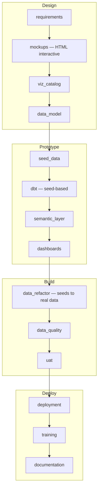

# Dashboard-First Rapid Development Release

Use this when you want early stakeholder feedback via interactive dashboard mocks before building the data layer. This approach is especially effective when the SOW is well-defined but client data access may be delayed — you can have a working prototype with seed data before the client provides database credentials.

**In-scope artifacts**: `requirements`, `mockups`, `viz_catalog`, `data_model`, `seed_data`, `dbt`, `semantic_layer`, `dashboards`, `data_refactor`, `data_quality`, `uat`, `deployment`, `training`, `documentation`



## Workflow

```
/wire:new                                               # release_type: dashboard_first

# Phase 1: Requirements (Day 1)
/wire:requirements-generate <release-folder>
/wire:requirements-validate <release-folder>
/wire:requirements-review <release-folder>

# Phase 2: Interactive Dashboard Mocks (Day 1–2)
/wire:mockups-generate <release-folder>                 # HTML interactive mockups
/wire:mockups-review <release-folder>

# Phase 3: Visualization Catalog (Day 2)
/wire:viz_catalog-generate <release-folder>             # Generate-only, no validate/review

# Phase 4: Data Model (Day 2–3)
/wire:data_model-generate <release-folder>
/wire:data_model-validate <release-folder>
/wire:data_model-review <release-folder>

# Phase 5: Seed Data (Day 3)
/wire:seed_data-generate <release-folder>               # CSV files with referential integrity
/wire:seed_data-validate <release-folder>
/wire:seed_data-review <release-folder>

# Phase 6: Development — seed-based (Days 3–5)
/wire:dbt-generate <release-folder>                     # Uses ref() to seeds, not source()
/wire:dbt-validate <release-folder>
/wire:utils-run-dbt <release-folder>                    # dbt seed && dbt run && dbt test
/wire:dbt-review <release-folder>

/wire:semantic_layer-generate <release-folder>
/wire:semantic_layer-validate <release-folder>
/wire:semantic_layer-review <release-folder>

/wire:dashboards-generate <release-folder>
/wire:dashboards-validate <release-folder>
/wire:dashboards-review <release-folder>

# Phase 7: Data Refactor — seeds → real data (when client data available)
/wire:data_refactor-generate <release-folder>
/wire:data_refactor-validate <release-folder>
/wire:data_refactor-review <release-folder>

# Phase 8: Testing
/wire:data_quality-generate <release-folder>
/wire:data_quality-validate <release-folder>
/wire:data_quality-review <release-folder>

/wire:uat-generate <release-folder>
/wire:uat-review <release-folder>

# Phase 9: Deployment + Enablement
/wire:deployment-generate <release-folder>
/wire:deployment-validate <release-folder>
/wire:deployment-review <release-folder>
/wire:utils-deploy-to-prod <release-folder>

/wire:training-generate <release-folder>
/wire:training-validate <release-folder>
/wire:training-review <release-folder>

/wire:documentation-generate <release-folder>
/wire:documentation-validate <release-folder>
/wire:documentation-review <release-folder>

/wire:archive <release-folder>
```

## Phase 2: Interactive Dashboard Mockups

This is the key differentiator. The mockups command for `dashboard_first` projects generates **pixel-accurate, interactive HTML Looker mockups** directly inside Claude Code — no external tools required.

The framework:
1. Reads the approved requirements and plans the dashboard structure — pages, KPI tiles, charts, tables, and filters
2. Reads the Looker design system reference (teal sidebar, Google Sans, Chart.js charts)
3. Generates one or more **self-contained HTML files** that faithfully reproduce the Looker UI
4. Simultaneously produces `design/dashboard_visualization_catalog.csv` and `design/dashboard_spec.md`

Open the HTML file in a browser — the charts respond to hover and the tabs switch. Iterate on the mockups by asking Claude to modify specific tiles before running `viz_catalog:generate`.

## Phase 7: Data Refactor

Once the client provides access to their actual data sources:
1. Compares the seed-based source schema against the real one
2. Generates a refactoring plan documenting every change needed
3. Executes the changes: updates source definitions, staging model SQL, and dbt configuration

The transition from `ref('customers_seed')` to `source('salesforce', 'accounts')` is a mechanical operation guided by the schema comparison.

## Tips

- **Start mocking early**: You can run `/wire:mockups-generate` during the SOW preparation phase
- **Don't delay the refactor**: Once client data is available, run the data refactor promptly
- **The prototype is disposable**: The seed-based dbt project exists to validate the design

> **Tip**: Run `/wire:playbook-generate <release-folder>` after mockups are approved.
