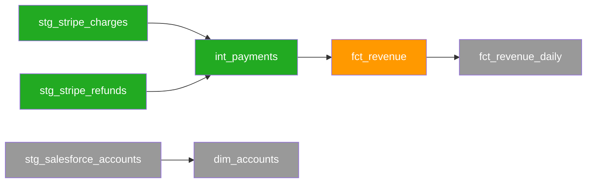

# Platform Migration Release

The Platform Migration release type covers the full lifecycle of migrating a data platform from one warehouse stack to another. It supports bidirectional BigQuery ↔ Snowflake migrations and introduces two structural features: a two-zone artifact model and an iterative equivalency loop.

**Supported platform pairs**: `bigquery_to_snowflake`, `snowflake_to_bigquery`

## Artifact zones

**Pre-audit utilities** — run these before starting the audit zone to register and snapshot the source dbt repository.

| Command | Purpose |
|---|---|
| `/wire:migration-source-register <release>` | Register the source dbt git repo (URL or local path, branch, models path) in `status.md` |
| `/wire:migration-source-refresh <release>` | Refresh or create the local snapshot; updates `migration_source.last_refreshed` |

`dbt-migration-generate` checks `migration_source.last_refreshed` at startup and warns if the snapshot is more than 24 hours old.

**Audit zone** — read-only analysis of the source platform. No writes to any external system.

| Artifact | Command | Purpose |
|---|---|---|
| `ingestion_audit` | `/wire:ingestion-audit-*` | Catalog all Fivetran connectors, sync configs, column selections |
| `db_object_audit` | `/wire:db-object-audit-*` | Enumerate databases, schemas, tables, views, procedures |
| `security_audit` | `/wire:security-audit-*` | Catalog roles, permissions, users, service accounts |
| `dbt_audit` | `/wire:dbt-audit-*` | Catalog dbt models, classify by migration complexity |
| `orchestration_audit` | `/wire:orchestration-audit-*` | Catalog orchestration jobs, schedules, and dependencies |
| `migration_inventory` | `/wire:migration-inventory-*` | Synthesise all five audits into a unified catalogue |

**Migration zone** — writes to the target platform. Safety-gated commands require explicit confirmation.

| Artifact | Safety gate | Purpose |
|---|---|---|
| `migration_strategy` | No | Platform-pair translation decisions, phasing, rollback; generates per-batch Mermaid DAG files |
| `target_setup` | **Yes** | Target warehouse config, schemas, roles, service accounts |
| `ingestion_migration` | **Yes** | Migrate connectors to target platform via MCP (creates new connectors + connect cards); runbook fallback if MCP unavailable |
| `dbt_migration` | No | Translate dbt models batch by batch; inline translate→compile→run→equivalency loop per model (up to 5 iterations) |
| `orchestration_migration` | **Yes** | Recreate orchestration jobs on target platform |
| `equivalency_validation` | No (loop) | Iterative row-count, schema, value, freshness comparison |
| `cutover` | **Yes** | Go-live runbook — point of no return |
| `migration_report` | No | Post-migration record |

## Setting up a Platform Migration release

Run `/wire:new` and select **Platform Migration**. You will be asked five additional questions:

1. **Source platform** — BigQuery or Snowflake
2. **Target platform** — must differ from source
3. **dbt project path** — relative to repo root
4. **Orchestration tool** — Dagster, dbt Cloud, Airflow, or None
5. **Connectivity** — public endpoint or private network requiring an MCP tunnel

## MCP server connections

The audit and migration commands connect directly to your source and target systems via MCP servers and APIs. Configure these before running any audit commands — not before `/wire:new`.

### Warehouse access (source and target)

Both warehouse platforms are accessed via the claude.ai MCP servers, available when running Wire in Claude Code with an Anthropic account.

| Platform | MCP server | What it's used for |
|---|---|---|
| Snowflake | `claude_ai_Snowflake` | `db-object-audit`, `security-audit`, `target-setup`, `equivalency-validate` |
| BigQuery | `claude_ai_BigQuery_MCP` | `db-object-audit`, `security-audit`, `target-setup`, `equivalency-validate` |

Authenticate via the claude.ai interface before starting the audit zone. Run `/wire:mcp list` to confirm both platforms are reachable.

### Ingestion tool connections

Wire auto-detects which ingestion tool you are using and connects via MCP or API fallback:

| Tool | Connection | Fallback |
|---|---|---|
| Fivetran | claude.ai Fivetran MCP server | Pre-exported CSV at `audit/fivetran_connectors_input.csv` |
| RudderStack | MCP server at `mcp.rudderstack.com` (OAuth) | None — authenticate via `/wire:mcp auth rudderstack` |
| Coupler.io | MCP server at `app.coupler.io/mcp` (personal access token) | CSV at `audit/coupler_dataflows_input.csv` |
| Segment | Public API token (`SEGMENT_TOKEN` env var) | None — no MCP server available |
| Airbyte | Airbyte API token (`AIRBYTE_TOKEN` env var, `api.airbyte.com/v1` or self-hosted) | Optional: Agent MCP at `mcp.airbyte.ai/mcp` |

`ingestion-audit-generate` probes each MCP endpoint with a 10-second timeout and falls back automatically where a CSV fallback exists. For large Fivetran estates (100+ connectors), prepare the CSV from the Fivetran dashboard before running the audit zone — the template is at `wire/TEMPLATES/migration/fivetran_connectors_input.csv`.

### Reverse ETL connections

If the source platform includes reverse ETL syncs, Wire audits them via the Hightouch REST API (`https://api.hightouch.com/api/v1`) using a read-only API key set in the `HIGHTOUCH_TOKEN` env var, or from a copy of the client's Hightouch Git config directory at `audit/hightouch_git/`.

### Private network access

If either warehouse is behind a VPC and not publicly reachable, deploy an MCP server tunnel inside the client's network and register it in Claude Console → Settings → MCP Tunnels. Wire outputs the exact tunnel deployment steps during `/wire:new` setup — do not proceed to the audit zone until the tunnel is confirmed active.

## Audit zone: parallel by default

```
/wire:migration-audit-all <release-folder>
```

This fans out five subagents simultaneously. Before launching, you will see a token cost confirmation with options to run in parallel or sequentially.

## dbt audit and complexity classification

`dbt-audit-generate` reads every `.sql` model file and assigns a complexity rating:

| Rating | Criteria |
|---|---|
| `trivial` | No platform-specific features; view or table materialization |
| `low` | 1–2 platform-specific functions with direct target equivalents |
| `medium` | 3+ platform-specific functions, OR incremental materialization |
| `high` | Nested/repeated field logic, complex incremental strategies |
| `blocked` | Depends on an out-of-scope object, OR uses a feature with no known target equivalent |

## Ingestion migration: MCP-driven execution

When the relevant ingestion tool's MCP server is reachable, `ingestion-migration-generate` executes the migration directly rather than writing a runbook:

1. Probes the MCP server for the ingestion tool in the audit (Fivetran, Airbyte, etc.)
2. Creates a **new connector** on the target destination for each in-scope connector — the source connector stays active throughout the parallel-run window
3. Generates a **connect card** (or equivalent setup URL) per connector and presents it immediately for credential entry
4. Polls connector state and reports which connectors have reached `connected` status

Wire never edits or re-points an existing source connector. If the MCP server is unavailable, Wire falls back to a step-by-step runbook — which also describes new connector creation only. The validate step adapts: MCP path verifies connector state via API; runbook path checks document completeness.

## Source repository management

Before running any audit or migration commands, register the source dbt project so Wire knows where to find model SQL files and the manifest.

```
/wire:migration-source-register <release>
/wire:migration-source-refresh <release>
```

`migration-source-register` records the source repository location — a remote git URL or a local path, the branch, and the models directory — in `status.md` under `migration_source`. `migration-source-refresh` checks out or pulls the snapshot and writes the current timestamp to `migration_source.last_refreshed`.

`dbt-migration-generate` reads `last_refreshed` at startup. If it is more than 24 hours old, translation is blocked with a warning until you run `migration-source-refresh` again. This prevents silent drift between the snapshotted SQL and whatever is live in the source warehouse.

## dbt migration: parallel agents, batches, and folder structure

```
/wire:dbt-migration-generate <release-folder>                      # all pending batches
/wire:dbt-migration-generate <release-folder> --batch 3            # specific batch
/wire:dbt-migration-generate <release-folder> --model stg_x        # single model
/wire:dbt-migration-generate <release-folder> --models stg_x,stg_y # named subset
```

### Scoping translation with node selectors

`--select` scopes the translation set by graph relationship using dbt's node-selection grammar, with `--exclude` as its companion. Both are resolved by Wire over the source project's dependency graph — **no dbt binary is required**. Wire reads the graph from the source project's `target/manifest.json` (a plain JSON artifact; no warehouse connection), and falls back to parsing `ref()`/`source()` and YAML config when no manifest is present.

```
/wire:dbt-migration-generate <release-folder> --select +vehicles            # vehicles and all upstream models
/wire:dbt-migration-generate <release-folder> --select vehicles+            # vehicles and all downstream models
/wire:dbt-migration-generate <release-folder> --select "+vehicles+"         # full subgraph
/wire:dbt-migration-generate <release-folder> --select "vehicles customers" # union — both subgraphs
/wire:dbt-migration-generate <release-folder> --select "+vehicles+" --exclude "tag:deprecated"
```

| Pattern | Meaning |
| :---- | :---- |
| `vehicles` | That model only (same as `--model vehicles`) |
| `+vehicles` / `vehicles+` | Plus all ancestors / all descendants |
| `2+vehicles` / `vehicles+1` | Ancestors up to 2 degrees / descendants down to 1 |
| `@vehicles` | Model, descendants, and ancestors of those descendants |
| `a b` (space) | Union — match either |
| `tag:x,config.materialized:y` (comma) | Intersection — match all |
| `tag:pilot`, `path:models/staging` | Set selectors by tag, config, or path |

A bare `--select vehicles` is identical to `--model vehicles`. `--select` cannot be combined with `--batch`, `--model`, or `--models`. Before translating, Wire prints the resolved model list and aborts if the selector matches nothing.

Wire splits each batch into groups of ~5 models and spawns one `wire:migration-specialist` agent per group simultaneously — a 20-model batch runs as 4 parallel agents; 3 batches of 20 launches 12 agents at once.

Translated models preserve the source project's folder structure. A model at `models/staging/stripe/stg_stripe_charges.sql` produces `migration/dbt/staging/stripe/stg_stripe_charges.sql` in the release folder. Companion YAML files follow the same structure.

Each model gets one of three translation treatments:
- **auto-translate**: Mechanical syntax substitution applied with high confidence
- **guided-translate**: Non-trivial dialect difference — translated then flagged with `-- WIRE:REVIEW`
- **rewrite**: Logic tightly coupled to source platform features — flagged with `-- WIRE:REWRITE`

### Iterative translation and equivalency loop

Starting in v3.9.9, `dbt-migration-generate` embeds a per-model loop directly inside each translation agent. No manual intervention between iterations. Both the source and target platform MCP servers must be reachable before the command starts — it aborts with a clear error if either is missing.

For each model, the agent runs up to five iterations:

1. Translate source SQL to the target warehouse dialect
2. Compile-check against the target platform — `LIMIT 0` query, no data read
3. Run the model on the target test project
4. Three equivalency checks in sequence: row count (±0.5% tolerance), schema match, 1 000-row column value sampling
5. If any check fails, auto-fix the translated SQL and repeat from step 2

A model exits the loop as soon as all four checks pass. After five failed iterations it is marked `failed` and the batch continues — no mid-loop prompt to the user. Failures are surfaced in the acceptance pack once the batch completes.

The per-model loop runs inside the same parallel agent structure — a 20-model batch still spawns four agents simultaneously; each agent handles its own loop for the ~5 models assigned to it.

## Batch DAG visualisation

`/wire:migration-strategy-generate` generates a Mermaid DAG file per batch at `artifacts/migration_strategy/dag_batch_N.md`. Each node represents one model; state is colour-coded and updated in-place as `dbt-migration-generate` runs.

| Colour | State |
|---|---|
| Grey (`#999`) | Not started |
| Orange (`#f90`) | Translated / in progress |
| Green (`#2a2`) | Equivalency passed |
| Red (`#c00`) | Failed after 5 iterations |

Example batch DAG:



Open the DAG file in any Mermaid-capable viewer — GitHub renders it natively in the PR diff.

## Migration acceptance packs

Once all models in a batch reach a terminal state (passed or failed after 5 iterations), `dbt-migration-generate` automatically writes `artifacts/dbt_migration/acceptance_pack_batch_N.md`. The pack contains a per-model results table — translation treatment, iteration count, equivalency check results, and any `-- WIRE:REVIEW` or `-- WIRE:REWRITE` flags — followed by a sign-off block.

Use the review command to present the pack to stakeholders:

```
/wire:migration-acceptance-pack-review <release> [--batch N]
```

Omit `--batch` to review the most recently completed batch. The reviewer chooses one of three outcomes:

- **Approve** — batch is accepted; Wire unblocks the next batch
- **Reject** — batch is sent back; `dbt-migration-generate` re-runs failed models
- **Hold** — batch is paused pending an external decision; noted in `status.md`

`cutover-generate` remains blocked until all batches are approved.

### What an acceptance pack looks like

`acceptance_pack_batch_1.md` is a structured markdown document written directly to `.wire/releases/<release>/migration/dbt/`. Here is a realistic example for a Snowflake → BigQuery migration batch with 8 models, 6 passed and 2 failed:

```markdown
# Migration Batch 1 — Acceptance Pack

**Generated**: 2026-05-14
**Release**: 01-gdp-snowflake-to-bq
**Batch**: 1
**Models in batch**: 8
**Status**: 6 passed · 2 failed

## Results Table

| Model | Iterations | Compile | Run | Row Count | Schema | Value Sample | Status |
|---|---|---|---|---|---|---|---|
| stg_salesforce__accounts | 1 | ✅ | ✅ | ✅ | ✅ | ✅ | **PASSED** |
| stg_salesforce__opportunities | 2 | ✅ | ✅ | ✅ | ✅ | ✅ | **PASSED** |
| stg_salesforce__contacts | 1 | ✅ | ✅ | ✅ | ✅ | ✅ | **PASSED** |
| stg_netsuite__transactions | 3 | ✅ | ✅ | ✅ | ✅ | ✅ | **PASSED** |
| stg_netsuite__customers | 1 | ✅ | ✅ | ✅ | ✅ | ✅ | **PASSED** |
| stg_netsuite__revenue_lines | 2 | ✅ | ✅ | ✅ | ✅ | ✅ | **PASSED** |
| stg_intercom__event_attributes | 5 | ✅ | ✅ | ✅ | ✅ | ❌ | **FAILED** |
| stg_intercom__session_metadata | 5 | ✅ | ✅ | ❌ | ✅ | ✅ | **FAILED** |

## Confirmation Statements

- All 8 models in batch 1 have been processed through the translation and equivalency loop
- Models marked PASSED have satisfied: row count ±0.5%, schema match, column value sampling ±1%/±2%
- Models marked FAILED exhausted 5 iterations without passing all equivalency checks
- No writes were made to the source platform (Snowflake) during this batch
- The following models require manual remediation:
  - `stg_intercom__event_attributes` — WIRE:REWRITE; VARIANT positional access has no direct BigQuery equivalent; value sample check failed on `prop_key` / `prop_value`
  - `stg_intercom__session_metadata` — row count delta exceeded ±0.5% after 5 iterations; QUALIFY window tie-breaking behaviour differs between Snowflake and BigQuery

## Batch 1 DAG

graph TD
  stg_salesforce__accounts:::complete
  stg_salesforce__opportunities:::complete
  stg_salesforce__contacts:::complete
  stg_netsuite__transactions:::complete
  stg_netsuite__customers:::complete
  stg_netsuite__revenue_lines:::complete
  stg_intercom__event_attributes:::failed
  stg_intercom__session_metadata:::failed

  classDef complete fill:#2a2,color:#fff
  classDef failed fill:#c00,color:#fff

## Sign-off

*Pending review by `/wire:migration-acceptance-pack-review 01-gdp-snowflake-to-bq --batch 1`*
```

After the review command runs and the reviewer decides to hold, the sign-off block is appended to the same file:

```markdown
## Sign-off

| Field | Value |
|---|---|
| Decision | HOLD |
| Reviewer | Alex Caldwell |
| Date | 2026-05-14 |
| Notes | Two Intercom models require manual rewrite. Scheduled for a follow-up batch 1b. Proceeding with batch 2 for remaining model layers. |
```

## Equivalency validation loop

Once data is flowing into both platforms:

```
/wire:equivalency-validate <release-folder>
```

Each run performs five check types: row count, schema, value, freshness, and dbt tests. When a check fails:

```
/wire:equivalency-investigate <release-folder> --object carwow_sales.fct_orders
/wire:equivalency-fix <release-folder> --object carwow_sales.fct_orders --approach "Update TIMESTAMP_DIFF translation"
```

`cutover-generate` is blocked until `checks_failing: 0`.

## Safety gates

Four commands require explicit confirmation before proceeding:
- **`target-setup-review`** — confirms DDL scripts have been reviewed, target environment is isolated, client has approved in writing
- **`ingestion-migration-review`** — confirms target landing schemas are ready, parallel running window is agreed
- **`orchestration-migration-review`** — confirms all orchestration jobs have been reviewed
- **`cutover-review`** — the point of no return. Requires all equivalency checks passing, written client sign-off, rollback window agreed

## Full command sequence

```
/wire:new                                            # release_type: platform_migration

# ── SOURCE REPOSITORY ───────────────────────────────────────────
/wire:migration-source-register <release>            # register source dbt repo URL/path, branch, models path
/wire:migration-source-refresh <release>             # snapshot the repo; updates last_refreshed

# ── AUDIT ZONE (read-only) ──────────────────────────────────────
/wire:migration-audit-all <release>

# Per-audit validate + review gates
/wire:ingestion-audit-validate <release>
/wire:ingestion-audit-review <release>
/wire:db-object-audit-validate <release>
/wire:db-object-audit-review <release>
/wire:security-audit-validate <release>
/wire:security-audit-review <release>
/wire:dbt-audit-validate <release>
/wire:dbt-audit-review <release>
/wire:orchestration-audit-validate <release>
/wire:orchestration-audit-review <release>

# Synthesis — requires all five audits approved
/wire:migration-inventory-generate <release>
/wire:migration-inventory-validate <release>
/wire:migration-inventory-review <release>

# ── MIGRATION ZONE ──────────────────────────────────────────────
/wire:migration-strategy-generate <release>          # also writes dag_batch_N.md per batch
/wire:migration-strategy-validate <release>
/wire:migration-strategy-review <release>

# ⚠ SAFETY GATE
/wire:target-setup-generate <release>
/wire:target-setup-validate <release>
/wire:target-setup-review <release>

# ⚠ SAFETY GATE
/wire:ingestion-migration-generate <release>
/wire:ingestion-migration-validate <release>
/wire:ingestion-migration-review <release>

# dbt migration — batched; repeat for each batch
# each batch runs an inline translate→compile→run→equivalency loop per model (up to 5 iterations)
# after each batch completes, an acceptance pack is auto-generated
/wire:dbt-migration-generate <release>
/wire:dbt-migration-validate <release>
/wire:dbt-migration-review <release>
/wire:migration-acceptance-pack-review <release> --batch N

# ⚠ SAFETY GATE
/wire:orchestration-migration-generate <release>
/wire:orchestration-migration-validate <release>
/wire:orchestration-migration-review <release>

# Equivalency loop — repeat until checks_failing == 0
/wire:equivalency-validate <release>
/wire:equivalency-investigate <release> --object <table_or_model>
/wire:equivalency-fix <release> --object <table_or_model>

# ⚠ SAFETY GATE — point of no return
/wire:cutover-generate <release>
/wire:cutover-validate <release>
/wire:cutover-review <release>

/wire:migration-report-generate <release>
/wire:migration-report-validate <release>
/wire:migration-report-review <release>

/wire:archive <release>
```

:::info[Tutorial available]

A worked example of a Platform Migration engagement — using a fictional client scenario with realistic command output, agent delegation, and reviewer decisions — is available in the [Tutorial: Platform Migration](../tutorials/platform-migration).

:::

