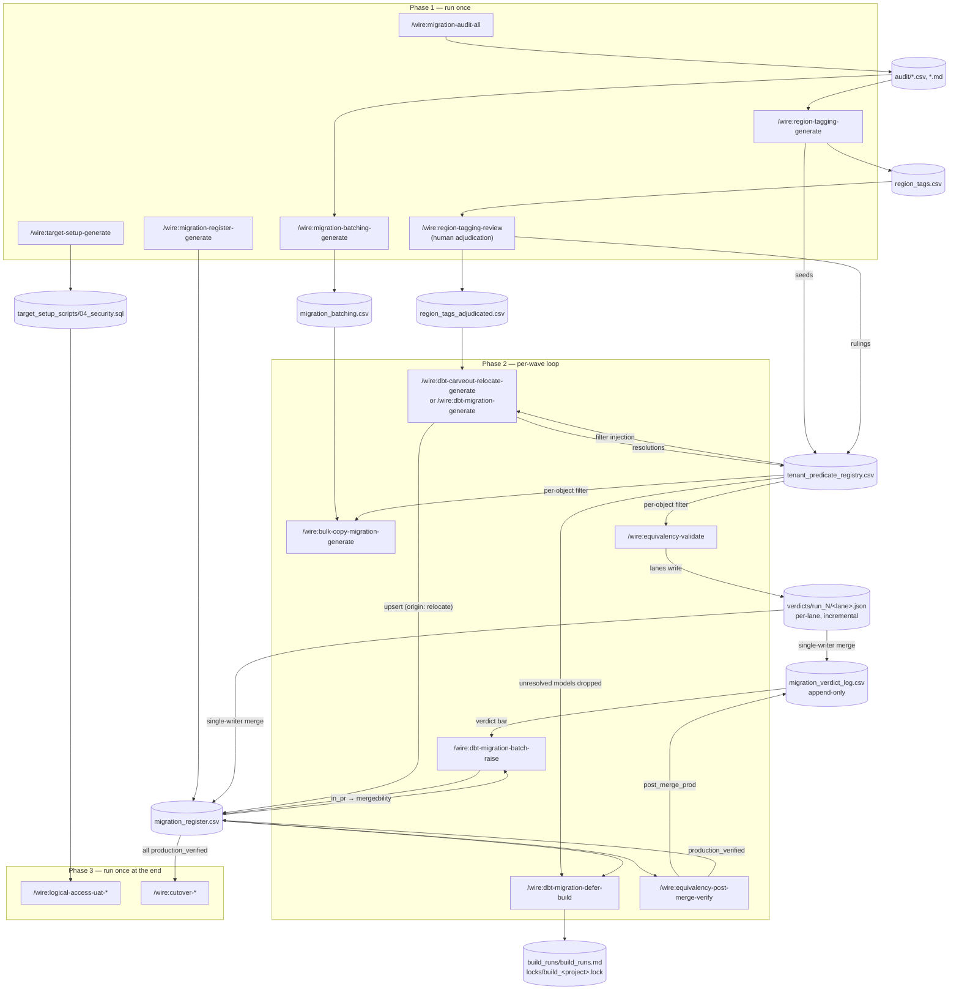

# Tenant Carve-out Release

The Tenant Carve-out release type extracts a single tenant's data, models, and access model from a shared multi-tenant platform into the tenant's own target project, isolated from every other tenant. It is delivered as a scope of the [Platform Migration](./platform-migration) release type: `migration.scope: tenant_carveout` in `status.md`, set at `/wire:new`. It reuses the whole platform-migration command set and adds five carve-out command families, per-object tenant scoping, and an isolation proof before cutover.

This page documents the release type as of **v3.11.4**.

A carve-out runs in one of two shapes:

| Shape | dbt step | When |
|---|---|---|
| **Concurrent** | `/wire:dbt-migration-*` translates the tenant's models from the source platform | The carve-out runs alongside (or as) the parent migration |
| **Staged** | `/wire:dbt-carveout-relocate-*` relocates already-translated, already-correct target-dialect SQL from the parent release's repo | The parent migration has already landed; re-translating correct SQL would re-derive the same answer |

Everything else in the flow is identical between the two shapes.

## Setting up a carve-out release

Run `/wire:new`, select **Platform Migration**, and answer the migration-scope question with **Tenant carve-out**. Wire captures the default tenant predicate. The keys that drive the carve-out in `status.md`:

| Key | Purpose |
|---|---|
| `migration.scope` | `tenant_carveout`. Every migration command reads this |
| `migration.tenant_predicate` | The default row predicate (e.g. `tenant_id = 1042`). From v3.11.3 this is only the seed for the predicate registry; consumers read the registry, not this string |
| `migration.target_project` | The tenant's own project. Under the carve-out, every build write must land inside it |
| `migration.parent_target_project` | Staged shape only. The parent migration's production project: the comparison source for relocated models and the defer-state fallback for builds |
| `migration.parent_release` | Staged shape only. The parent migration's release folder name. The relocate step reads the parent register from it to write the cross-release linkage columns and to refuse relocating a model whose parent verdict is `fail` |
| `migration.cross_release_triggers` | Machine-readable parent-to-carve-out dependencies ("closes when the parent completes its Bronze backfill"), evaluated by the drift gate each run |
| `migration.gate_policy` | `equivalence_before_pr` (default) or `ship_then_verify` (requires a recorded client ruling) |
| `migration.client_repos` | One entry per repo the carve-out ships into: role, url, base branch |
| `migration.cost_controls` | `unit`, `per_run_budget`, `daily_budget`, `scratch_dataset` (default `wire_sandbox`). Budgets apply across all agent lanes |
| `data_safety.production_projects` | Projects that are off-limits for writes |

A carve-out release created before v3.11.3 gains the tenant predicate registry through `/wire:upgrade`, which backfills it from the existing region tags (Step 6a).

## The command sequence, grouped by cadence

The release runs in three phases: a set of commands you run once up front to capture the audit data and rule on the separation of every object, an iterative loop you repeat per wave to carve the tenant's data and models out, and a set of closing commands you run once at the end.

### Phase 1: run once, up front

These commands build the evidence base and the rulings the loop consumes. Each has the standard generate / validate / review triad; the review gates in this phase are human decisions that nothing downstream may override.

```
/wire:new                                            # release_type: platform_migration, scope: tenant_carveout

/wire:migration-source-register <release>            # register the source dbt repo
/wire:migration-source-refresh <release>             # snapshot it

/wire:migration-audit-all <release>                  # five audits in parallel (six with reverse ETL)
#   each audit then: -validate and -review

/wire:region-tagging-generate <release> --region <code>
/wire:region-tagging-validate <release>
/wire:region-tagging-review <release>                # HUMAN GATE — adjudication of every shared item

/wire:migration-inventory-generate <release>         # synthesis of all audits → migration_inventory.md
/wire:migration-inventory-validate <release>
/wire:migration-inventory-review <release>

/wire:migration-batching-generate <release>          # wave schedule → migration_batching.csv
/wire:migration-batching-validate <release>
/wire:migration-batching-review <release>            # client sign-off on wave composition

/wire:migration-strategy-generate <release>
/wire:migration-strategy-validate <release>
/wire:migration-strategy-review <release>

/wire:data-residency-assessment-generate <release>   # GDPR / residency assessment
/wire:data-residency-assessment-validate <release>
/wire:data-residency-assessment-review <release>     # HUMAN GATE — client DPO/legal sign-off

/wire:target-setup-generate <release>                # tenant project, GRANTs + RLS → 04_security.sql
/wire:target-setup-validate <release>
/wire:target-setup-review <release>                  # SAFETY GATE

/wire:migration-register-generate <release>          # creates migration_register.csv
#   --from region-tagging seeds it from the adjudicated carve-in set;
#   --ingest-merge-state backfills delivery state from live gh reads,
#   for a carve-out that reached delivery before its register existed
/wire:migration-register-validate <release>
```

What this phase settles, and where:

- **What exists** goes into the audit CSVs and reports under `audit/`, synthesised into `migration/migration_inventory.md`.
- **What belongs to the tenant** is classified by `region-tagging-generate` into `migration/region_tags.csv` (three buckets: confident-region, shared-row-level, global-deferred) and ruled on at `region-tagging-review`, which writes `migration/region_tags_adjudicated.csv` with a `carve_in` / `split` / `defer` / `reassign` ruling per item.
- **How each object separates** is recorded in `migration/tenant_predicate_registry.csv`. `region-tagging-generate` seeds one row per classified item; the review turns seeds into rulings. Each row carries one of five separation mechanisms, or `unresolved` (see [the registry](#the-tenant-predicate-registry) below).
- **The wave schedule** is `migration/migration_batching.csv`, the authoritative execution order for the loop.
- **The delivery ledger** is `migration/migration_register.csv`, one row per model or snapshot, which every loop command reads and the single writer updates.

### Phase 2: the iterative carve-out loop, repeated per wave

This is the part that runs over and over, one wave at a time, until every in-scope object is in the tenant project and verified. It is also the part designed for fully-agentic delivery (see [below](#enabling-fully-agentic-delivery)).

```
# 1. Copy the wave's raw history (in place of ingestion-migration)
/wire:bulk-copy-migration-generate <release> --wave <id>
/wire:bulk-copy-migration-validate <release> --wave <id>
/wire:bulk-copy-migration-review <release> --wave <id>     # SAFETY GATE — authorises that wave's Stage 1 pilot copy only

# 2. Get the wave's dbt models into the tenant project — one of:
/wire:dbt-migration-generate <release> --wave <id>          # concurrent shape: translate
/wire:dbt-carveout-relocate-generate <release> --wave <id> \
    --source-dbt-project-path <path> --target-dbt-project-path <path> \
    --target-project <name>                                 # staged shape: relocate
#   both chain validate → lint → fix → pre-pr-review by default (--no-chain opts out)
/wire:dbt-carveout-relocate-review <release>                # rules on probe proposals and manual-review models

# 3. Build and verify in the sandbox
/wire:dbt-migration-defer-build <release> --models <names>  # scratch-dataset builds, cost-screened, tenant write guard
/wire:equivalency-validate <release> --wave <id>            # tenant-scoped, per-object registry filter
/wire:equivalency-investigate <release> --object <name>     # when a check fails
/wire:equivalency-fix <release> --object <name>
/wire:equivalency-sweep <release> --pattern <rule-id>       # one root-caused defect, swept estate-wide
/wire:reverse-etl-equivalency-validate <release>            # sync twins, tier-1 exactness (reverse ETL in scope)

# 4. Ship and verify
/wire:dbt-migration-batch-raise <release> --wave <id>       # PR to the client repo, drop-on-defect
/wire:equivalency-post-merge-verify <release>               # after client merge → production_verified

# 5. Client-facing wave sign-off
/wire:migration-acceptance-pack-review <release> --wave <id>
```

Loop mechanics:

- **Waves are the reporting unit, not the work unit.** Work is pull-based over the delivery stage ladder in the register (translate/relocate, validate + lint, build, equivalence, PR). A model advances whenever its inputs allow, whatever its wave.
- **Each wave's bulk-copy review authorises only that wave's Stage 1 pilot-partition copy.** The copy itself is two-stage per table: pilot partition, then an equivalency gate (row count + checksum, tenant-scoped), then the remainder.
- **Relocation is gated on the parent's proof.** Before copying anything, the relocate step reads each model's verdict in the parent register: a `fail` refuses the relocation with the parent reference, and the linkage columns (`parent_release` / `parent_model` / `parent_verdict_ref`) are written on every relocated row (see [Cross-release linkage](#cross-release-linkage-v3114)).
- **Re-running is cheap and monotonic.** Relocate re-runs skip what is done, never overwrite a human ruling, and resolve descendants automatically once an upstream gains a separation mechanism. Batch-raise derives fresh candidates from the register each run and drops defective models individually rather than blocking the batch. Batches never stack: cutting a batch branch from an unmerged branch is refused (`stack_depth_exceeded`).
- **The loop exits** when every in-scope object reaches `delivery_stage: production_verified` in the register and the equivalency status shows `checks_failing: 0`.

### Phase 3: run once, at the end

```
/wire:logical-access-uat-generate <release> --region <code>
/wire:logical-access-uat-validate <release>          # ≥1 negative test per IAM boundary in 04_security.sql
/wire:logical-access-uat-review <release>            # HUMAN GATE — isolation-proof sign-off

# ⚠ SAFETY GATE — point of no return
/wire:cutover-generate <release>
/wire:cutover-validate <release>
/wire:cutover-review <release>

/wire:migration-report-generate <release>
/wire:migration-report-validate <release>
/wire:migration-report-review <release>

/wire:archive <release>
```

The logical-access UAT proves the isolation deliverable: every IAM boundary in `04_security.sql` gets positive tests and at least one negative test (query another tenant's project, expect permission denied; query a shared table, expect zero other-tenant rows). A negative test that returns another tenant's data fails the gate regardless of the positives and routes back to `target-setup`. Cutover is blocked until this review is approved, and re-running the security DDL after sign-off invalidates the attestation.

## Key data stores

All paths are relative to the release folder (`.wire/releases/<release>/`).

| Path | Written by | Read by | Holds |
|---|---|---|---|
| `audit/*.csv`, `audit/*.md` | The five/six audit commands | region-tagging, inventory, batching, bulk-copy | The source-platform catalogue: connectors, objects, roles, dbt models (`audit/dbt_audit.csv`), snapshots (`audit/dbt_snapshots.csv`) |
| `migration/region_tags.csv` | `region-tagging-generate` | validate, review | Seed classification: `item_id, item_type, source_audit, bucket, signal, confidence_score` |
| `migration/region_tags_adjudicated.csv` | `region-tagging-review` | relocate, registry checks, downstream carve-out commands | The seed columns plus `adjudicated_ruling` (`carve_in` / `split` / `defer` / `reassign`) and `adjudication_note`. The real, checked input every carve-out command consumes |
| `migration/tenant_predicate_registry.csv` | Seeded by `region-tagging-generate`; ruled at `region-tagging-review`; resolutions written back by `dbt-carveout-relocate-generate` | `equivalency-validate`, `bulk-copy-migration-generate`, `dbt-carveout-relocate-generate`, `dbt-migration-defer-build` | Per-object separation mechanism and filter expression (schema below) |
| `migration/migration_inventory.md` | `migration-inventory-generate` | strategy, batching, residency assessment | Unified catalogue synthesised from all audits |
| `migration/migration_batching.csv` | `migration-batching-generate` | Every `--wave`-scoped command | The authoritative wave schedule, all object types |
| `migration/migration_register.csv` | Single writer: the orchestrating session / equivalency merge, plus `dbt-migration-generate`, `dbt-carveout-relocate-generate` (upsert), `batch-raise`, `post-merge-verify` | Batch-raise candidate derivation, defer-build, the release director | Current state per model/snapshot: 17 columns including `state`, `last_equivalence_result`, `delivery_stage` (blank → `in_pr` → `merged` → `production_verified`), `pr_url`, and the cross-release linkage columns `parent_release` / `parent_model` / `parent_verdict_ref` on relocated rows. Relocated rows carry `origin: relocate` in `notes` |
| `migration/migration_verdict_log.csv` | `equivalency-validate` merge step only, append-only | Register validation, reporting, reviews | Dated verdict history: `model, object_type, run_point, verdict, divergence_mechanism, method_class, mode, baseline_t, file_version, lane_id, report_ref, written_at`. The register is current-state; this log is the history |
| `migration/bulk_copy_migration_runbook_<wave>.md` | `bulk-copy-migration-generate` | validate, review, the copy operator | Per-wave copy steps, each with its resolved tenant filter, the two-stage gate, the scoped service account, and the credential rotation checklist |
| `migration/dbt_carveout_relocate_manifest_<wave>.md` | `dbt-carveout-relocate-generate` | review (derived report only; validate re-derives from disk) | Per-model relocation record: bucket, injection point, ladder rung, conflicts, proposals |
| `migration/target_setup_scripts/04_security.sql` | `target-setup-generate` | logical-access UAT, residency assessment | Tenant-scoped GRANTs, the row-level-security predicate, the scoped service account |
| `migration/data_residency_assessment.md` | `data-residency-assessment-generate` | DPO/legal review | GDPR scope, residency constraints, historical-window review, `[CLIENT DPO/LEGAL]` determinations |
| `migration/logical_access_uat_plan.md` | `logical-access-uat-generate` | validate, review | Test matrix, per-test evidence blocks, three-attestation sign-off |
| `migration/known_differences.yaml` | The engagement (entries proven once, with a detection query) | `equivalency-validate` | Connector-emission known differences: a divergence matching an entry classifies `pass_qualified` with the entry cited, only when the detection query accounts for the entire delta |
| `status.md` | Every command | Every command | Release config, per-artifact state, `waves_complete`, per-wave validate/review results |
| `execution_log.md` | Every command and skill activation | The director, reporting | Append-only trace: one row per run with timestamp, command, result, detail |

### The tenant predicate registry

`migration.tenant_predicate` is one string; a real carve-out needs several separation mechanisms at once. `migration/tenant_predicate_registry.csv` (contract: `specs/utils/tenant_predicate_registry.md`) resolves separation one object at a time.

Columns: `item_id, item_type, mechanism, expression, tenant_column, resolved_by, resolving_node, provenance, verified_date, confidence, notes`.

| `mechanism` | Meaning | Filter a consumer applies |
|---|---|---|
| `row_predicate` | A boolean over a column the object carries | `WHERE <expression>` |
| `derived_expr` | The tenant is recoverable only by an expression | `WHERE <expression>` |
| `account_cascade` | An enumerated id set; the upstream platform has no tenant column | `WHERE <col> IN (...)` |
| `object_carve` | No row predicate exists; the object is in or out whole, by name or schema convention | None. Compare or copy it whole |
| `inherited` | No tenant column of its own; the upstream path is already scoped. `resolving_node` names the upstream | None. Already tenant-only on both sides |
| `unresolved` | No mechanism established | **Flagged. Never compared or copied unfiltered** |

Lifecycle: `region-tagging-generate` seeds one row per classified item (confident-region items seed as `object_carve`; shared items carrying the predicate's column seed as `row_predicate` from the default predicate; everything else seeds `unresolved`). `region-tagging-review` turns seeds into rulings (`resolved_by: adjudication`). `dbt-carveout-relocate-generate` writes resolutions back as its ladder resolves models, and its row-distribution probes land as **proposals** at `confidence: medium`, with their query and result as provenance, for a reviewer to accept or reject. A row whose `resolved_by` is `adjudication` or `manual` is never overwritten by a re-run; a conflicting machine result is reported as a conflict and left as the ruling says.

The unresolved rule is mechanical and universal, because unfiltered is the one wrong answer that looks like a real result. An unfiltered source-side query returns every tenant's rows, so a comparison fails for a reason unrelated to the migration; an unfiltered bulk copy moves another tenant's data across the residency boundary, which deleting rows afterwards does not undo. Per consumer:

| Consumer | Behaviour on `unresolved` (or no row) |
|---|---|
| `equivalency-validate` | Verdict `fail`, reason `unresolved_predicate`; nothing is compared |
| `bulk-copy-migration-generate` | No copy step emitted; listed under unresolved items |
| `dbt-carveout-relocate-generate` | `manual_review_required`, after the resolution ladder has had its attempt |
| `dbt-migration-defer-build` | Dropped from the build set, reason `unresolved_predicate`, no override |

### The register and the verdict log

`migration/migration_register.csv` is the loop's ledger. Its 17 columns split into identity (`model`, `object_type`, `source_path`, `source_layer`, `bq_target`), migration state (`state`, `last_migrated_commit`, `snapshot_strategy`), equivalence (`last_equivalence_result`, `last_equivalence_t`, `last_validated_commit`), delivery (`delivery_stage`, `pr_url`), and cross-release linkage (`parent_release`, `parent_model`, `parent_verdict_ref` — set only on relocated rows), plus `notes`. `state` and `delivery_stage` are orthogonal: a merged model that later drifts keeps its delivery progress and gains a health flag.

`migration/migration_verdict_log.csv` is append-only: every verdict at every run point (`standard`, `pre_raise`, `post_merge_prod`) adds a row, so throughput history is never lost to a last-write-wins overwrite. Under the carve-out, every verdict row records `scope: tenant_carveout` and a SHA-256 hash of the exact per-object filter applied, plus the resolved mechanism (and `resolving_node` for inherited objects), so a carve-out verdict can never be mistaken for a full-estate one.

Relocated models (`origin: relocate` in the register) compare differently at equivalency time: their source side is the **parent target project's production relation with the tenant filter applied** (`migration.parent_target_project`), and their target side is the tenant project's relation, unscoped. This re-proves the carve-out, not the parent's translation.

### Cross-release linkage (v3.11.4)

The carve-out inherits the parent release's translations, backfills, and defects, and the linkage columns make that machine-readable. The relocate step reads the parent register (via `migration.parent_release`) before copying anything: a model whose parent verdict is `fail` is **refused** (`parent_verdict_fail`, with the parent reference) — relocating SQL the parent has proven wrong copies a known defect into the tenant project. A proven parent (`pass`/`pass_qualified`) relocates with `parent_verdict_ref` written; anything else relocates with the ref blank, an evidence gap the comparator treats as unproven: the relocate-mode comparison will not use the parent target as a trusted basis until the parent verdict is proven (`parent_verdict_insufficient` otherwise).

`migration.cross_release_triggers` carries the dependencies the other way: "closes when the parent completes its Bronze backfill" becomes a trigger the drift gate evaluates each run instead of a PR comment nobody re-reads. When a trigger fires — or the parent runs a defect-class sweep (`equivalency-sweep`) hitting models this carve-out relocated — the affected relocated copies are marked re-verify-owed via the linkage, and the drift report lists them until fresh verdicts land.

### Declared windows and known differences (v3.11.4)

Two structured qualifiers matter most under a carve-out, where young tenant Bronze connectors mean the target routinely holds less history than the source. An object with a **declared window** (floor auto-derived from target Bronze `MIN(loaded_at)`, reasoned exclusions, cap at the pinned as-of) turns that shortfall into `diff_availability` with the window as structured fields on the verdict row — claimable only when the in-window comparison passes exactly, and rendered as fields in the PR body rather than re-argued in prose. The **known-differences registry** (`migration/known_differences.yaml`) does the same for connector behaviour classes: a surplus a registered detection query fully accounts for classifies `pass_qualified` with the entry cited; an unregistered surplus still fails. Both are described in full on the [Platform Migration](./platform-migration#declared-windows-and-known-differences-v3114) page.

## How the commands and data stores interact



## Files supporting fully-agentic delivery of the loop

Phase 2 is built to run as an agent fleet: one human release director, one orchestrating session, and 6 to 12 flat lane agents working the stage ladder in parallel (`specs/utils/migration_fleet.md`). That only works if a lane can die at any moment without losing work, if no two writers collide, and if spend stays inside budget. The framework creates these files to make that hold:

| File | Created by | Purpose |
|---|---|---|
| `migration/verdicts/run_<N>/<lane_id>.json` | Each equivalency lane, its own file only | Incremental lane verdicts. The lane rewrites the file after **each object**, so a killed lane loses at most the in-flight object and a resumed lane skips everything already present. Carries `scope`, `tenant_predicate_sha256`, and per-verdict mechanism provenance |
| `migration/migration_verdict_log.csv` | The single-writer merge step | The append-only journal the lane files merge into: lane files sorted by `lane_id`, every well-formed verdict appended, latest `generated_at` wins per model for register updates, malformed rows rejected and reported |
| `migration/locks/build_<project>.lock` | `dbt-migration-defer-build` | Build-slot lock holding the lane id and a UTC timestamp: one dbt build per project at a time. A lock younger than 60 minutes blocks with the holder reported; older is stale and removed, so a dead build lane never blocks the project permanently |
| `migration/build_runs/build_runs.md` | `dbt-migration-defer-build` | Append-only build and cost journal: timestamp, lane id, models, cost estimate, actual cost, budget outcome, per-model result. Supplies the day's cumulative spend for the daily-budget screen on every subsequent run, across all lanes |
| Lane progress manifests | Translation, build, and PR-prep lanes | Each lane's own state file, at a path declared in its lane brief inside its owned tree, rewritten after each completed item, never only at the end. The final write marks the lane `complete` with a one-line summary |
| Registry backup | `dbt-carveout-relocate-generate` Step 2c | `tenant_predicate_registry.csv` is backed up before the write-back and re-read after, because under a fleet one lane may write it while another reads |
| `migration/equivalency_report_<N>.md` | `equivalency-validate` | Per-run evidence report, including the merge summary (appended / updated / malformed / conflict / not_merged / unknown_model). Verdict rows point at it via `report_ref` |
| `execution_log.md` | Every command | The unified run trace. When nobody is typing commands, this is the record of what ran, when, and with what result |
| `status.md` wave keys | Loop commands | `waves_complete`, `wave_validate`, `wave_review` accumulate per wave, so a re-entering session knows exactly where the loop stands |
| Chunk ledgers (`migration/bring_in/<table>_ledger.csv`) | Bulk-copy bring-in lanes | One row per copy chunk: boundary keys, row count, load-job id, state. Job ids derive deterministically from release + table + chunk floor, so a re-run re-submitting a completed chunk is rejected as a duplicate instead of double-loading. A killed copy resumes mid-table |
| `client_comms/watch_state.json` | `utils-client-watch` | The tracked-post list and last-tick cursors for the headless client watch; a killed tick loses at most one cursor advance |

Recovery is contractual, not best-effort:

- **Resume contract**: on restart with the same brief, a lane reads its state file first and skips every completed item. Losing a session must cost at most the in-flight item.
- **Stall detection**: the orchestrator treats a lane with no writes for 30 minutes as stalled and may re-dispatch its remaining items to a new lane. The resume contract is what makes re-dispatch safe.
- **Single writer**: lanes never write the register or the verdict log. Exactly one process (the orchestrating session, or the `equivalency-validate` run itself when there is no fleet) merges lane files into both, deterministically.
- **Budget enforcement**: every build is dry-run cost-screened against `migration.cost_controls` before it runs, and every lane's spend counts against the shared per-run and daily budgets.

## Enabling fully-agentic delivery

There is no `/wire:fleet` command. The fleet operating model is invoked by the release director in conversation, once the run-once phase has produced everything the loop needs. The orchestrating session then follows `specs/utils/migration_fleet.md` and `specs/utils/migration_agent_delegate.md`.

### Preconditions

Before starting the fleet, confirm:

1. **The audit data is captured**: all audits approved, `migration/migration_inventory.md` approved, `migration/migration_batching.csv` reviewed.
2. **The separation process is decided per object**: `region-tagging-review` is approved, `migration/region_tags_adjudicated.csv` exists, and the predicate registry is seeded with the medium/low-confidence rows ruled. Anything still `unresolved` will be flagged and skipped by every consumer, so the fewer unresolved rows, the more the fleet can run unattended.
3. **The legal and safety gates are through**: the data-residency assessment has DPO/legal sign-off, `target-setup-review` is approved and `04_security.sql` applied, and the first wave's `bulk-copy-migration-review` has authorised its pilot copy.
4. **The ledger exists**: `migration/migration_register.csv` has been generated.
5. **The config is set**: `migration.gate_policy`, `migration.client_repos`, `migration.cost_controls`, `migration.target_project`, and (staged shape) `migration.parent_target_project`.
6. **The agent definition is present**: `agents/migration-specialist/AGENT.md` ships with the Wire plugin; without it, commands fall back to inline execution.

### Starting the fleet

The director speaks in intents and rulings, not commands: "run wave B02 as a fleet", "ship everything that's ready", "carry on and update me when the lanes finish". The orchestrating session:

1. **Dispatches lanes** as `wire:migration-specialist` subagents. Translation and relocation runs split into groups of about 5 models per agent (3 for complex models, up to 8 for simple ones); equivalency scopes over 50 objects partition into one lane per schema, layer, or domain. Every lane brief states four things: the lane's state-file path and resume contract, its declared tree ownership, its budget line, and the flat-lane rule (no sub-agents below a lane). Passing `--inline` to any command opts out of delegation.
2. **Adds the carve-out lanes** to the standard roster (translation slices, per-project build lanes, comparison sweeps, PR prep, reconciliation): a region-tagging evidence lane that assembles lineage traces and row samples for the adjudication pile (the ruling itself stays human), an isolation-verification lane that runs the logical-access checks possible with RA-held credentials, and a bulk-copy monitor lane that watches the two-stage copy and its pilot gate.
3. **Applies the park rule**: the three human gates (region-tagging adjudication, DPO/legal residency sign-off, isolation UAT sign-off) are park points, not lane stalls. An item waiting on a ruling parks in the queue and its lane moves to the next runnable item. Nothing idles waiting on a human.
4. **Runs the consolidation and backstop pass** over lane output before anything ships: re-check build results against the warehouse rather than the lane's claim, scan for the engagement's documented traps, verify register/verdict consistency, and spot-check a sample at full depth. This pass is mandatory whatever model runs the lanes.
5. **Raises PRs by readiness, not by wave**: `dbt-migration-batch-raise` derives candidates from the register (gates clean, verdict sufficient for the gate policy, external-output models requiring an exact `pass`), drops defective models individually, and refuses stacked branches. Under the carve-out, `ship_then_verify` additionally refuses to run until the adjudication and residency gates are complete, and `defer-build` refuses any write outside the tenant project.

The director's control surface while the fleet runs is `/wire:migration-status` (per-wave exclusive stages derived live from the manifest, the register, and a fresh read of the client repos, with a provenance header on every invocation), the register (`state`, `last_equivalence_result`, `delivery_stage` per model), the verdict log for dated history, and `execution_log.md` for the run trace. `/wire:utils-client-watch` runs as a scheduled tick alongside the fleet: client replies land in the answers ledger verbatim, merged PRs advance the register and trigger post-merge verification, and `/wire:utils-ask-list-generate` drafts the capped ask list without ever re-asking a ledger-answered question. Waves stay what they are good at: client-facing reporting labels for the acceptance packs.

### Example: a directed fleet session

The mocked session below shows the pattern as it ran on the first at-scale engagement of this type: after the session opens, the director types intents and rulings, not Wire commands. The orchestrating session invokes the commands, dispatches the lanes, and merges what they report back. Circled numbers link the transcript to the notes alongside.

<div style={{display: 'flex', flexWrap: 'wrap', gap: '1.5rem', alignItems: 'flex-start'}}>
<div style={{flex: '3 1 480px', minWidth: 0}}>

```text
$ cd ~/clients/meridian-delivery && claude

> /wire:start

⏺ Release 02-tenant-carveout (platform_migration, scope:
  tenant_carveout, v3.11.3). Wave B01 production_verified.
  Wave B02: adjudication approved, pilot copy approved,
  14 models pending. Next: run the B02 loop.

> Wave B02 is ready. Run the rest of the wave as a fleet:   ①
  relocate, build, compare, and raise what's ready. Park
  anything that needs a ruling.

⏺ Preconditions: region-tagging review approved · residency
  review approved · 04_security.sql applied · register
  present · gate_policy: equivalence_before_pr. 3 registry
  rows still unresolved — those models will be flagged and
  parked, never carved unfiltered.

⏺ Dispatching 7 lanes (wire:migration-specialist):          ②
    relocate-b02-s1   relocate-generate, 5 models
    relocate-b02-s2   relocate-generate, 5 models
    relocate-b02-s3   relocate-generate, 4 models (complex)
    build-north-pool  defer-build, as relocation clears
    sweep-silver-b02  equivalency lane, schema: silver
    bulkcopy-monitor  B02 stage-2 copy + pilot gate
    evidence-adjud    lineage + row samples, 3 unresolved
  Every lane brief declares its state file + resume          ③
  contract, owned tree, budget line, and the flat-lane rule.

> what are you doing now, what are we waiting on?           ④

⏺ 11:42 · register: 14 relocated, 9 built, 6 verdicts
  (5 pass, 1 pass_qualified), 0 fail. build-north-pool
  holds locks/build_meridian-north.lock; spend $4.12 of
  the $40 daily budget. Waiting on you: dim_customers
  probe proposal needs a ruling; 2 items parked for
  region-tagging adjudication (evidence pack ready).

> The dim_customers probe is right: the boundary is         ⑤
  region_key, not the legacy market column. Accept it.

⏺ Recorded at dbt-carveout-relocate-review Step 3b:
  resolved_by: adjudication, confidence: high. The row is
  now ruling-protected; its two descendants resolve by
  inheritance on the next pass, nobody re-triages them.

> ok carry on and update me when the lanes finish

⏺ Fleet complete (2h 10m).                                  ⑥
  Backstop pass: builds re-checked against the warehouse,
  register/verdict log consistent, 2-model deep spot-check
  clean. Wave B02: 14/14 relocated · 14 built ($11.87) ·
  verdicts 12 pass, 1 pass_qualified (allow-listed cast),
  1 fail (queued for equivalency-investigate).
  batch-raise: 13 eligible, 1 dropped (pre_raise_fail) →
  PR #214 on meridian-airflow, base main, stack depth 0.
  Register: 12 in_pr. Parked for humans: 2 adjudication
  items. post-merge-verify advances the rest to
  production_verified once the client merges.
```

</div>
<div style={{flex: '2 1 280px'}}>

**① Intent, not commands.** The director's instruction is a sentence. The orchestrating session re-checks the phase-1 preconditions itself before dispatching anything, and states up front what the unresolved registry rows mean for the run.

**② The lane roster.** Relocation slices of about 5 models each (smaller for complex models), one build lane per target project, one comparison lane per schema, the bulk-copy monitor, and the evidence lane that prepares adjudication material without ruling on it.

**③ The lane brief.** The four mandatory declarations are what make a killed lane resumable at the cost of one in-flight item.

**④ Supervision.** The answer comes from the register, the build lock, and the cost journal, not from the lanes' own claims. Parked items are listed with what they wait on.

**⑤ A ruling.** The rung-4 probe wrote a proposal to the predicate registry at medium confidence. Accepting it at review Step 3b upgrades it to a ruling no re-run may overwrite, and unblocks descendants by inheritance.

**⑥ Ship by readiness.** The mandatory consolidation and backstop pass runs before anything ships. The raise is drop-on-defect (one model dropped, the batch proceeds) and unstacked (cut from `main`, depth 0). Human gates parked two items without stalling any lane.

</div>
</div>

## Branching strategy

A carve-out release tracks a moving parent release: the parent keeps landing changes while the carve-out extracts the tenant on its own branch. Keep the two in sync with `git merge <parent-branch>` into the carve-out branch on a regular cadence, not rebase. The releases touch disjoint files (the parent extends staging and warehouse models; the carve-out adds region tags, tenant IAM, and bulk-copy runbooks), so the merges are close to conflict-free. Reserve `git rebase` for short-lived, single-owner per-batch branches cut *from* the carve-out branch.

Once any per-batch branch has been cut, treat the carve-out branch as append-only. Rebasing it and force-pushing rewrites its history, which moves the commit those per-batch branches' merge-base points at; the force-push silently orphans them, with no error to flag it.

## Related pages

- [Platform Migration](./platform-migration) covers everything the carve-out inherits: the audit zone, dbt translation and the equivalency loop, snapshots, the ship-and-verify pipeline, and the reporting-layer migrations (Metabase, Omni, OAC), which run for a carve-out exactly as for a full migration.
- [Tutorial: Tenant Carve-out](../tutorials/platform-migration-tenant-carveout) is a worked example with realistic command output, covering both the concurrent and the staged shapes.
