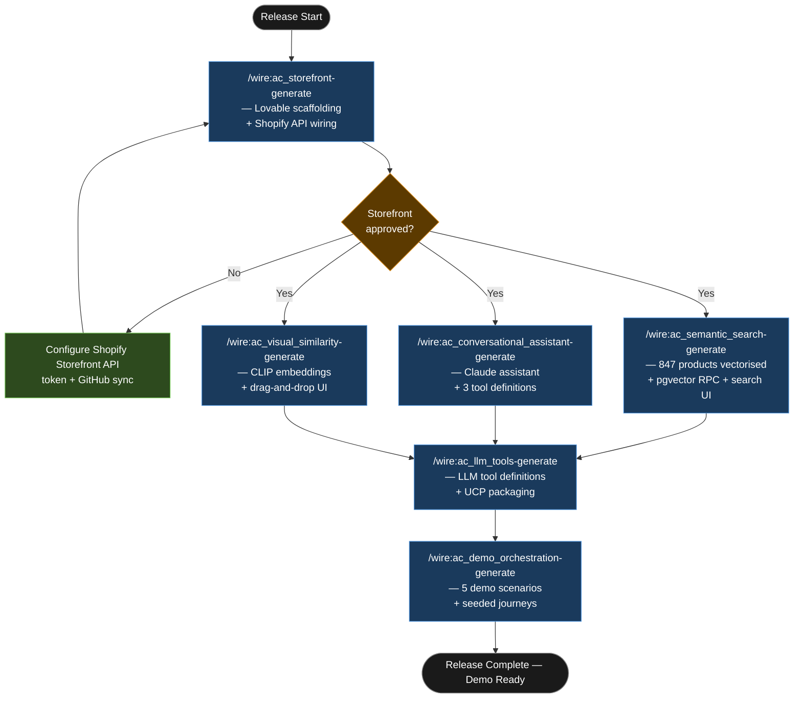

# Tutorial: Agentic Commerce

This walkthrough traces an `agentic_commerce` release from initial setup through demo-ready delivery. The client is Thornwick Outdoor Ltd, a UK direct-to-consumer outdoor equipment brand running entirely on Shopify, with three AI features to add: semantic product search, a conversational shopping assistant, and visual similarity browsing.

## Statement of Work

```
**Rittman Analytics × Thornwick Outdoor Ltd**  
**Engagement**: AI storefront features — semantic search, conversational assistant, visual similarity  
**Date**: June 2026  
**Type**: Time & materials

### Engagement overview

Thornwick Outdoor Ltd operates a Shopify store with 847 SKUs across 14 product categories. The existing storefront and checkout are functional; the brief is to add AI-powered discovery features that Shopify's native search cannot provide. Rittman Analytics will generate a React 18 storefront via Lovable as the host for these features, then build three AI capabilities against that codebase using the Wire `agentic_commerce` release type.

### In scope

- Lovable-generated React 18 + Vite + Tailwind storefront connected to the Shopify Storefront API (products, collections, cart, checkout redirect)
- Bidirectional GitHub sync between Lovable project and `thornwick-storefront` repository
- Supabase project provisioned on client's GCP organisation, with `product_embeddings` (pgvector, vector 1536) and `image_embeddings` (pgvector, vector 512) schemas
- Semantic product search: Anthropic embeddings pipeline across all 847 products, pgvector RPC (`search_products`), search UI replacing native Shopify search
- Conversational shopping assistant: Claude-powered, basket-aware, with three tool definitions (`get_product_details`, `check_stock_availability`, `get_return_policy`)
- Visual similarity browsing: CLIP embeddings on product image catalogue, drag-and-drop and camera-upload UI, 8-result similarity grid
- LLM tool definitions packaged for UCP server (5 tools: `get_product_details`, `check_stock_availability`, `get_return_policy`, `search_products`, `add_to_cart`)
- Demo orchestration: 5 scripted demo scenarios with seeded dataset of 30 customer journeys

### Out of scope

- Virtual try-on feature — deferred to Phase 2; requires AR capability assessment not yet completed
- Personalisation engine — deferred; depends on subscriber behavioural data not yet collected
- Shopify admin or backend integration — Storefront API only; no changes to product catalogue, pricing, or fulfilment configuration
- Any modifications to the existing Shopify theme or native storefront

### Timeline

| Week | Work |
|------|------|
| Week 1 | Storefront generation (Lovable), Shopify API wiring, GitHub sync, Supabase provisioning, semantic search embedding pipeline and UI |
| Week 2 | Conversational shopping assistant (3 tool definitions, system prompt, basket integration), visual similarity (CLIP pipeline, drag-and-drop UI) |
| Week 3 | LLM tool packaging for UCP server, demo orchestration (5 scenarios, seeded journeys), UAT against agreed acceptance criteria, handover |

### Key assumptions

- Thornwick's Shopify store is on Shopify Plus; Storefront API access is available and the API token will be provided before Week 1 starts
- Anthropic API key provided by client for embeddings pipeline and conversational assistant
- Supabase project can be provisioned within client's GCP organisation (eu-west-2 region)
- Product catalogue is exported as a structured JSON file and delivered to Rittman Analytics before the start of Week 1
- Client provides at least one subject-matter expert for conversational assistant knowledge review during Week 2

### Acceptance criteria

- Semantic search returns relevant results for 10 test queries agreed with client before UAT
- Conversational assistant passes 20 scripted dialogue tests covering product recommendation, stock enquiry, and returns policy scenarios
- Visual similarity returns at least 6 visually relevant products for each of 10 agreed test images
- Demo environment runs 5 scripted scenarios continuously for 30 minutes without errors or failed API calls
```


## What is an Agentic Commerce release?

The agentic_commerce release type solves a specific sequencing problem: AI features in a storefront context need a working frontend before they can be built, tested, or demonstrated — but scaffolding a production-quality React storefront from scratch is slow enough to consume most of a short engagement. Lovable eliminates that bottleneck. It generates a React 18 + Vite + Tailwind storefront from a structured prompt sequence, connected to the Shopify Storefront API, in under an hour. GitHub bidirectional sync is configured immediately after generation, so the code is in version control and available to Claude Code before the first AI feature starts.

Supabase provides the backend layer. pgvector handles embedding storage for semantic search and image similarity. Auth covers personalisation state. Both are provisioned through Lovable's project settings and available from the first feature command. This matters because the nine AI features in scope are genuinely independent after the storefront is approved — semantic search does not need the conversational assistant to exist, and visual similarity does not need either. The release type is structured to reflect that: `ac_storefront` must reach Approved before anything else starts, but the remaining features can run in parallel.

All `ac_*` generate commands are auto-delegated to the `agentic-commerce-developer` specialist agent. Review commands stay in the main session — they require your direct input and a named stakeholder sign-off. The `agentic-commerce-developer` agent writes only production code and integration configuration. It does not produce mock data or placeholder UI.

### High-Level Process


## Engagement overview

| | |
|-|-|
| **Client** | Thornwick Outdoor Ltd |
| **Engagement** | AI storefront features — semantic search, conversational assistant, visual similarity |
| **Revenue** | ~£12m, DTC only |
| **Platform** | Shopify (existing store), GitHub, Supabase, Anthropic API |
| **Release type** | `agentic_commerce` |
| **Release ID** | `01-thornwick-agentic-commerce` |

Thornwick already has a functioning Shopify store with 847 SKUs across 14 product categories, from technical outerwear to navigation equipment. The brief is to add AI-powered discovery features, not to replace the storefront — the existing Shopify checkout, product management, and fulfilment workflows remain untouched. The Wire agentic_commerce release builds a React frontend that proxies the Shopify Storefront API and adds AI capabilities that Shopify's native search cannot provide.

## Deliverables

| Deliverable | Format |
|---|---|
| React storefront | Lovable project + GitHub repo (`thornwick-storefront`) |
| Shopify Storefront API integration | Products, collections, cart, checkout redirect |
| Supabase schema | pgvector tables for product and image embeddings |
| Semantic search feature | Natural language query → ranked product results |
| Conversational shopping assistant | Multi-turn Claude-powered assistant with basket awareness |
| Visual similarity feature | CLIP embeddings, drag-and-drop UI, 8-result grid |
| LLM tool definitions | Packaged tool specs for external consumption via UCP server |
| Demo orchestration | 5 set-piece scenarios, seeded dataset with 30 customer journeys |

## Tutorial Playbook

The diagram below is the delivery playbook for this tutorial's scenario. In a live engagement, [`/wire:playbook-generate`](../reference/commands#session-and-management-commands) generates this as a Mermaid-format delivery plan — dependency order, team assignments, and target dates tailored to the specific release.



After `ac_storefront` is approved, the three AI feature commands (`ac_semantic_search`, `ac_conversational_assistant`, `ac_visual_similarity`) can run concurrently. `ac_llm_tools` and `ac_demo_orchestration` are sequential at the end — `ac_llm_tools` packages the tool definitions from all preceding features, and `ac_demo_orchestration` wraps the complete working storefront into a scripted demo.

## Walkthrough

### Engagement setup

```
/wire:new
→ Client: Thornwick Outdoor Ltd
→ Engagement name: thornwick-agentic-commerce
→ Release type: agentic_commerce
→ Release ID: 01-thornwick-agentic-commerce
→ .wire/releases/01-thornwick-agentic-commerce/status.md created
  9 features across 2 phases, all at not_started
```

:::info[Issue tracking and document sync]

Wire can sync artifact progress to [Jira](../advanced/issue-tracking#jira-integration) or [Linear](../advanced/issue-tracking#linear-integration) as each generate, validate, and review step completes. With the Jira integration, you can choose between one sub-task per lifecycle step (each moving through its own workflow states) or one ticket per artifact that transitions between issue statuses. Wire can create the Epic and issue hierarchy for you when you run `/wire:new`, or link to an existing one you have already set up.

Generated artifacts can also be replicated to [Confluence](../advanced/document-store#confluence) or [Notion](../advanced/document-store#notion) for client review — review commands pull comments and edits made in the document store back as context before gathering sign-off.

Both integrations are optional. Configure the [Atlassian](../reference/mcp-servers#atlassian), [Linear](../reference/mcp-servers#linear), or [Notion](../reference/mcp-servers#notion) MCP servers in `.claude/settings.json` to enable them.

:::


### Phase 1 — Base storefront

```
/wire:ac_storefront-generate 01-thornwick-agentic-commerce
→ [auto-delegated to agentic-commerce-developer]
```

:::info[Auto-delegation]

When you see `-> [auto-delegated to X agent]`, the main session has routed that command to a [specialist subagent](../advanced/wire-agents#auto-delegation-on-individual-commands) automatically — no extra steps needed. The specialist runs with a focused brief rather than the full engagement context, which typically produces sharper domain-specific output. Review commands (`*-review`) always stay in the main session and require your direct input.

:::

The `agentic-commerce-developer` agent runs a five-phase Lovable prompt sequence: brand foundation (Thornwick colour palette, typography, outdoor photography treatment), product grid layout, Shopify Storefront API wiring, cart and checkout flow, then GitHub sync. The Shopify Storefront API token is passed via a Supabase Edge Function — never exposed in the frontend bundle.

```
ac_storefront generation complete

  Storefront URL:   https://thornwick-outdoor.lovable.app
  GitHub repo:      github.com/thornwick-outdoor/thornwick-storefront
  Supabase project: thornwick-outdoor (eu-west-2)
  
  Shopify wiring:
    Products:     ✓  847 products, 14 collections synced via Storefront API
    Cart:         ✓  Add to cart, update quantity, remove item
    Checkout:     ✓  Redirect to Shopify checkout (existing payment flow preserved)
    
  Supabase schema:
    product_embeddings   (id, shopify_product_id, embedding vector(1536), metadata jsonb)
    image_embeddings     (id, shopify_product_id, image_url, embedding vector(512), metadata jsonb)
    
  GitHub sync: bidirectional — Lovable ↔ github.com/thornwick-outdoor/thornwick-storefront
  
  All subsequent development proceeds via Claude Code against the GitHub repo.
```

```
/wire:ac_storefront-validate 01-thornwick-agentic-commerce → PASS
/wire:ac_storefront-review 01-thornwick-agentic-commerce
→ Approved by Thornwick e-commerce lead, 2026-06-05
→ Decision: checkout stays on native Shopify — no custom checkout in scope
```

### Phase 2 — AI features

#### Semantic search

```
/wire:ac_semantic_search-generate 01-thornwick-agentic-commerce
→ [auto-delegated to agentic-commerce-developer]
```

The agent runs the product embedding pipeline against all 847 products: title, description, and key attributes combined into a single text representation, embedded via the Anthropic embeddings API, stored in the `product_embeddings` pgvector table. The search UI component is added to the storefront — a prominent search bar with natural language placeholder text ("waterproof jacket for winter hillwalking"), replacing the Shopify native search. Results are re-ranked by a lightweight in-memory scoring pass that factors in stock availability retrieved from the Storefront API.

The core Supabase RPC function:

```sql
CREATE OR REPLACE FUNCTION search_products(
  query_embedding vector(1536),
  match_threshold float DEFAULT 0.7,
  match_count int DEFAULT 12
)
RETURNS TABLE (
  shopify_product_id text,
  similarity float
)
LANGUAGE plpgsql AS $$
BEGIN
  RETURN QUERY
  SELECT
    pe.shopify_product_id,
    1 - (pe.embedding <=> query_embedding) AS similarity
  FROM product_embeddings pe
  WHERE 1 - (pe.embedding <=> query_embedding) > match_threshold
  ORDER BY pe.embedding <=> query_embedding
  LIMIT match_count;
END;
$$;
```

#### Conversational shopping assistant

```
/wire:ac_conversational_assistant-generate 01-thornwick-agentic-commerce
→ [auto-delegated to agentic-commerce-developer]
```

The agent builds a multi-turn Claude-powered assistant with basket awareness. Three tools are defined:

```json
[
  {
    "name": "get_product_details",
    "description": "Retrieve full product details including variants, pricing, stock status, and technical specifications for a specific Shopify product ID.",
    "input_schema": { "type": "object", "properties": { "product_id": { "type": "string" } }, "required": ["product_id"] }
  },
  {
    "name": "check_stock_availability",
    "description": "Check current stock levels for a product variant. Returns available quantity and estimated restock date if out of stock.",
    "input_schema": { "type": "object", "properties": { "variant_id": { "type": "string" } }, "required": ["variant_id"] }
  },
  {
    "name": "get_return_policy",
    "description": "Retrieve the current return and exchange policy for a product category.",
    "input_schema": { "type": "object", "properties": { "product_category": { "type": "string" } }, "required": ["product_category"] }
  }
]
```

The system prompt grounds the assistant in Thornwick's product range and positions it as a knowledgeable outdoor equipment specialist — not a generic retail chatbot. It has access to the current cart state via the Shopify Storefront API cart API, so it can make contextually appropriate recommendations ("you already have the Kinder Shell in your basket — the Kinder mid-layer pairs with it for temperatures below 5°C").

#### Visual similarity

```
/wire:ac_visual_similarity-generate 01-thornwick-agentic-commerce
→ [auto-delegated to agentic-commerce-developer]
```

CLIP embeddings are generated for all product primary images across the 847-product catalogue, stored in the `image_embeddings` pgvector table. The UI feature — accessible from every product card — accepts a drag-and-drop image upload or a device camera capture, embeds the input image using the same CLIP model, and returns an 8-product similarity grid. Useful for customers who have seen a jacket in a review or on another person and want to find something comparable in Thornwick's range.

#### LLM tool definitions

```
/wire:ac_llm_tools-generate 01-thornwick-agentic-commerce
→ [auto-delegated to agentic-commerce-developer]
```

The three tool definitions from `ac_conversational_assistant`, plus two additional tools (`search_products`, `add_to_cart`), are packaged into a standardised specification suitable for external consumption via the UCP server. This means the full Thornwick product intelligence capability — search, product detail, stock check, policy lookup, cart manipulation — is available to any external agent or integration that connects to the UCP server endpoint.

#### Demo orchestration

```
/wire:ac_demo_orchestration-generate 01-thornwick-agentic-commerce
→ [auto-delegated to agentic-commerce-developer]
```

The agent produces a demo control panel (floating UI, visible only in demo mode) with a five-scenario state machine:

- **Technical buyer demo**: walks through the architecture — pgvector nearest-neighbour search, tool call trace, embedding pipeline. Aimed at a client's data engineering team.
- **Commercial demo**: conversion-focused. Starts with a customer intent ("buying kit for a Cairngorm winter traverse") and demonstrates how the conversational assistant narrows from 847 products to a coherent recommended kit list in three exchanges.
- **Press/media demo**: visual-led. Opens with visual similarity search using a press image, then shows the assistant describing provenance and materials.
- **Live show flow**: optimised for a trade show screen. Runs on a 4-minute loop with pre-seeded queries that reliably return high-quality results.
- **Executive overview**: 90-second version of the commercial demo for a board-level audience.

The seeded demo dataset contains 30 realistic customer journeys — names, browsing sequences, basket states, and purchase history — loaded into Supabase to make the personalisation features demonstrably non-trivial from the first demo.

## What was produced

| Artifact | Detail |
|---|---|
| React storefront | Lovable project + `thornwick-storefront` GitHub repo, React 18 + Vite + Tailwind |
| Shopify integration | 847 products, 14 collections, cart and checkout redirect via Storefront API |
| Supabase schema | `product_embeddings` (vector 1536) + `image_embeddings` (vector 512) |
| Semantic search | Anthropic embeddings, pgvector RPC, search UI replacing native Shopify search |
| Conversational assistant | Claude, 3 tool definitions, basket-aware system prompt |
| Visual similarity | CLIP embeddings, drag-and-drop upload, 8-result similarity grid |
| LLM tool definitions | 5 tool specs packaged for UCP server consumption |
| Demo control panel | 5 scripted scenarios, 30-journey seeded dataset |
