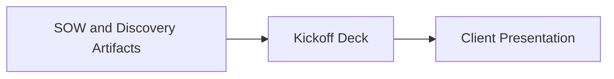
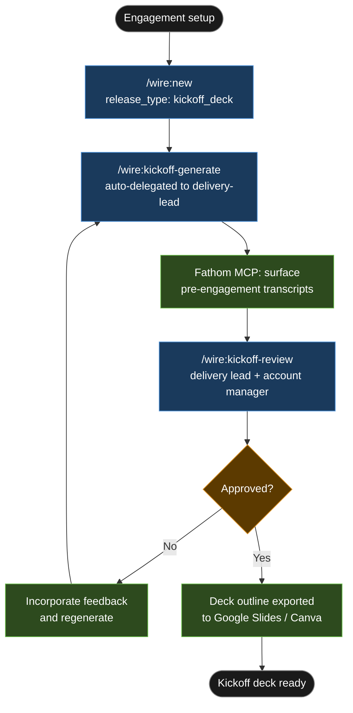

# Tutorial: Kickoff Deck

## Statement of Work

```
**Rittman Analytics × Pennant Advisory Partners**
**Engagement**: Data Platform Build
**Date**: March 2026
**Type**: Fixed price

### Engagement overview

Pennant Advisory Partners is a 30-person UK management consultancy whose board MI reporting is currently produced manually in Excel — a two-day monthly effort that caused a reporting error at board level in Q3 2025. Rittman Analytics is engaged to replace this process with a managed data platform on BigQuery, dbt, and Looker, drawing from Salesforce CRM, Sage accounting, and a bespoke project management system. The platform will deliver automated weekly refresh and self-serve dashboard access for senior partners.

### In scope

- Fivetran connectors: Salesforce (CRM), Sage (accounting), bespoke project management system → BigQuery
- dbt staging models for all three sources (`stg_salesforce_*`, `stg_sage_*`, `stg_pms_*`)
- dbt integration and warehouse models: pipeline performance, revenue by practice, utilisation
- LookML semantic layer covering all warehouse models
- Looker dashboards: pipeline performance, revenue by practice, utilisation
- Deployment to BigQuery production and Looker production
- Training: one session for the data team, one session for end users (senior partners)
- Kickoff deck (this release) — first deliverable, produced within 48 hours of SOW signature

### Out of scope

- CRM data cleansing or deduplication within Salesforce
- Sage accounting system migration or reconfiguration
- Real-time or near-real-time data streaming
- Historical data backfill beyond what Fivetran retrieves on initial sync

### Timeline

| Week | Phase | Key milestones |
|------|-------|----------------|
| Week 1 | Requirements | Requirements specification drafted; source system access confirmed |
| Weeks 2–3 | Design | Data model and pipeline design approved; steering group review gate Week 3 |
| Weeks 4–7 | Development | Fivetran connectors live; dbt models deployed; LookML and dashboards built |
| Weeks 8–9 | Testing and UAT | Data quality checks; UAT with senior partners; UAT sign-off |
| Week 10 | Deployment and enablement | Production deployment; training sessions; handover |

The kickoff deck is produced in Week 1, Day 1–2 — before requirements work begins.

### Key assumptions

- Salesforce API credentials and edition details confirmed by Pennant before Week 1 commences
- Sage accounting export format agreed and sample data provided before design begins (Week 2)
- Bespoke project management system API documentation provided before Week 4 development starts
- Client steering group meets fortnightly; all review gates are scheduled around this cadence
- James Hartley (COO) acts as sponsor and approver; Priya Mehta is the data access point of contact

### Acceptance criteria

- All dbt models pass `dbt test` with zero failures in the staging and warehouse layers
- Looker dashboards (pipeline performance, revenue by practice, utilisation) are live in Looker production and accessible to the three named senior partners
- UAT sign-off obtained from Priya Mehta by end of Week 9
- Training sessions completed and recorded; end users able to access dashboards without RA assistance

---
```


## Kickoff deck brief

The kickoff deck is a sub-task of the engagement above, scoped to one day's effort.

- Must be produced and approved within 48 hours of SOW signature — it is the first client-facing artefact
- Must reference the approved delivery timeline above (4 phases, 10 weeks, fortnightly steering group cadence)
- Must include a RACI matrix covering the key delivery activities and roles
- Must include an open questions log seeded from the two pre-engagement discovery call transcripts (Fathom), with owners and due dates assigned

---

## What is a Kickoff Deck release?

The `kickoff_deck` release type is a rapid standalone release with no technical deliverables. It produces a structured slide deck outline in Markdown — covering the engagement overview, the Wire delivery approach, team roles, the phased timeline, the artifact schedule with review gates, the first session agenda, and a log of key assumptions and open questions. Completed in one to two hours once the SOW is loaded, it is delegated automatically to the `delivery-lead` agent, which reads the SOW and any available meeting transcripts before generating anything.

No pipeline design, data model, or dbt work is in scope. The release exists purely to give the client a polished, accurate first artefact within 48 hours of signature — one that demonstrates the delivery team has read the contract and understood the engagement before walking into the room.

### High-Level Process



## Engagement overview

| | |
|-|-|
| **Client** | Pennant Advisory Partners |
| **Engagement** | Data Platform Onboarding |
| **Duration** | 10 weeks |
| **Release type** | `kickoff_deck` |
| **Release ID** | `01-pennant-kickoff` |
| **Delivery lead** | Sarah Chen |

Pennant Advisory Partners is a 30-person UK management consultancy with an operational transformation focus. The firm has signed a SOW with Rittman Analytics to replace manual board MI reporting with a managed data platform — BigQuery, dbt, and Looker — running off their existing Salesforce and project management data. The delivery lead needs a client-facing kickoff deck ready before the first steering group session, which falls 48 hours after contract signature.

## Deliverables

| Artefact | Format | Location |
|---|---|---|
| Kickoff deck outline | Markdown sections (slide-by-slide) | `.wire/releases/01-pennant-kickoff/kickoff_deck.md` |
| First session agenda | Structured agenda with owners and timings | Embedded in deck outline |
| RACI matrix | Roles × activities table | Embedded in deck outline |
| Assumptions and open questions log | Numbered log with owners | `.wire/releases/01-pennant-kickoff/assumptions.md` |

## Tutorial Playbook

The diagram below is the delivery playbook for this tutorial's scenario. In a live engagement, [`/wire:playbook-generate`](../reference/commands#session-and-management-commands) generates this as a Mermaid-format delivery plan — dependency order, team assignments, and target dates tailored to the specific release.



## Walkthrough

### Step 1 — Engagement setup

```
/wire:new
→ Client: Pennant Advisory Partners
→ Engagement name: pennant-kickoff
→ Release type: kickoff_deck
→ Release ID: 01-pennant-kickoff
→ Start date: 2026-03-10
→ Delivery lead: Sarah Chen
→ .wire/releases/01-pennant-kickoff/status.md created
  4 artifacts: kickoff_deck, session_agenda, raci, assumptions_log
  All at not_started
```

For a `kickoff_deck` release, [`/wire:new`](../reference/commands#session-and-management-commands) asks only for client name, engagement name, start date, and delivery lead name. No source system details, no stack selection. Drop the signed SOW PDF into `.wire/releases/01-pennant-kickoff/requirements/` before running the next command — that is the primary input. The agent reads nothing else if no discovery artifacts exist yet.

### Step 2 — Generate the deck

```
/wire:kickoff-generate 01-pennant-kickoff
→ [auto-delegated to delivery-lead agent]
→ Fathom context: searching for Pennant Advisory Partners recordings...
→ Fathom context: 2 recordings found

  1. Discovery call — 2026-02-22 (47 min)
     Participants: Sarah Chen (RA), James Hartley (Pennant COO), Priya Mehta (Pennant Head of Ops)
     Topics surfaced:
       - Primary pain point: board MI pack built manually in Excel, 2-day effort per month,
         errors in Q3 2025 caused a board-level incident
       - Desired state: automated weekly refresh, self-serve access for three senior partners
       - Data sources confirmed: Salesforce (Enterprise), Kimble PSA, Xero

  2. Pre-SOW alignment call — 2026-03-01 (31 min)
     Participants: Sarah Chen (RA), Mark Rittman (RA), James Hartley (Pennant COO)
     Topics surfaced:
       - Agreed engagement duration: 10 weeks
       - Preferred communication: Slack (#pennant-data) + fortnightly steering group
       - Client sponsor confirmed as James Hartley; data access point of contact is Priya Mehta
       - Budget governance: steering group approves any scope change above 0.5 days

→ Generating kickoff deck outline...
→ kickoff_deck.md written to .wire/releases/01-pennant-kickoff/
→ assumptions.md written (7 items, 3 open questions)
```

:::info Auto-delegation

When you see `-> [auto-delegated to X agent]`, the main session has routed that command to a [specialist subagent](../advanced/wire-agents#auto-delegation-on-individual-commands) automatically — no extra steps needed. The specialist runs with a focused brief rather than the full engagement context, which typically produces sharper domain-specific output. Review commands (`*-review`) always stay in the main session and require your direct input.

:::

The agent pulls the two discovery call transcripts via the Fathom MCP server and uses them to populate the deck with specifics that would otherwise require a separate briefing call — the board incident, the Kimble PSA source system, the budget governance threshold. The SOW provides the timeline and deliverable structure. Together they produce a deck outline that reads as if the delivery team has already spent time with the client. Which, via the transcripts, they have.

The generated "Delivery Timeline" slide content block looks like this:

```markdown
## Slide: Delivery Timeline

### Phase 1 — Requirements & Design (Weeks 1–3)
  - Requirements specification approved by Pennant sponsor (Week 2)
  - Data model and pipeline design approved (Week 3)
  - Review gate: steering group session, 2026-03-24

### Phase 2 — Development (Weeks 4–7)
  - Fivetran connectors: Salesforce, Kimble PSA, Xero → BigQuery
  - dbt staging → integration → warehouse models
  - LookML semantic layer and initial dashboard definitions
  - Review gate: internal review + client data team walkthrough, 2026-04-14

### Phase 3 — Testing & UAT (Weeks 7–8)
  - Data quality checks and UAT with senior partners
  - Review gate: UAT sign-off by Priya Mehta, 2026-04-28

### Phase 4 — Deployment & Enablement (Weeks 9–10)
  - Production deployment, training sessions (data team + end users)
  - Final review gate: go-live approval, 2026-05-05
  - Handover: 2026-05-12
```

The open questions section generates automatically from Fathom gaps and SOW ambiguities:

```markdown
## Open Questions

OQ-1  Data access credentials
      Salesforce, Kimble PSA, and Xero API credentials not yet received.
      Owner: Priya Mehta | Due: 2026-03-14

OQ-2  Salesforce edition and API version
      SOW references "Salesforce Enterprise" but Fivetran connector configuration
      requires the API version. Kimble PSA custom objects may affect the Fivetran
      schema — need a schema export.
      Owner: Priya Mehta | Due: 2026-03-14

OQ-3  Stakeholder availability for UAT sessions
      Three senior partners need to be available for UAT in Week 7.
      Calendar availability not yet confirmed.
      Owner: James Hartley | Due: 2026-03-17
```

### Step 3 — Review

```
/wire:kickoff-review 01-pennant-kickoff
→ [main session — review gates stay with the consultant]
→ Reviewer 1: Sarah Chen (delivery lead)
→ Reviewer 2: Tom Aldridge (account manager)
→ Feedback: update Phase 1 duration — requirements sign-off is Week 3, not Week 2,
  given Pennant's fortnightly steering group cadence
→ Regenerating...
→ Approved by Sarah Chen and Tom Aldridge, 2026-03-09
```

Review runs in the main session. The account manager's feedback here was minor — one timing adjustment flowing from the steering group cadence confirmed on the pre-SOW call. A single regeneration, reviewed and approved within the same working session.

## What was produced

| Artefact | Notes |
|---|---|
| Kickoff deck outline | 9 sections, fully populated from SOW + 2 Fathom transcripts |
| Delivery timeline | 4 phases, 4 review gate milestones, week-by-week |
| RACI matrix | 8 activities × 6 roles |
| First session agenda | 90-minute agenda with owners and time slots |
| Assumptions log | 4 confirmed assumptions |
| Open questions log | 3 items with owners and due dates |

The kickoff deck output is a Markdown document suitable for pasting into Google Slides or Canva — it is not a rendered presentation, and no PDF export step is included in this release type.
