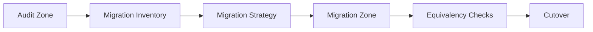
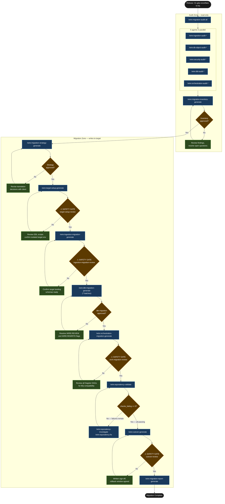

# Tutorial: Platform Migration

This walkthrough traces a complete platform migration engagement from audit through cutover, using a fictional B2B data services client moving their analytics stack from Snowflake to BigQuery. It covers every command in the migration sequence, shows how the two-zone model keeps the audit phase safe, and demonstrates the equivalency validation loop that gates cutover.

## Statement of Work

```
**Rittman Analytics × Gatwick Data Partners**
**Engagement**: Snowflake to BigQuery Platform Migration
**Date**: March 2026
**Type**: Fixed price

### Engagement overview

Gatwick Data Partners operates a Snowflake-based analytics platform that must migrate to BigQuery before a fixed board-mandated GCP consolidation deadline. The Snowflake contract renewal window cannot slip. Rittman Analytics will execute a full platform migration — 180 dbt models, four Fivetran connectors, Dagster orchestration, and the Looker semantic layer — using Wire's two-zone model to keep the audit phase entirely read-only and gate every write to the target platform behind a safety review.

### In scope

- Full audit of the existing Snowflake platform: all four Fivetran connectors (Salesforce, NetSuite, Intercom, SFTP), all Snowflake database objects, security roles and grants, 180 dbt models (classified by migration complexity), and 11 Dagster DAGs
- Migration inventory and risk matrix derived from the five audits
- Migration strategy document covering all Snowflake-to-BigQuery translation decisions
- Target BigQuery environment setup: four datasets (`gdp_raw`, `gdp_staging`, `gdp_integration`, `gdp_warehouse`), IAM bindings, service account provisioning
- Fivetran connector reconfiguration to BigQuery destinations for all four connectors (two native BQ destinations; two requiring manual reconfiguration via HVR and custom connector update)
- Translation of all 180 dbt models across seven batches (132 auto-translated, 45 guided-translate, 3 full rewrites for Snowflake VARIANT handling)
- Dagster orchestration migration: 11 DAGs rewritten for BigQuery, secrets migrated from Dagster's built-in SecretsManager to GCP Secret Manager
- Equivalency validation loop: row count, schema, value, freshness, and dbt tests run against both platforms until `checks_failing: 0`
- Structured cutover with a 72-hour Snowflake rollback window
- Migration report documenting all decisions and outcomes

### Out of scope

- Looker dashboard redesign or LookML rewrites beyond the minimum required to make existing explores work against BigQuery (the `netsuite_explore` PDT patch is in scope; broader LookML refactoring is not)
- New source connections not already active in the Snowflake environment
- Post-migration feature development, new dbt models, or analytics layer extensions
- AWS infrastructure or any GCP services outside the BigQuery and Secret Manager resources created during target setup

### Timeline

| Period | Activity |
|---|---|
| Weeks 1–2 | Audit zone: five parallel audits (ingestion, DB objects, security, dbt, orchestration), all approved before any migration work begins |
| Week 3 | Migration inventory synthesis and migration strategy document; both approved before target setup |
| Weeks 4–6 | Target setup (safety gate), Fivetran connector reconfiguration (safety gate), dbt migration batches 1–7 |
| Week 7 | Dagster orchestration migration (safety gate), equivalency validation loop — investigate and fix cycles until `checks_failing: 0` |
| Week 8 | Two-week parallel run window; final equivalency validation; cutover (safety gate); migration report |

### Key assumptions

- The existing Snowflake account remains live and accessible throughout the engagement; Rittman Analytics requires read credentials for all schemas in scope
- Gatwick Data Partners provides a GCP project (`gdp-analytics-prod`) with billing active and sufficient IAM permissions for Rittman Analytics to create datasets, service accounts, and Secret Manager secrets
- All four Fivetran connectors support BigQuery as a destination (Salesforce and NetSuite confirmed native; Intercom and SFTP compatibility to be confirmed in the ingestion audit — any gaps are a scope risk)
- The two-week parallel run window (weeks 7–8) is agreed with the client's operations team before the engagement begins; no production Snowflake workloads will be decommissioned within this window without the client's written sign-off
- Looker PDT rebuild is scheduled outside business hours; the client's retail data customers will experience a brief dashboard unavailability during the PDT rebuild at cutover

### Acceptance criteria

- All 180 dbt models producing equivalent output in BigQuery with `checks_failing: 0` across all five equivalency check types (row count ±2%, schema match, value spot-check, freshness, dbt tests)
- All four Fivetran connectors active and syncing to BigQuery destinations
- All 11 Dagster DAGs running on GCP with no sensor failures
- Looker connected to BigQuery; all 12 production dashboards verified by the client and confirmed undisrupted
- Written cutover sign-off on record in `decisions.md` from an authorised Gatwick Data Partners stakeholder before the Snowflake read access window closes
```


## What is a Platform Migration release?

The Platform Migration release type is built around one structural insight: the moment you start writing to the target platform, the risk profile changes entirely. To reflect this, Wire divides all migration work into two zones.

The **audit zone** is read-only. All five audit commands — ingestion, database objects, security, dbt, orchestration — connect to the source platform and produce catalogues. Nothing is created, reconfigured, or modified anywhere. An analyst running these commands on a production Snowflake environment cannot break anything. The zone is designed to be safely executable by someone with read credentials and no write access to either platform.

The **migration zone** writes to the target. It begins with the migration strategy — a pure document, no external writes — and escalates to DDL execution, connector reconfiguration, dbt batch translation, orchestration migration, and finally cutover. Four commands in this zone are **safety-gated**: `target-setup-review`, `ingestion-migration-review`, `orchestration-migration-review`, and `cutover-review`. Each requires explicit confirmation before Wire proceeds. The cutover gate is the point of no return — it requires all equivalency checks passing, written client sign-off on record, and an agreed rollback window.

The **equivalency validation loop** sits between orchestration migration and cutover. It runs five check types — row count, schema, value, freshness, and dbt tests — against both platforms simultaneously. When checks fail, you run `equivalency-investigate` to diagnose and `equivalency-fix` to repair. `cutover-generate` is blocked until `checks_failing: 0`. There is no way to skip this gate programmatically.

### High-Level Process



## The scenario

| | |
|-|-|
| **Client** | Gatwick Data Partners (B2B data services, UK) |
| **Engagement** | Snowflake to BigQuery platform migration |
| **Release ID** | `01-gdp-snowflake-to-bq` |
| **Release type** | `platform_migration` |
| **Migration pair** | `snowflake_to_bigquery` |
| **Target duration** | 8 weeks (parallel-run window: weeks 7–8) |

**Scope**: 180 dbt models (mix of dbt Core and dbt Cloud managed), 4 Fivetran connectors (Salesforce, NetSuite, Intercom, SFTP), Dagster orchestration with 11 DAGs, Looker semantic layer with 6 explores and 12 dashboards.

The 8-week deadline is driven by a board-mandated cloud consolidation onto GCP, which means the Snowflake contract renewal window is fixed. Slipping past it means an unplanned renewal. The Dagster migration is the most operationally uncertain element — Dagster's Snowflake and BigQuery integrations differ enough that DAG code will need hands-on review, not just syntax substitution. The Looker semantic layer must remain intact throughout; disrupting the 12 production dashboards during migration is not acceptable to the client's retail data customers.

## What you will produce

**Audit zone** — read-only analysis:

| Artifact | Location |
|---|---|
| Ingestion audit (4 Fivetran connectors catalogued) | `artifacts/ingestion_audit/` |
| DB object audit (Snowflake databases, schemas, tables, views) | `artifacts/db_object_audit/` |
| Security audit (roles, grants, service accounts) | `artifacts/security_audit/` |
| dbt audit (180 models classified by complexity) | `artifacts/dbt_audit/` |
| Orchestration audit (11 Dagster DAGs, schedules, dependencies) | `artifacts/orchestration_audit/` |
| Migration inventory (unified catalogue, risk matrix, phasing plan) | `artifacts/migration_inventory/` |

**Migration zone** — target platform artifacts:

| Artifact | Location |
|---|---|
| Migration strategy (translation decisions, wave phasing, rollback) | `artifacts/migration_strategy/` |
| Target setup DDL (BigQuery datasets, IAM, service accounts) | `artifacts/target_setup/` |
| Ingestion migration (Fivetran connector reconfigurations) | `artifacts/ingestion_migration/` |
| dbt migration (180 translated models, 7 batches) | `models/` (in-repo) |
| Orchestration migration (11 Dagster DAGs, rewritten for BigQuery) | `artifacts/orchestration_migration/` |
| Equivalency validation reports (iterative) | `artifacts/equivalency_validation/` |
| Cutover runbook | `artifacts/cutover/` |
| Migration report | `artifacts/migration_report/` |

## Tutorial Playbook

The diagram below is the delivery playbook for this tutorial's scenario. In a live engagement, [`/wire:playbook-generate`](../reference/commands#session-and-management-commands) generates this as a Mermaid-format delivery plan — dependency order, team assignments, and target dates tailored to the specific release.



## Walkthrough

### 5a. Setup and audit zone

```
/wire:new
→ Client: Gatwick Data Partners
→ Engagement name: gatwick_data_partners
→ Release type: platform_migration
→ Release ID: 01-gdp-snowflake-to-bq
→ Branch: feature/01-gdp-snowflake-to-bq

Platform Migration — additional questions:
  (1) Source platform: Snowflake
  (2) Target platform: BigQuery
  (3) dbt project path: dbt/gdp_analytics
  (4) Orchestration tool: Dagster
  (5) Connectivity: public endpoint (Snowflake + BigQuery both reachable)

→ .wire/releases/01-gdp-snowflake-to-bq/status.md created
  14 migration artifacts across audit + migration zones, all at not_started
  migration_pair: snowflake_to_bigquery
```

With the release created, run all five audits simultaneously:

```
/wire:migration-audit-all 01-gdp-snowflake-to-bq

Token cost confirmation
─────────────────────────────────────────────────────────────────
  5 audit agents × estimated 12k tokens each ≈ 60k tokens total
  Parallel (recommended): ~8 min wall-clock
  Sequential: ~35 min wall-clock

  Proceed in parallel? [Y/n]: Y

Dispatching 5 agents simultaneously:
  → [migration-specialist agent: ingestion-audit-generate]
  → [migration-specialist agent: db-object-audit-generate]
  → [migration-specialist agent: security-audit-generate]
  → [migration-specialist agent: dbt-audit-generate]
  → [migration-specialist agent: orchestration-audit-generate]
```

The dbt audit produces a complexity classification table for all 180 models:

```
dbt Audit — Model Complexity Classification
──────────────────────────────────────────────────────────────────────
  Rating      Count   Notes
  ──────────  ─────   ──────────────────────────────────────────────
  trivial       82    Views and simple selects; no platform functions
  low           50    DATE_DIFF, SPLIT, DATEADD — direct equivalents
  medium        31    Incremental models; 3+ function substitutions
  high          14    Nested FLATTEN logic; complex MERGE strategies
  blocked        3    Use VARIANT type with no BigQuery equivalent

  BLOCKED MODELS:
    stg_salesforce__opportunity_history
      — PARSE_JSON(variant_col) with downstream FLATTEN: no direct
        BQ equivalent; requires redesign as JSON STRING + JSON_EXTRACT
    int__netsuite_line_items
      — LATERAL FLATTEN(input => custom_fields) across 4 CTEs
    fct_intercom_event_attributes
      — VARIANT array with positional access [:0], [:1]: must
        rewrite using JSON_EXTRACT_ARRAY
```

The ingestion audit finds a split in Fivetran connector compatibility:

```
Ingestion Audit — Fivetran Connector Analysis
──────────────────────────────────────────────────────────────────────
  Connector       Source      Current dest   BQ native?   Action needed
  ──────────────  ──────────  ─────────────  ──────────   ─────────────
  salesforce      Salesforce  Snowflake      Yes          Add new BQ destination
  netsuite        NetSuite    Snowflake      Yes          Add new BQ destination
  intercom        Intercom    Snowflake      No           Reconfigure via HVR
  sftp_retail     SFTP        Snowflake      No (SFTP)    Custom connector update

  2 of 4 connectors support BigQuery as a native destination.
  2 require manual reconfiguration. See ingestion_audit/connector_detail.md
  for recommended approach per connector.
```

### 5b. Migration inventory

Once all five audits are approved, the inventory synthesises them:

```
/wire:migration-inventory-generate 01-gdp-snowflake-to-bq
→ [auto-delegated to migration-specialist agent]

Migration Inventory — Risk Summary
──────────────────────────────────────────────────────────────────────
  HIGH risk items (3):
    RISK-01: VARIANT type handling — 3 blocked models require full
             redesign; estimated 3–4 days manual effort
    RISK-02: Dagster secrets manager — 11 DAGs reference Snowflake
             credentials via Dagster's built-in SecretsManager using
             snowflake_resource; all must be rewritten to use
             gcp_resource and Secret Manager
    RISK-03: Looker explore using Snowflake-specific SQL — the
             netsuite_explore uses a PDT with TO_DATE(col, 'YYYY-MM-DD')
             and TIMESTAMPDIFF(day, ...); will break on BQ without
             LookML-level patch

  MEDIUM risk items (6):
    ...

  Phasing recommendation:
    Wave 1 (weeks 1–2): Connectors (Salesforce, NetSuite native BQ)
                        + trivial/low models (132 models)
    Wave 2 (weeks 3–5): Medium complexity models (31 models)
                        + Intercom/SFTP connector reconfig
    Wave 3 (weeks 5–6): High complexity models (14 models, manual review)
                        + Dagster migration
    Wave 4 (weeks 7–8): Blocked models redesign (3 models)
                        + equivalency loop + cutover
```

:::info Auto-delegation

When you see `-> [auto-delegated to X agent]`, the main session has routed that command to a [specialist subagent](../advanced/wire-agents#auto-delegation-on-individual-commands) automatically — no extra steps needed. The specialist runs with a focused brief rather than the full engagement context, which typically produces sharper domain-specific output. Review commands (`*-review`) always stay in the main session and require your direct input.

:::

### 5c. Migration strategy

```
/wire:migration-strategy-generate 01-gdp-snowflake-to-bq
→ [auto-delegated to migration-specialist agent]
```

A sample of the translation decisions from the strategy document:

```markdown
## Snowflake → BigQuery: Key Translation Decisions

### FLATTEN → UNNEST
  Snowflake: SELECT f.value FROM table, LATERAL FLATTEN(input => arr) f
  BigQuery:  SELECT f FROM table, UNNEST(arr) AS f
  Treatment: auto-translate for simple cases; guided-translate where
             FLATTEN is nested inside a CTE

### DATE_DIFF argument order
  Snowflake: DATEDIFF('day', start_date, end_date)  -- (unit, start, end)
  BigQuery:  DATE_DIFF(end_date, start_date, DAY)   -- (end, start, unit)
  Treatment: auto-translate; regex pattern is unambiguous

### SPLIT delimiter default
  Snowflake: SPLIT(col, ',') returns ARRAY
  BigQuery:  SPLIT(col, ',') returns ARRAY<STRING> — compatible
             BUT: SPLIT with no delimiter arg differs; always make
             delimiter explicit
  Treatment: guided-translate with WIRE:REVIEW on any SPLIT with
             a computed delimiter

### MERGE with explicit unique_key
  Snowflake: MERGE with WHEN MATCHED / WHEN NOT MATCHED
  BigQuery:  Same syntax; difference is in dbt's unique_key handling
             for incremental models — must be a column, not an
             expression, in BQ adapter
  Treatment: auto-translate merge SQL; flag any unique_key that is
             a dbt expression with WIRE:REVIEW
```

### 5d. Target setup (SAFETY GATE)

```
/wire:target-setup-generate 01-gdp-snowflake-to-bq
→ [auto-delegated to migration-specialist agent]
→ DDL scripts generated: artifacts/target_setup/

/wire:target-setup-validate 01-gdp-snowflake-to-bq → PASS

/wire:target-setup-review 01-gdp-snowflake-to-bq

⚠  SAFETY GATE — target-setup-review
──────────────────────────────────────────────────────────────────────
This command will create BigQuery datasets, IAM bindings, and service
accounts in the target GCP project (gdp-analytics-prod).

Before confirming, verify:
  [ ] DDL scripts reviewed: artifacts/target_setup/bigquery_ddl.sql
  [ ] Target environment is isolated from any existing production data
  [ ] Client has approved target setup in writing (attach to decisions.md)
  [ ] GCP project billing confirmed active

Proceeding creates the following resources:
  - 4 BigQuery datasets: gdp_raw, gdp_staging, gdp_integration, gdp_warehouse
  - 1 service account: wire-dbt-runner@gdp-analytics-prod.iam.gserviceaccount.com
  - IAM bindings: BigQuery Data Editor on gdp_raw/gdp_staging/gdp_integration/gdp_warehouse

Confirm? Type YES to proceed: YES

→ BigQuery datasets created (gdp_raw, gdp_staging, gdp_integration, gdp_warehouse)
→ Service account wire-dbt-runner provisioned
→ IAM bindings applied
→ artifacts/target_setup/target_setup.md updated — status: complete
```

### 5e. dbt migration — batched

With 180 models across 7 batches, Wire processes them wave by wave:

```
/wire:dbt-migration-generate 01-gdp-snowflake-to-bq
→ [auto-delegated to migration-specialist agent]
→ Processing batch 1 of 7 (trivial/low models, wave 1)
→ 26 models auto-translated, 0 guided-translate, 0 rewrite
→ Batch 1 complete. Run /wire:dbt-migration-validate to check.
```

A guided-translate example from batch 3, flagged for consultant review:

```sql
-- models/staging/stg_salesforce__opportunity_stages.sql
-- WIRE:REVIEW — DATE_DIFF used with computed interval variable.
-- Auto-translated arg order; verify business logic matches source.
-- Source (Snowflake): DATEDIFF(v_interval, created_date, close_date)
-- Translated (BigQuery): DATE_DIFF(close_date, created_date, DAY)
-- If v_interval was ever changed from 'day' at runtime, this will silently
-- compute incorrectly. Confirm v_interval is always 'day' before approving.

SELECT
    opportunity_id,
    stage_name,
    DATE_DIFF(close_date, created_date, DAY) AS days_in_stage,
    ...
```

One of the three blocked models required a full rewrite. The VARIANT handling for `fct_intercom_event_attributes`:

```sql
-- models/staging/stg_intercom__event_attributes.sql
-- WIRE:REWRITE — Original used VARIANT positional access [:0], [:1]
-- on a PARSE_JSON() column. BigQuery has no VARIANT type.
-- Rewritten to use JSON_EXTRACT_ARRAY + OFFSET-based access.
-- Original Snowflake: event_props[:0]::STRING AS prop_key
-- BigQuery equivalent below. Review SAFE offset use — source data may
-- have arrays shorter than expected.

SELECT
    event_id,
    JSON_EXTRACT_SCALAR(
        JSON_EXTRACT_ARRAY(event_props)[SAFE_OFFSET(0)]
    ) AS prop_key,
    JSON_EXTRACT_SCALAR(
        JSON_EXTRACT_ARRAY(event_props)[SAFE_OFFSET(1)]
    ) AS prop_value,
    ...
```

### 5f. Equivalency validation loop

With both platforms loaded and Dagster pointing at BigQuery, the equivalency loop begins:

```
/wire:equivalency-validate 01-gdp-snowflake-to-bq

Equivalency Validation — Run 1 of n
──────────────────────────────────────────────────────────────────────
  Check type          Tables checked   Passing   Failing
  ──────────────────  ──────────────   ───────   ───────
  Row count (±2%)            180           178         2
  Schema match               180           179         1
  Value spot-check            45            43         2
  Freshness (<4h lag)        180           180         0
  dbt tests                  180           176         4

  checks_failing: 9
  Cutover blocked until checks_failing == 0

  Failing objects:
    fct_netsuite_revenue          — row count delta: 3.1% (above 2% threshold)
    fct_salesforce_pipeline       — row count delta: 2.4%
    stg_salesforce__accounts      — schema: column 'annual_revenue_converted'
                                    NUMERIC in Snowflake, FLOAT64 in BigQuery
    fct_netsuite_revenue          — value: SUM(net_amount) differs by 0.08%
    fct_salesforce_pipeline       — value: COUNT(DISTINCT opp_id) differs
    stg_intercom__sessions        — dbt test: not_null on session_end_ts fails
    [3 more dbt test failures...]
```

Investigating the largest discrepancy — `fct_netsuite_revenue` with a 3.1% row count delta:

```
/wire:equivalency-investigate 01-gdp-snowflake-to-bq \
  --object gdp_warehouse.fct_netsuite_revenue

Investigation: fct_netsuite_revenue
──────────────────────────────────────────────────────────────────────
  Snowflake row count:  847,293
  BigQuery row count:   821,054
  Delta:                26,239 rows (3.10%)

  Likely cause identified:
    The incremental model uses unique_key = 'transaction_id || line_id'
    — a string concatenation expression. The Snowflake dbt adapter
    accepts expressions as unique_key. The BigQuery adapter does not;
    it silently fell back to a full OVERWRITE on the first run and then
    used INSERT-only on subsequent runs, missing 26k updates.

  Recommended fix:
    Add surrogate_key column to the model using
    dbt_utils.generate_surrogate_key(['transaction_id', 'line_id'])
    and set unique_key = 'surrogate_key' in the model config.
```

```
/wire:equivalency-fix 01-gdp-snowflake-to-bq \
  --object gdp_warehouse.fct_netsuite_revenue \
  --approach "Add dbt_utils surrogate_key, update unique_key config"

→ Model updated: models/warehouse/fct_netsuite_revenue.sql
→ dbt run --select fct_netsuite_revenue --full-refresh (BigQuery target)
→ Row count after fix: 847,301 (delta vs Snowflake: 8 rows, 0.001%)
→ fct_netsuite_revenue: row count PASS, value PASS
```

After three rounds of investigate-fix cycles across all failing objects:

```
/wire:equivalency-validate 01-gdp-snowflake-to-bq

Equivalency Validation — Run 4 of 4
──────────────────────────────────────────────────────────────────────
  Check type          Tables checked   Passing   Failing
  ──────────────────  ──────────────   ───────   ───────
  Row count (±2%)            180           180         0
  Schema match               180           180         0
  Value spot-check            45            45         0
  Freshness (<4h lag)        180           180         0
  dbt tests                  180           180         0

  checks_failing: 0
  Cutover gate is now unblocked.
```

### 5g. Cutover (SAFETY GATE)

```
/wire:cutover-generate 01-gdp-snowflake-to-bq
→ [auto-delegated to migration-specialist agent]

/wire:cutover-validate 01-gdp-snowflake-to-bq → PASS

/wire:cutover-review 01-gdp-snowflake-to-bq

⚠  SAFETY GATE — cutover-review (point of no return)
──────────────────────────────────────────────────────────────────────
Pre-flight requirements:
  [✓] All equivalency checks passing (checks_failing: 0, run 4)
  [✓] Written client sign-off on record
      — decisions.md entry: "GDP board sign-off received 2026-04-18,
        ref email from CTO James Forrester"
  [✓] Rollback window agreed: 72 hours post-cutover
  [✓] Looker PDT rebuild scheduled: 2026-04-22 03:00 UTC
  [✗] Dagster sensor tests on BigQuery target: NOT YET RUN
      → Run dagster asset materialize --select "*" on BQ target
        and confirm no sensor failures before proceeding

  One pre-flight item incomplete. Resolve before confirming.
```

After resolving the Dagster sensor pre-flight item:

```
Confirm cutover? This will:
  1. Pause all Dagster jobs on Snowflake
  2. Switch dbt profiles.yml target to BigQuery
  3. Rebuild Looker PDTs against BigQuery
  4. Redirect Fivetran connectors to BigQuery destinations
  5. Resume Dagster jobs pointing at BigQuery
  6. Decommission Snowflake read access (72h window)

Type YES to proceed: YES

→ Cutover runbook executing...
  Step 1/6: Dagster jobs paused on Snowflake — DONE
  Step 2/6: dbt profiles.yml switched to BigQuery — DONE
  Step 3/6: Looker PDT rebuild triggered — RUNNING (async)
  Step 4/6: Fivetran destinations switched — DONE
  Step 5/6: Dagster jobs resumed on BigQuery — DONE
  Step 6/6: Snowflake read access window: 72h from 2026-04-22 04:17 UTC
→ Cutover complete. Platform is now live on BigQuery.
```

### 5h. Migration report

```
/wire:migration-report-generate 01-gdp-snowflake-to-bq
→ [auto-delegated to migration-specialist agent]

Migration Report — 01-gdp-snowflake-to-bq
──────────────────────────────────────────────────────────────────────
  Models migrated:          180 (132 auto-translated, 45 guided-translate,
                                 3 full rewrites)
  Connectors reconfigured:  4 (2 native BQ destinations, 2 reconfigurations)
  Dagster DAGs rewritten:   11
  Rows spot-checked:        2,847 across 45 tables
  Equivalency failures at cutover: 0
  Looker explores affected: 1 (netsuite_explore PDT patched)
  Dashboards disrupted:     0

  Duration: 7.5 weeks (target: 8 weeks)

  Key decisions recorded in decisions.md:
    - VARIANT columns redesigned as JSON STRING + JSON_EXTRACT (3 models)
    - Dagster secrets migrated from built-in SecretsManager to GCP Secret Manager
    - Looker netsuite_explore PDT rewritten: TO_DATE → PARSE_DATE,
      TIMESTAMPDIFF → DATE_DIFF
    - fct_netsuite_revenue unique_key changed from expression to surrogate column
      (BigQuery adapter constraint)
    - Snowflake decommission scheduled 72h post-cutover: 2026-04-25 04:17 UTC
```

## What was produced

| Artifact | Format | Status |
|---|---|---|
| Ingestion audit | `artifacts/ingestion_audit/ingestion_audit.md` | Approved |
| DB object audit | `artifacts/db_object_audit/db_object_audit.md` | Approved |
| Security audit | `artifacts/security_audit/security_audit.md` | Approved |
| dbt audit (complexity matrix) | `artifacts/dbt_audit/dbt_audit.md` | Approved |
| Orchestration audit (11 Dagster DAGs) | `artifacts/orchestration_audit/orchestration_audit.md` | Approved |
| Migration inventory | `artifacts/migration_inventory/migration_inventory.md` | Approved |
| Migration strategy | `artifacts/migration_strategy/migration_strategy.md` | Approved |
| Target setup DDL | `artifacts/target_setup/bigquery_ddl.sql` + runbook | Approved |
| Ingestion migration config | `artifacts/ingestion_migration/` | Approved |
| dbt migration (180 models, 7 batches) | `models/` in repo | Approved |
| Orchestration migration (11 DAGs) | `artifacts/orchestration_migration/` | Approved |
| Equivalency validation reports (4 runs) | `artifacts/equivalency_validation/` | All checks passing |
| Cutover runbook | `artifacts/cutover/cutover_runbook.md` | Executed |
| Migration report | `artifacts/migration_report/migration_report.md` | Complete |
| `decisions.md` | 18 agent decisions across audit and migration zones | — |
