# The Wire Framework: Consultant Handbook

**Rittman Analytics — Internal Use**

**Version**: 3.3.0 | **Date**: March 2026

---

## Contents

1. [What Is the Wire Framework?](#1-what-is-the-wire-framework)
2. [The Problem It Solves](#2-the-problem-it-solves)
3. [Project Types](#3-project-types)
4. [Installation and Setup](#4-installation-and-setup)
5. [Core Concepts You Need to Know](#5-core-concepts-you-need-to-know)
6. [Running a Full Platform Engagement (End-to-End)](#6-running-a-full-platform-engagement-end-to-end)
7. [Running a Pipeline + dbt Engagement](#7-running-a-pipeline--dbt-engagement)
8. [Running a dbt Development Engagement](#8-running-a-dbt-development-engagement)
9. [Running a Dashboard Extension Engagement](#9-running-a-dashboard-extension-engagement)
10. [Running a Dashboard-First Rapid Development Engagement](#10-running-a-dashboard-first-rapid-development-engagement)
11. [Running an Enablement Engagement](#11-running-an-enablement-engagement)
12. [Worked Example: Barton Peveril Live Pastoral Analytics](#12-worked-example-barton-peveril-live-pastoral-analytics)
13. [Wire Autopilot: Autonomous Execution](#13-wire-autopilot-autonomous-execution)
14. [Wire Studio: Web-Based Interface (Experimental)](#14-wire-studio-web-based-interface-experimental)
15. [Extending and Customising the Framework](#15-extending-and-customising-the-framework)
16. [FAQ](#16-faq)
17. [Troubleshooting](#17-troubleshooting)

---

## 1. What Is the Wire Framework?

The Wire Framework is Rittman Analytics' proprietary AI-accelerated delivery system for data platform engagements. It uses an AI coding agent — either **Claude Code** (Anthropic) or **Gemini CLI** (Google) — as its runtime, and encodes 20+ years of analytics engineering methodology as structured, executable workflow specifications.

In practical terms: instead of a consultant manually writing dbt models, LookML, pipeline code, training materials, and documentation over several weeks, the framework directs the AI to produce all of these artifacts in a fraction of the time — with embedded quality gates ensuring the output meets our standards.

**The framework does not replace consultants.** It gives them an AI that works at machine speed and never forgets a naming convention, freeing the consultant to focus on client relationships, design decisions, and the creative problem-solving that AI cannot do.

### What it looks like in practice

You open Claude Code in a git repository where the framework is installed. You type `/wire:new` and answer a few questions about the client and project. You copy the SOW PDF into a folder. Then you work through a sequence of `/wire:*` commands — generating requirements, then designs, then code, then tests, then a deployment runbook, then training materials. At each step the framework validates the output and asks you or the client to approve it before moving on. Alternatively, you can use `/wire:autopilot` to have the AI run through the entire lifecycle autonomously — it asks a few clarifying questions upfront, then generates, validates, and self-reviews every artifact without further input.

At the end, you have: a production-ready dbt project, a LookML semantic layer, deployed Looker dashboards, data quality tests, a deployment runbook, and training materials — all version-controlled in git with a complete audit trail.

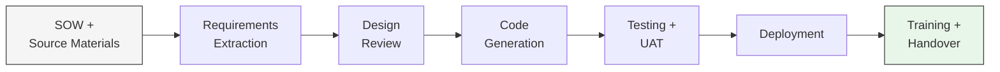

---

## 2. The Problem It Solves

### The methodology gap

Naive AI code generation tools (GitHub Copilot, raw ChatGPT prompting) can produce syntactically valid SQL. What they fail at is *methodology*:

- Consistent naming conventions across 15+ models (`stg_focus__student_notes`, not `staging_notes` or `stg_notes`)
- Correct surrogate key patterns and grain management
- Relationship test coverage on every foreign key
- Traceability from business requirements to warehouse columns
- Cross-system join integrity (Focus `assignment_marks.enrolment_id` → ProSolution `Enrolment.EnrolmentID`)
- Requirements-driven design rather than improvised structure

These failures are not knowledge failures — the models know the conventions. They are *context and control* failures. Without a structured methodology constraining the generation process, LLMs improvise, and the accumulated inconsistencies across a project erode the value proposition entirely.

### How the Wire Framework closes the gap

The framework encodes the methodology itself as workflow specifications that the AI reads before generating anything. Each specification tells the AI:

- Which upstream artifacts to read as inputs
- What templates to follow for naming, structure, and testing
- What validation checks to apply before presenting output for review
- How to update the project state tracker

The AI fills in the blanks within a tightly constrained template rather than inventing structure from scratch. The result looks like it was written by a senior analytics engineer who has been on the project for months — because it was generated by an AI that read every design decision and requirement that a senior analytics engineer would have absorbed.

---

## 3. Project Types

The framework encodes our delivery methodology as six project types, each one defining a different ordered set of in-scope artifacts and the commands that apply to them. When you run `/wire:new` and select a project type, the framework instantiates that process definition into the project's `status.md` file - writing the in-scope artifacts and their gate states as YAML frontmatter. This is how our specific delivery process gets applied to each engagement: the project type determines which artifacts to produce, in what order, and which gates each one must pass through. Artifacts that are out of scope for the selected type are marked `not_applicable` and skipped entirely.

| Type | Scope | Typical Duration | Artifacts in Scope |
|------|-------|------------------|--------------------|
| **Full Platform** | SOW → production dashboards + trained users | 2–3 weeks | All 15 artifact types |
| **Dashboard-First** | Interactive mocks drive data model; seed data enables immediate dbt | 1–2 weeks | 14 artifacts (omits workshops, conceptual_model, pipeline_design, pipeline; adds viz_catalog, seed_data, data_refactor) |
| **Pipeline + dbt** | New data pipeline + dbt transformation layer | 1–2 weeks | requirements, pipeline_design, data_model, pipeline, dbt, data_quality, deployment |
| **dbt Development** | Analytics engineering on existing infrastructure | 1 week | requirements, data_model, dbt, data_quality |
| **Dashboard Extension** | New dashboards on an existing semantic layer | 3–5 days | requirements, mockups, dashboards, uat |
| **Enablement** | Training and documentation for an existing platform | 2–3 days | training, documentation |

### Choosing the right type

- If the client needs a new data source connected end-to-end through to a dashboard: **Full Platform**
- If you want early stakeholder feedback via interactive dashboard mocks before building the data layer, especially when client data access may be delayed: **Dashboard-First**
- If the client has a BI tool / semantic layer and just needs new data flowing in: **Pipeline + dbt**
- If the data is already in the warehouse and you just need to build the transformation layer: **dbt Development**
- If the semantic layer already has the data and the client just needs new dashboards: **Dashboard Extension**
- If the platform exists and you've been engaged to train and document it: **Enablement**

**Full Platform vs Dashboard-First**: Both produce the same end result (production dashboards with a dbt warehouse). The difference is the *order of operations*. Full Platform follows the traditional flow: requirements → conceptual model → pipeline design → data model → dbt → dashboards. Dashboard-First inverts this: requirements → interactive dashboard mocks → visualization catalog → data model → seed data → dbt → dashboards → data refactor. Choose Dashboard-First when getting visual feedback early is more valuable than following the traditional top-down design sequence — typically when the SOW is well-defined enough to mock dashboards immediately but client data access may take time.

---

## 4. Installation and Setup

### Prerequisites

**Required:**
- Git repository initialised (`git init` or cloned)
- **One of** the following AI coding agents:
  - **Claude Code** — installed and authenticated (`claude` CLI). Requires Claude Pro, Max, Team, or Enterprise subscription. VS Code (1.98.0+) with Claude Code extension, or Claude Code CLI.
  - **Gemini CLI** — installed and authenticated (`gemini` CLI). Requires Gemini Code Assist subscription or Google Cloud project with Gemini API access.
- Python 3.8+ (for dbt and pipeline development)

**Recommended:**
- GitHub Desktop (for non-technical team members)
- dbt Cloud account (or dbt Core installed locally)

**Cloud platform access** (varies by project stack):
- Google Cloud: BigQuery access, Looker access, dbt Cloud connected to BigQuery, GCP service account credentials
- Other platforms: Snowflake/Databricks/Redshift credentials, BI platform access (Tableau, Power BI, etc.), dbt Cloud or dbt Core configured

### Step 1: Install the plugin or extension

**Claude Code users:**

In any Claude Code session, register the marketplace and install:
```
/plugin marketplace add rittmananalytics/wire-plugin
/plugin install wire@rittman-analytics
```
When prompted for scope, select **"Install for you (user scope)"** to make Wire available across all repositories.

Restart Claude Code. All commands are available as `/wire:*` after restart.

**Gemini CLI users:**
```bash
gemini extensions install https://github.com/rittmananalytics/wire-extension
```
All commands are available immediately as `/dp *` — no further setup required.

Each command has its full workflow specification embedded inline. No framework files need to exist in the repository. MCP servers (Atlassian, Fathom, Context7) are configured automatically.

### Step 2: Verify

Open your AI coding agent in the repository root:

```bash
claude     # Claude Code
gemini     # Gemini CLI
```

Run `/wire:start` (Claude Code) or `/dp start` (Gemini CLI) to confirm everything works.

To authenticate optional MCP integrations:
- **Claude Code**: use the `/mcp` command
- **Gemini CLI**: use `gemini mcp` commands

### Wire Studio prerequisites (optional)

Wire Studio is a separate web-based interface that runs alongside (not instead of) the CLI. If you want to use Wire Studio locally, you need:

- **Node.js 18+** and npm

No Docker required. No GitHub OAuth app required.

See [Section 14: Wire Studio](#14-wire-studio-web-based-interface-experimental) for full setup and usage instructions.

### Upgrading

Plugin and extension users get updates automatically when a new version is published. Project data in `.wire/` is never touched by upgrades — workflow specs are defensively compatible with existing project state.

---

## 5. Core Concepts You Need to Know

> **Command notation:** Commands in this handbook are shown in Claude Code format (`/wire:*`). If you are using Gemini CLI, drop the `/wire:` prefix and replace colons with spaces — e.g., `/wire:requirements-generate my_project` becomes `/dp requirements generate my_project`.

### Self-contained command architecture

Every `/wire:*` command is a single, self-contained file — the command file *is* the complete workflow specification. There is no separation between a discovery layer and a logic layer. In Claude Code, these are `.md` files distributed as a plugin; in Gemini CLI, `.toml` files distributed as an extension.

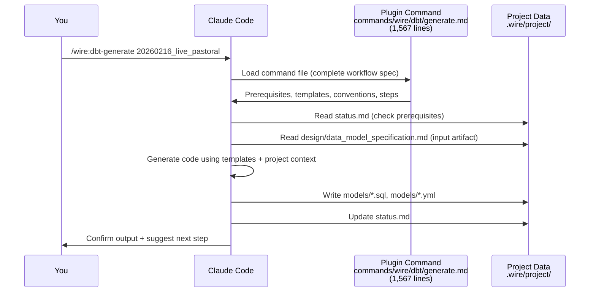

Each command file contains the full workflow inline — from 100 lines for a simple review command to over 1,500 lines for dbt generation. No external files are referenced. This means:
- Adding a new command = write one command file, rebuild the plugin/extension
- Modifying a command's behaviour = edit that one file. The change applies on the next invocation — no build step, no reinstallation

### The artifact lifecycle

Every artifact produced by the framework follows three gates:

- **Generate**: AI produces the artifact from upstream inputs and templates
- **Validate**: Automated checks run (naming, test coverage, completeness, etc.)
- **Review**: You or the client approves the artifact

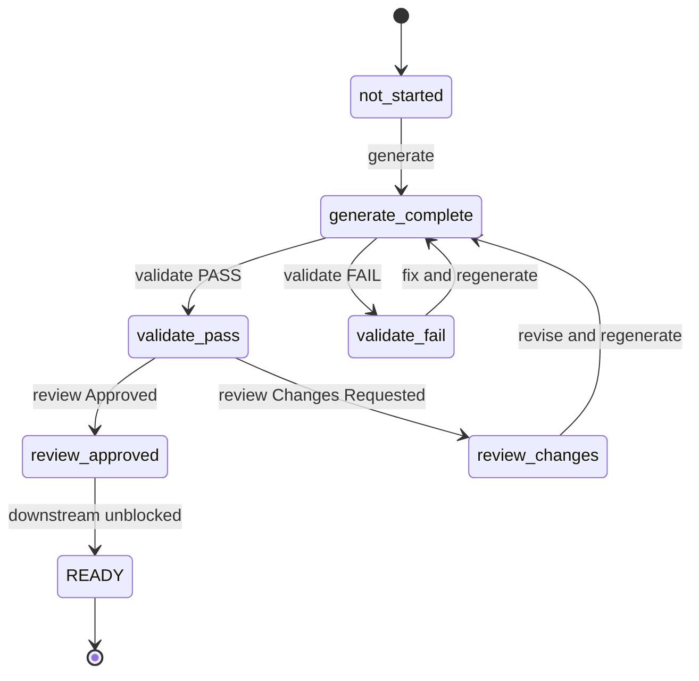

An artifact should not progress until all three gates are passed. Downstream artifacts check upstream readiness before they generate. This enforces phase discipline automatically although you can over-ride if you need to.

### Git branching

`/wire:new` enforces a mandatory branch check. If you run it while on `main` or `master`, the framework will stop and ask you to create a feature branch before any project files are created. It suggests `feature/{folder_name}` (e.g., `feature/20260210_acme_marketing_analytics`) but you can choose your own name.

If you're already on a feature branch, the check passes silently — no action required.

This ensures all project work lives on a branch that can be reviewed via pull request before merging. When the engagement is complete, create a PR with `/wire:utils-create-pr <project_id>`.

### The status file

Each project has a `status.md` file at `.wire/<project_id>/status.md`. This is the running instance of the delivery process - created by `/wire:new` when you select a project type, and updated by every subsequent command. It has two roles:

1. **Human-readable**: project overview, notes, blockers
2. **Machine-readable YAML frontmatter**: the instantiated process definition - which artifacts are in scope, which gates have been passed, and what comes next

The YAML frontmatter lists every in-scope artifact with its generate/validate/review gate states. Out-of-scope artifacts (determined by the project type) are marked `not_applicable`. Each command reads this state before executing - that's how the framework enforces phase discipline and prerequisite ordering. The framework updates `status.md` automatically after each command. You can also edit it manually to add notes or record decisions.

When you run `/wire:start`, the framework reads all `status.md` files and tells you the suggested next action across all active projects.

### The execution log

In addition to `status.md`, each project maintains an `execution_log.md` file that records a timestamped entry for every command that changes state. This provides a complete, append-only history of the delivery process — what was run, when, what the result was, and a brief summary.

```markdown
| Timestamp | Command | Result | Detail |
|-----------|---------|--------|--------|
| 2026-02-22 14:40 | /wire:requirements-generate | complete | Generated requirements spec (3 files) |
| 2026-02-22 15:12 | /wire:requirements-validate | pass | 14 checks passed, 0 failed |
| 2026-02-22 16:00 | /wire:requirements-review | approved | Reviewed by Jane Smith |
```

The log is useful for handovers (a new consultant can see the full history of what was done), for auditing (confirming when artifacts were generated and who approved them), and for debugging (identifying when a failure occurred and what preceded it).

### The chain of derivation

Each artifact constrains the next. By the time the AI generates LookML, the dimension names, measure definitions, and join paths are fully determined by upstream artifacts — there is no room for improvisation.

```mermaid
graph LR
    SOW["SOW PDF<br/><i>Client scope</i>"]
    REQ["Requirements<br/><i>FR-1..FR-N, NFR-1..NFR-N</i>"]
    CM["Conceptual Model<br/><i>Business entities<br/>+ relationships</i>"]
    PD["Pipeline Design<br/><i>Sources, replication,<br/>architecture + DFD</i>"]
    DM["Data Model<br/><i>Tables, columns,<br/>joins, seeds + ERD</i>"]
    DBT["dbt Code<br/><i>SQL models,<br/>YAML tests</i>"]
    LML["LookML<br/><i>Views, explores,<br/>measures</i>"]
    DASH["Dashboards<br/><i>Tiles, filters,<br/>layouts</i>"]

    SOW -->|"extract"| REQ
    REQ -->|"model"| CM
    CM -->|"informs"| PD
    CM -->|"informs"| DM
    PD -->|"informs"| DM
    DM -->|"generate"| DBT
    DBT -->|"expose"| LML
    LML -->|"compose"| DASH

    style SOW fill:#f9f,stroke:#333
    style DASH fill:#9f9,stroke:#333
```

The `dashboard_first` project type follows an alternative chain where interactive dashboard mocks produce a visualization catalog that drives the data model directly — the measures and dimensions the dashboards need determine what the warehouse must provide. Seed data enables dbt to run immediately without client data access, and a later data refactor step transitions from seeds to real client data.

```mermaid
graph LR
    SOW["SOW PDF"]
    REQ["Requirements"]
    MOCK["Dashboard Mocks<br/><i>Lovable interactive</i>"]
    VIZ["Viz Catalog<br/><i>Measures + dimensions</i>"]
    DM["Data Model"]
    SEED["Seed Data<br/><i>CSV files</i>"]
    DBT["dbt Code<br/><i>seed-based</i>"]
    LML["LookML"]
    DASH["Dashboards"]
    REFACTOR["Data Refactor<br/><i>seeds → real data</i>"]

    SOW -->|"extract"| REQ
    REQ -->|"mock"| MOCK
    MOCK -->|"catalog"| VIZ
    VIZ -->|"informs"| DM
    DM -->|"generate"| SEED
    SEED -->|"generate"| DBT
    DBT -->|"expose"| LML
    LML -->|"compose"| DASH
    DASH -->|"refactor"| REFACTOR

    style SOW fill:#f9f,stroke:#333
    style DASH fill:#9f9,stroke:#333
    style REFACTOR fill:#e8f5e9,stroke:#333
```

---

## 6. Running a Full Platform Engagement (End-to-End)

Use this for engagements that go from SOW to production dashboards and trained users. All 15 artifact types are in scope.

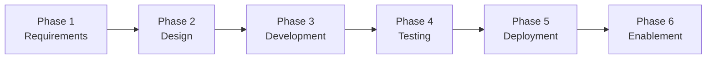

### Workflow

```
/wire:new                                          # project_type: full_platform

# Phase 1: Requirements
/wire:requirements-generate <project_id>
/wire:requirements-validate <project_id>
/wire:requirements-review <project_id>

# Phase 2: Design
/wire:conceptual_model-generate <project_id>
/wire:conceptual_model-validate <project_id>
/wire:conceptual_model-review <project_id>

/wire:pipeline_design-generate <project_id>
/wire:pipeline_design-validate <project_id>
/wire:pipeline_design-review <project_id>

/wire:data_model-generate <project_id>
/wire:data_model-validate <project_id>
/wire:data_model-review <project_id>

/wire:mockups-generate <project_id>
/wire:mockups-review <project_id>

# Phase 3: Development
/wire:pipeline-generate <project_id>
/wire:pipeline-validate <project_id>
/wire:pipeline-review <project_id>

/wire:dbt-generate <project_id>
/wire:dbt-validate <project_id>
/wire:utils-run-dbt <project_id>
/wire:dbt-review <project_id>

/wire:semantic_layer-generate <project_id>
/wire:semantic_layer-validate <project_id>
/wire:semantic_layer-review <project_id>

/wire:dashboards-generate <project_id>
/wire:dashboards-validate <project_id>
/wire:dashboards-review <project_id>

# Phase 4: Testing
/wire:data_quality-generate <project_id>
/wire:data_quality-validate <project_id>
/wire:data_quality-review <project_id>

/wire:uat-generate <project_id>
/wire:uat-review <project_id>

# Phase 5: Deployment
/wire:deployment-generate <project_id>
/wire:deployment-validate <project_id>
/wire:deployment-review <project_id>
/wire:utils-deploy-to-prod <project_id>

# Phase 6: Enablement
/wire:training-generate <project_id>
/wire:training-validate <project_id>
/wire:training-review <project_id>

/wire:documentation-generate <project_id>
/wire:documentation-validate <project_id>
/wire:documentation-review <project_id>

/wire:archive <project_id>
```

### Session start

Begin every Claude Code session with:

```
/wire:start
```

The framework shows all active projects and recommends the next action. This is your dashboard.

### Phase 1: Requirements (Day 1)

```
/wire:new
```
Answer the prompts: project type (`full_platform`), client name, project name, SOW path. Selecting `full_platform` is the key decision - it tells the framework to instantiate our full delivery process, activating all 15 artifact workflows across six phases and writing them into `status.md` as the project's process definition. Each artifact starts at `not_started` for all three gates (generate, validate, review). A `pipeline_only` project would only activate seven artifacts; a `dashboard_extension` just four. If you're on `main` or `master`, the framework will ask you to create a feature branch (e.g., `feature/20260202_barton_peveril_live_pastoral`) before creating any files. Optionally set up Jira tracking — you can create new issues, link to existing issues in the client's Jira board, or skip.

**After `/wire:new` completes**: Copy the SOW PDF (and any other source materials — meeting notes, SQL examples, existing data model docs) into the newly created `.wire/<project_id>/artifacts/` directory before running the next command.

```
/wire:requirements-generate <project_id>
```
The AI reads the SOW PDF, extracts structured requirements (functional, non-functional, data, technical, user), maps each SOW deliverable to the framework artifacts that will produce it, and writes `requirements/requirements_specification.md`.

```
/wire:requirements-validate <project_id>
```
Checks completeness across all 13 sections, verifies each deliverable has acceptance criteria, and flags any timeline feasibility concerns.

```
/wire:requirements-review <project_id>
```
Present the requirements to the client stakeholder. Record their approval (or requested changes) in the framework. If changes are needed: address them and re-run generate + validate + review.

**If requirements need workshop clarification**:
```
/wire:workshops-generate <project_id>
/wire:workshops-review <project_id>
```

**Ready criteria**: requirements artifact is `review: approved`.

### Phase 2: Design (Days 2–4)

The design phase now follows a defined sequence. The conceptual model gates everything else.

#### Step 1: Conceptual entity model (Day 2 morning)

```
/wire:conceptual_model-generate <project_id>
```
Produces a business-level entity model: an inventory of domain entities, a Mermaid `erDiagram` (entity names and relationships, no columns), and a relationship narrative. Any ambiguous entity boundaries or scope questions are surfaced as Open Questions.

```
/wire:conceptual_model-validate <project_id>
```
Checks entity coverage against functional requirements, cardinality completeness, diagram syntax, PascalCase naming, and that no column-level detail has leaked in.

```
/wire:conceptual_model-review <project_id>
```
**Review audience: business stakeholders, not just the technical team.** The goal is to confirm the entity landscape — what the business cares about — before pipeline architecture and detailed modelling begins. Approving entities here constrains everything that follows.

**Ready criteria**: `conceptual_model: review: approved` — this unblocks pipeline_design and data_model.

#### Step 2: Pipeline design + data flow diagram (Day 2–3)

```
/wire:pipeline_design-generate <project_id>
```
Produces the full pipeline architecture document — source system analysis, replication scenarios with cost analysis, scheduling, error handling, design decisions requiring client input — **plus an embedded Data Flow Diagram (DFD)** as a Mermaid flowchart showing the end-to-end movement of data from source systems through ingestion, staging, warehouse, to BI dashboards.

```
/wire:pipeline_design-validate <project_id>
```
Validates the architecture text and the DFD: all sources present, entity coverage through the flow, staging naming conventions, node labels populated (no placeholders), and Mermaid syntax.

```
/wire:pipeline_design-review <project_id>
```
Technical review with the data engineering lead. Resolve any open design decisions (replication scenarios, scheduling choices) before this is approved.

#### Step 3: Data model specification + physical ERD (Day 3–4)

```
/wire:data_model-generate <project_id>
```
Produces the complete dbt-layer data model specification — source definitions with freshness thresholds, staging models with grain and column mappings, integration models, warehouse models with surrogate keys and FK paths, seed files — **plus an embedded Physical ERD** as a Mermaid `erDiagram` with every warehouse model, all columns with types, PKs, FKs, and relationship lines. This is the most consequential design artifact.

```
/wire:data_model-validate <project_id>
```
Validates naming conventions, grain definitions, PK/FK traceability, test coverage plan, and ERD consistency (every ERD entity matches the model spec, every FK has a corresponding join definition).

```
/wire:data_model-review <project_id>
```
**This is the most important review gate in the full-platform workflow.** Approving a model with incorrect grain, wrong join keys, or missing entities is expensive to fix after dbt code is generated. Reviewer: analytics engineering lead. Allow adequate time.

#### Step 4: Dashboard mockups (Day 4)

```
/wire:mockups-generate <project_id>
```
Produces dashboard wireframes based on the requirements. Review with end users, not the technical stakeholder.

**Ready criteria**: all four design artifacts are `review: approved`.

### Phase 3: Development (Days 5–8)

```
/wire:pipeline-generate <project_id>
```
Generates data pipeline code (Python, Cloud Functions, or equivalent) based on the approved pipeline design. Includes extract logic, load logic, error handling, and scheduling configuration.

```
/wire:dbt-generate <project_id>
```
Generates all dbt models — staging, integration, and warehouse layers — from the approved data model specification. The generation workflow embeds comprehensive analytics engineering conventions: field naming rules (`_pk`, `_fk`, `_natural_key`, `_ts`, `is_`/`has_` prefixes), field ordering (keys → dates → attributes → metrics → metadata), SQL style rules (4-space indentation, 80-char lines, explicit joins, `s_` CTE prefix, `final` CTE pattern), and multi-source framework support for projects with multiple source systems (configuration-driven source management, entity deduplication with `merge_sources` macro, `IN UNNEST()` join patterns). Convention loading follows a 2-tier system: project-specific conventions (`.dbt-conventions.md`) take priority over embedded defaults. Includes YAML documentation files and automated tests (not_null + unique on every PK, relationships on every FK, typically 40–50 tests for a mid-sized engagement).

```
/wire:utils-run-dbt <project_id>
```
Runs the generated dbt models in dbt Cloud or locally. Verify all models build and tests pass before proceeding.

```
/wire:dbt-validate <project_id>
```
Validates dbt models against a comprehensive checklist: file and model naming conventions (singular names, correct layer prefixes/suffixes), field naming conventions (`_pk`, `_fk`, `_ts`, boolean prefixes), field ordering, SQL structure (CTE patterns, style compliance), model configuration (materialization by layer), testing coverage (PK tests, FK relationships, integration model unique combinations), documentation coverage (100% for staging and warehouse layers), and optionally runs sqlfluff linting. Produces a structured validation report with severity-rated issues (critical, important, nice-to-have) and actionable recommendations.

```
/wire:semantic_layer-generate <project_id>
```
Generates LookML views, explores, measures, and dimension definitions from the approved dbt models. The generation follows a 9-phase workflow: understand the task, examine existing LookML project, parse schema information (with full data type mapping), design the LookML structure, create view files (with embedded templates for primary keys, string/date/numeric dimensions, derived fields, measures, and drill sets), update model files, validate syntax, and provide a handover summary. Includes 5 embedded patterns (dimension table, fact table, aggregated PDT, multi-join explore, native derived table with parameters) and BigQuery-specific support (nested/repeated fields with UNNEST, partitioned table optimization, JSON field handling). Validation includes mandatory table/column reference cross-checking against source DDL and `preferred_slug` compliance checking.

```
/wire:dashboards-generate <project_id>
```
Generates Looker dashboard LookML from the approved mockups and semantic layer. Validate and review.

**Ready criteria**: all four development artifacts are `review: approved` and dbt tests passing.

### Phase 4: Testing (Days 9–10)

```
/wire:data_quality-generate <project_id>
```
Generates additional data quality tests beyond the embedded dbt tests: freshness checks, row count reconciliation, cross-system validation, custom business rules.

```
/wire:utils-run-dbt <project_id>
```
Run dbt tests (use `--test` flag). Review any failures and fix the underlying data or model issues.

```
/wire:uat-generate <project_id>
```
Generates a UAT plan mapped to the functional requirements. Conduct UAT sessions with end users, record outcomes, and iterate on any issues.

```
/wire:uat-review <project_id>
```
Records UAT sign-off. Do not proceed to deployment without this.

**Ready criteria**: all dbt tests passing, UAT approved.

### Phase 5: Deployment (Day 11)

```
/wire:deployment-generate <project_id>
```
Generates the deployment runbook (step-by-step production deployment instructions), CI/CD pipeline configuration, monitoring and alerting setup, and rollback procedures.

```
/wire:deployment-validate <project_id>
```
Pre-deployment checklist: verifies all upstream artifacts are ready, no outstanding blockers, monitoring configuration complete.

```
/wire:utils-deploy-to-dev <project_id>
```
Test the deployment process in the dev environment.

```
/wire:utils-deploy-to-prod <project_id>
```
Follow the runbook. Smoke-test after deployment. Monitor for the first 24 hours.

**Ready criteria**: production deployment successful, monitoring operational.

### Phase 6: Enablement (Days 12–13)

```
/wire:training-generate <project_id>
```
Generates two training packages:
- **Data team enablement**: technical session plan (2 hours), covering how to extend the models, add new data sources, interpret monitoring alerts
- **End user training**: dashboard usage session (90 minutes), including responsible interpretation of data signals

```
/wire:training-review <project_id>
```
Rehearse sessions internally before delivering. Record any adjustments.

Deliver the training sessions. Record attendance in status.

```
/wire:documentation-generate <project_id>
```
Generates technical architecture documentation and end-user guides. Validate and finalise.

```
/wire:archive <project_id>
```
Archives the completed project and produces a project summary. The engagement is done.

### Utility commands available at any phase

In addition to the phase-specific commands above, the framework provides utility commands that can be used at any point during an engagement:

- **`/wire:utils-run-dbt <project_id>`** — Runs the generated dbt models in dbt Cloud or locally
- **`/wire:utils-deploy-to-dev <project_id>`** — Deploys to the development environment
- **`/wire:utils-deploy-to-prod <project_id>`** — Deploys to the production environment
- **`/wire:utils-meeting-context <project_id>`** — Retrieves Fathom meeting transcripts for project context, useful for capturing client decisions and requirements discussed in calls
- **`/wire:utils-jira-sync <project_id>`** — Syncs artifact status to Jira issues, keeping project management tools in sync with framework state
- **`/wire:utils-jira-status-sync <project_id>`** — Full reconciliation of all artifact states to Jira, ensuring complete alignment between framework status and Jira
- **`/wire:utils-jira-create <project_id>`** — Creates or links Jira issues for a project. Can create a new Epic/Task/Sub-task hierarchy from scratch, or search an existing Jira project for matching issues and link to them (e.g. when the client's board already has issues in a running sprint)
- **`/wire:utils-atlassian-search <project_id>`** — Searches Confluence for project documentation, useful for finding existing client documentation and prior engagement materials

---

## 7. Running a Pipeline + dbt Engagement

Use this when the client needs a new data source connected through to the dbt layer, but already has a BI tool / semantic layer in place or that work is out of scope.

**In-scope artifacts**: `requirements`, `workshops` (if needed), `pipeline_design`, `data_model`, `pipeline`, `dbt`, `data_quality`, `deployment`

**Out of scope**: `mockups`, `semantic_layer`, `dashboards`, `uat`, `training`, `documentation`

### Workflow

```
/wire:new                                   # project_type: pipeline_dbt
/wire:requirements-generate <project_id>
/wire:requirements-validate <project_id>
/wire:requirements-review <project_id>

/wire:pipeline_design-generate <project_id>
/wire:pipeline_design-validate <project_id>
/wire:pipeline_design-review <project_id>

/wire:data_model-generate <project_id>
/wire:data_model-validate <project_id>
/wire:data_model-review <project_id>

/wire:pipeline-generate <project_id>
/wire:pipeline-validate <project_id>
/wire:pipeline-review <project_id>

/wire:dbt-generate <project_id>
/wire:dbt-validate <project_id>
/wire:utils-run-dbt <project_id>
/wire:dbt-review <project_id>

/wire:data_quality-generate <project_id>
/wire:data_quality-validate <project_id>
/wire:data_quality-review <project_id>

/wire:deployment-generate <project_id>
/wire:deployment-validate <project_id>
/wire:deployment-review <project_id>
/wire:utils-deploy-to-prod <project_id>

/wire:archive <project_id>
```

---

## 8. Running a dbt Development Engagement

Use this when data is already in the warehouse (e.g. via Fivetran, Stitch, or manual loads) and you need to build or extend the dbt transformation layer.

**In-scope artifacts**: `requirements`, `conceptual_model`, `data_model`, `dbt`, `data_quality`

### Workflow

```
/wire:new                                   # project_type: dbt_development
/wire:requirements-generate <project_id>    # Focus on transformation requirements
/wire:requirements-validate <project_id>
/wire:requirements-review <project_id>

/wire:conceptual_model-generate <project_id>
/wire:conceptual_model-validate <project_id>
/wire:conceptual_model-review <project_id>

/wire:data_model-generate <project_id>      # Read existing source schema + requirements
/wire:data_model-validate <project_id>
/wire:data_model-review <project_id>

/wire:dbt-generate <project_id>
/wire:dbt-validate <project_id>
/wire:utils-run-dbt <project_id>
/wire:dbt-review <project_id>

/wire:data_quality-generate <project_id>
/wire:data_quality-validate <project_id>
/wire:data_quality-review <project_id>

/wire:archive <project_id>
```

**Tips for dbt-only engagements**:
- Add any existing dbt project files (existing `schema.yml`, source definitions, SQL examples) to `artifacts/` before running `data_model:generate` — the AI will use them to understand the existing model structure and extend it correctly
- Use `artifacts/` to store SQL examples from the source database — schema introspection results, sample queries — so the AI understands actual column names and types

---

## 9. Running a Dashboard Extension Engagement

Use this when the semantic layer already has the data, and you're adding new dashboards on top.

**In-scope artifacts**: `requirements`, `mockups`, `dashboards`, `uat`

### Workflow

```
/wire:new                                   # project_type: dashboard_extension
/wire:requirements-generate <project_id>    # Focus on dashboard/user requirements
/wire:requirements-validate <project_id>
/wire:requirements-review <project_id>

/wire:mockups-generate <project_id>         # Wireframes for review with end users
/wire:mockups-review <project_id>

/wire:dashboards-generate <project_id>
/wire:dashboards-validate <project_id>
/wire:dashboards-review <project_id>

/wire:uat-generate <project_id>
/wire:uat-review <project_id>

/wire:archive <project_id>
```

**Tips**:
- Add existing LookML view files to `artifacts/` before generating dashboards — the AI needs to know which dimensions and measures are available
- Mock data files or screenshot of existing Looker explores also help

---

## 10. Running a Dashboard-First Rapid Development Engagement

Use this when you want early stakeholder feedback via interactive dashboard mocks before building the data layer. This approach is especially effective when the SOW is well-defined but client data access may be delayed — you can have a working prototype with seed data before the client provides database credentials.

**In-scope artifacts**: `requirements`, `mockups`, `viz_catalog`, `data_model`, `seed_data`, `dbt`, `semantic_layer`, `dashboards`, `data_refactor`, `data_quality`, `uat`, `deployment`, `training`, `documentation`

**Out of scope**: `workshops`, `conceptual_model`, `pipeline_design`, `pipeline`

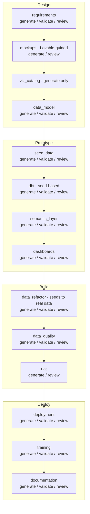

### Workflow

```
/wire:new                                          # project_type: dashboard_first

# Phase 1: Requirements (Day 1)
/wire:requirements-generate <project_id>
/wire:requirements-validate <project_id>
/wire:requirements-review <project_id>

# Phase 2: Interactive Dashboard Mocks (Day 1–2)
/wire:mockups-generate <project_id>               # Lovable-guided workflow
/wire:mockups-review <project_id>

# Phase 3: Visualization Catalog (Day 2)
/wire:viz_catalog-generate <project_id>           # Generate-only, no validate/review

# Phase 4: Data Model (Day 2–3)
/wire:data_model-generate <project_id>            # Driven by viz_catalog, not conceptual model
/wire:data_model-validate <project_id>
/wire:data_model-review <project_id>

# Phase 5: Seed Data (Day 3)
/wire:seed_data-generate <project_id>             # CSV files with referential integrity
/wire:seed_data-validate <project_id>
/wire:seed_data-review <project_id>

# Phase 6: Development — seed-based (Days 3–5)
/wire:dbt-generate <project_id>                   # Uses ref() to seeds, not source()
/wire:dbt-validate <project_id>
/wire:utils-run-dbt <project_id>                  # dbt seed && dbt run && dbt test
/wire:dbt-review <project_id>

/wire:semantic_layer-generate <project_id>
/wire:semantic_layer-validate <project_id>
/wire:semantic_layer-review <project_id>

/wire:dashboards-generate <project_id>
/wire:dashboards-validate <project_id>
/wire:dashboards-review <project_id>

# Phase 7: Data Refactor — seeds → real data (when client data available)
/wire:data_refactor-generate <project_id>         # Compares seed schema to real schema
/wire:data_refactor-validate <project_id>         # Verifies dbt compiles against real data
/wire:data_refactor-review <project_id>

# Phase 8: Testing
/wire:data_quality-generate <project_id>
/wire:data_quality-validate <project_id>
/wire:data_quality-review <project_id>

/wire:uat-generate <project_id>
/wire:uat-review <project_id>

# Phase 9: Deployment + Enablement
/wire:deployment-generate <project_id>
/wire:deployment-validate <project_id>
/wire:deployment-review <project_id>
/wire:utils-deploy-to-prod <project_id>

/wire:training-generate <project_id>
/wire:training-validate <project_id>
/wire:training-review <project_id>

/wire:documentation-generate <project_id>
/wire:documentation-validate <project_id>
/wire:documentation-review <project_id>

/wire:archive <project_id>
```

### Phase 1: Requirements (Day 1)

Same as Full Platform — copy the SOW to `artifacts/`, run requirements generate/validate/review. The key difference is that requirements approval unblocks **mockups** (not conceptual model).

### Phase 2: Interactive Dashboard Mocks (Day 1–2)

This is the key differentiator. Instead of generating ASCII wireframes, the mockups command for `dashboard_first` projects guides you through creating interactive dashboard mocks using [Lovable](https://lovable.dev).

```
/wire:mockups-generate <project_id>
```

The framework:
1. Reads the approved requirements and generates a **session brief** — a summary of the use case, key questions, and suggested dashboard pages
2. URL-encodes the use case and presents a ready-to-click `getmock.rittmananalytics.com` URL
3. You open the URL in your browser and Lovable creates an interactive dashboard mock
4. Iterate with stakeholders until they're happy with the layout and content
5. Run the Lovable prompt (provided by the framework) to generate two files:
   - A **CSV visualization catalog** (one row per chart: dashboard page, visualization name, chart type, measures, dimensions)
   - A **markdown dashboard specification**
6. Save both files into `.wire/<project_id>/design/`

```
/wire:mockups-review <project_id>
```

Review the Lovable mocks with end users and stakeholders. Share the published Lovable URL (e.g. `https://project-demo.lovable.app/`) for async feedback.

**Tips**:
- Share the Lovable mock URL with stakeholders as early as possible — even before requirements are formally approved if the SOW is clear enough. Early visual feedback is the whole point.
- Iterate on the mocks in Lovable before running `viz_catalog:generate`. Changes after the catalog is generated require regenerating downstream artifacts.

### Phase 3: Visualization Catalog (Day 2)

```
/wire:viz_catalog-generate <project_id>
```

This is a **generate-only** artifact (no separate validate or review gates). The command parses the CSV and markdown from Lovable into a structured catalog: a dashboard inventory, measures index, dimensions index, and requirements coverage analysis. This answers the question: exactly which measures and dimensions must the data model provide?

### Phase 4: Data Model (Day 2–3)

```
/wire:data_model-generate <project_id>
```

For `dashboard_first`, the data model is driven by the **visualization catalog** instead of a conceptual model and pipeline design. The prerequisites are `requirements: approved` and `viz_catalog: complete` (not `conceptual_model: approved` + `pipeline_design: approved` as in Full Platform).

The command also generates `source_tables_ddl.sql` and `target_warehouse_ddl.sql` in the design folder — SQL DDL files that define the expected source and target schemas.

### Phase 5: Seed Data (Day 3)

```
/wire:seed_data-generate <project_id>
```

After the data model is approved, the framework generates **internally consistent CSV seed data files** — one per source table — with realistic, domain-appropriate values that maintain referential integrity across all foreign key relationships.

The seed data validation gate checks:
- PK uniqueness (no duplicate primary keys)
- FK integrity (every foreign key value exists in the referenced table)
- Date consistency (no future dates in historical fields, chronological ordering)
- Value distributions (realistic for meaningful dashboard visualizations)

### Phase 6: Development — seed-based (Days 3–5)

```
/wire:dbt-generate <project_id>
```

For `dashboard_first`, dbt generation uses `ref('seed_name')` instead of `source()` — meaning `dbt seed && dbt run && dbt test` works immediately without any client data access. You have a working dbt project, populated warehouse, and functional dashboards before the client provides database credentials.

The rest of development (semantic layer, dashboards) proceeds as in Full Platform.

### Phase 7: Data Refactor (when client data available)

```
/wire:data_refactor-generate <project_id>
```

Once the client provides access to their actual data sources (DDLs, database credentials, or standard SaaS connector schemas), this command:
1. Compares the seed-based source schema against the real one
2. Generates a refactoring plan documenting every change needed
3. Executes the changes: updates source definitions, staging model SQL, and dbt configuration
4. Preserves seed files as reference

The transition from `ref('customers_seed')` to `source('salesforce', 'accounts')` is a mechanical operation guided by the schema comparison. This step — which would be expensive to do manually — is straightforward because the staging models were designed from the start to be refactorable.

### Tips for dashboard-first engagements

- **Start mocking early**: You can begin Lovable mocks during the SOW preparation phase or even before project kick-off. The earlier stakeholders see something visual, the better the feedback.
- **Seed data quality matters**: Realistic seed data makes the prototype convincing. The framework generates domain-appropriate values, but review the seeds for realism before showing to stakeholders.
- **Don't delay the refactor**: Once client data is available, run the data refactor promptly. The longer you wait, the more the seed-based version diverges from what the client expects.
- **The prototype is disposable**: The seed-based dbt project exists to validate the design. The real value is the iteration it enables, not the seed data itself.

---

## 11. Running an Enablement Engagement

Use this when an existing platform needs training and documentation — either as a standalone engagement or as the final phase of a delivery that was not originally run through the Wire Framework.

**In-scope artifacts**: `training`, `documentation`

### Workflow

```
/wire:new                                   # project_type: enablement
/wire:requirements-generate <project_id>    # Capture training audience and learning objectives

/wire:training-generate <project_id>
/wire:training-validate <project_id>
/wire:training-review <project_id>

/wire:documentation-generate <project_id>
/wire:documentation-validate <project_id>
/wire:documentation-review <project_id>

/wire:archive <project_id>
```

**Tips**:
- Add any existing technical documentation, data dictionaries, or architecture diagrams to `artifacts/` — the AI will use them as the basis for generated materials
- Add the client stakeholder list (names, roles, technical levels) to `artifacts/` so training materials can be calibrated appropriately

---

## 12. Worked Example: Barton Peveril Live Pastoral Analytics

This section shows how a real engagement — a Full Platform project for Barton Peveril Sixth Form College — was run through the framework, including the actual commands used and the decisions made at each step.

### Engagement overview

| | |
|-|-|
| **Client** | Barton Peveril Sixth Form College, Hampshire |
| **Project** | Live Pastoral Analytics (SOW 2) |
| **Duration** | 2 weeks (Feb 2–13, 2026) |
| **Budget** | $7,100 / 35 hours |
| **Project type** | Full Platform |

**SOW deliverables**:

| ID | Deliverable | Framework Artifacts |
|----|-------------|-------------------|
| D1 | Live Pastoral Data Pipeline (ProSolution + Focus → BigQuery) | `pipeline_design`, `pipeline`, `data_quality` |
| D2 | Looker Semantic Layer Extension (risk signals) | `data_model`, `dbt`, `semantic_layer` |
| D3 | SPA Operational Dashboard | `mockups`, `dashboards` |
| D4 | Data Team Enablement Session | `training` (technical) |
| D5 | End User Training Session | `training` (end-user) |

### Data architecture

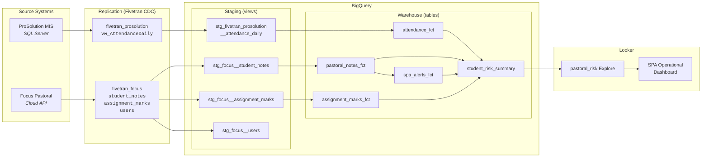

### Week 1: Requirements → Design → Development (Part 1)

#### Day 1 — Requirements and design kick-off

```bash
# Initialise the project
/wire:new
# → project_type: full_platform (activates all 15 artifact workflows)
# → client: Barton Peveril Sixth Form College
# → project_name: barton_peveril_live_pastoral
# → project_id: 20260202_barton_peveril_live_pastoral
# → branch: feature/20260202_barton_peveril_live_pastoral (created automatically if on main)
# → status.md created with full delivery process: requirements through enablement
```

Selecting `full_platform` instantiated our complete delivery process into the project's `status.md` - all 15 artifacts across six phases, each with generate/validate/review gates set to `not_started`. This is the process definition that will govern the entire engagement.

Copy the SOW PDF to `.wire/20260202_barton_peveril_live_pastoral/artifacts/`.

Also copy into `artifacts/`:
- Client SQL examples showing the ProSolution schema (`vw_AttendanceDaily`, `RegisterMark`, `RegisterStudent`, etc.)
- Meeting notes from the pre-engagement call

```
/wire:requirements-generate 20260202_barton_peveril_live_pastoral
```

**What the AI produced**:
- 13-section requirements specification (150+ lines)
- Functional requirements FR-1 through FR-9 with measurable acceptance criteria
- Non-functional requirements NFR-1 through NFR-7 (performance, security, freshness SLAs)
- D1–D5 deliverable-to-artifact mapping
- Key design flags requiring workshop resolution: attendance granularity (register-level vs daily snapshot), Fivetran replication cost vs data refresh frequency

```
/wire:requirements-validate 20260202_barton_peveril_live_pastoral
→ PASS (all 13 sections complete, acceptance criteria present for all deliverables)

/wire:requirements-review 20260202_barton_peveril_live_pastoral
→ Approved by Head of MIS, 2026-02-03
```

```
/wire:mockups-generate 20260202_barton_peveril_live_pastoral
```

Dashboard wireframes for the SPA Operational Dashboard:
- At-risk student list (attendance + pastoral note indicators)
- Unanswered SPA alert tracker
- Student detail drillthrough panel

Reviewed with SPAs and pastoral leads on Day 2.

#### Day 2 — Design review and development start

```
/wire:pipeline_design-generate 20260202_barton_peveril_live_pastoral
```

**What the AI produced** (using the SQL examples from artifacts/):
- Source schema analysis: ProSolution — `StudentDetail` → `Enrolment` → `RegisterStudent` → `RegisterMark` → `MarkType` → `RegisterSession`
- Three Fivetran replication scenarios with cost analysis:
  - Scenario A: Raw register-level tables (high granularity, high MAR cost)
  - Scenario B: Server-side view `vw_AttendanceDaily` (moderate cost, DBA creates)
  - Scenario C: Hybrid (daily view for dashboard, raw tables for drill-through)
- Architecture diagrams for all scenarios
- 10 design decisions (PD-1 through PD-10) requiring client input

**Decision taken**: Scenario C (Hybrid). Client DBA created `vw_AttendanceDaily` on the ProSolution SQL Server. Pipeline design went through two versions (v2.0 added Markbook/Assignment data to scope).

```
/wire:data_model-generate 20260202_barton_peveril_live_pastoral
```

**What the AI produced**:
- Complete `_sources.yml` for `fivetran_focus` and `fivetran_prosolution` with column-level descriptions and freshness thresholds (`warn_after: 30 min / error_after: 60 min` for Focus live data; `warn_after: 120 min / error_after: 1560 min` for ProSolution daily view)
- Staging models: `stg_fivetran_prosolution__attendance_daily`, `stg_focus__student_notes`, `stg_focus__assignment_marks`, `stg_focus__users`
- Warehouse models: `attendance_fct`, `pastoral_notes_fct`, `spa_alerts_fct`, `assignment_marks_fct`, `student_risk_summary` (aggregate)
- Seed files: `note_type_mappings.csv`, `attendance_mark_types.csv`
- Cross-system join keys documented: Focus `assignment_marks.enrolment_id` → ProSolution `Enrolment.EnrolmentID`

Note: the AI flagged that note body text should be excluded at the Fivetran level for safeguarding reasons — the `student_notes.body` column was explicitly marked as not replicated.

#### Days 3–4 — Development: Pipeline and dbt

```
/wire:pipeline-generate 20260202_barton_peveril_live_pastoral
```

Generated Fivetran connector configuration and supplementary Python Cloud Functions for transformations outside Fivetran's capability. Error handling and alerting on pipeline failures.

```
/wire:dbt-generate 20260202_barton_peveril_live_pastoral
```

**Generated models** (using templates from the workflow spec):
- 4 staging models (views, `tags=['staging', 'focus'/'prosolution']`)
- 5 warehouse models (tables, `tags=['warehouse', 'fact']`)
- Surrogate keys on all models using `dbt_utils.generate_surrogate_key()`
- 47 automated tests: not_null + unique on every PK, relationship tests on every FK, custom freshness tests on live data

```
/wire:utils-run-dbt 20260202_barton_peveril_live_pastoral
→ 9 models built successfully
→ 47 tests passing
```

```
/wire:dbt-validate 20260202_barton_peveril_live_pastoral
→ PASS
→ Naming conventions: compliant
→ Test coverage: 100% PK and FK coverage
→ Documentation: all columns described
```

### Week 2: Development (Part 2) → Testing → Deployment → Enablement

#### Day 5 — Semantic layer and dashboard development

```
/wire:semantic_layer-generate 20260202_barton_peveril_live_pastoral
```

Generated LookML:
- Views for all 5 warehouse models
- Risk signal measures: `attendance_deterioration_flag`, `pastoral_note_spike_flag`, `unanswered_alert_flag`
- `pastoral_risk` explore with joins across student, attendance, notes, and alerts

```
/wire:dashboards-generate 20260202_barton_peveril_live_pastoral
```

Generated SPA Operational Dashboard from approved mockups:
- Tile: At-risk students (ranked by composite risk score)
- Tile: Unanswered SPA alerts (overdue indicators)
- Tile: Workload prioritisation (alerts by SPA)
- Student drillthrough

#### Day 6 — Testing and iteration

```
/wire:data_quality-generate 20260202_barton_peveril_live_pastoral
→ Added: freshness alerts (data older than 90 minutes triggers Slack notification)
→ Added: row count reconciliation (ProSolution register count vs attendance_fct row count)
→ Added: null rate monitoring on attendance mark fields

/wire:uat-generate 20260202_barton_peveril_live_pastoral
```

UAT conducted with SPAs and pastoral leads on Day 6 (as per SOW timeline):
- All primary UAT scenarios passed
- One change request: add "days since last SPA contact" to student risk tile
- Dashboard iterated and re-reviewed

```
/wire:uat-review 20260202_barton_peveril_live_pastoral
→ Approved by Head of Student Services, 2026-02-10
```

#### Day 7 — Deployment

```
/wire:deployment-generate 20260202_barton_peveril_live_pastoral
→ Generated: deployment runbook, dbt Cloud job configuration, Looker deployment steps, rollback procedures

/wire:utils-deploy-to-dev 20260202_barton_peveril_live_pastoral
→ Dev deployment verified

/wire:utils-deploy-to-prod 20260202_barton_peveril_live_pastoral
→ Production deployment successful
→ Fivetran connectors active
→ dbt Cloud jobs scheduled
→ Dashboards published to Looker production
```

#### Day 8 — Enablement

```
/wire:training-generate 20260202_barton_peveril_live_pastoral
```

**D4 — Data Team Enablement** (morning, Chris, Joanne, Ethan):
- Session plan: How the live pipeline works, how dbt models are structured, how to add a new live data source, how to extend LookML
- Hands-on exercise: trace a data point from ProSolution SQL Server to the Looker dashboard

**D5 — End User Training** (afternoon, SPAs and pastoral leads):
- Session plan: Dashboard navigation, interpreting risk signals responsibly, when to act vs when to investigate further, data freshness expectations

```
/wire:archive 20260202_barton_peveril_live_pastoral
```

---

## 13. Wire Autopilot: Autonomous Execution

Wire Autopilot is an autonomous mode that takes a Statement of Work and executes the entire project lifecycle — generating, validating, and self-reviewing every artifact. Safety gates automatically pause execution before any phase that could affect external systems (activating pipelines, running dbt against databases, deploying to environments), requiring explicit confirmation before proceeding.

### When to use Autopilot

- **Rapid prototyping**: You need a complete set of deliverables quickly to demonstrate the approach to a client
- **Standard engagements**: The SOW is well-defined and follows a familiar pattern
- **Internal projects**: Where speed matters more than stakeholder approval at every gate
- **Proof of concept**: Creating a working prototype from a proposal before the engagement formally begins

### When NOT to use Autopilot

- **Complex, ambiguous SOWs**: When the SOW needs significant interpretation or clarification
- **Client-facing review gates**: When the client must approve each phase before moving forward
- **Novel architectures**: When the project involves unfamiliar technologies or unconventional patterns
- **Lovable mockups needed**: Dashboard-first projects that require interactive Lovable sessions (Autopilot can use wireframes instead, or pause for the Lovable session)

### How it works

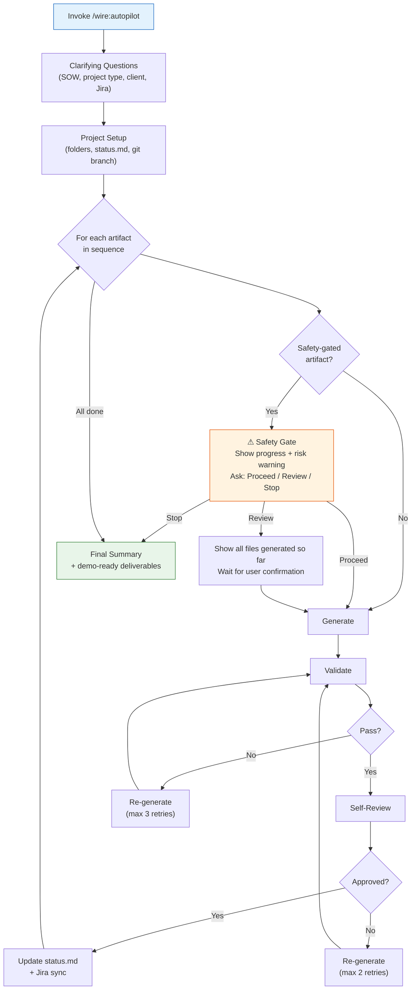

### Invoking Autopilot

```
/wire:autopilot path/to/SOW.pdf
```

Or without a path argument (Autopilot will ask for it):

```
/wire:autopilot
```

### Clarifying questions

Autopilot asks a small set of questions before going autonomous:

1. **SOW file path** (if not provided as argument)
2. **Project type** — inferred from the SOW, confirmed by you
3. **Client name and project name**
4. **Jira tracking** — create new issues, link existing, or skip
5. **Mockup mode** (dashboard-first only) — wireframes (autonomous) or pause for Lovable
6. **Additional context** — technologies, naming conventions, preferences

After confirmation, Autopilot runs autonomously — pausing only at safety gates.

### Safety gates

Autopilot automatically pauses before any phase that could affect systems outside the repository:

| Gated Artifact | Risk | What happens |
|----------------|------|-------------|
| `pipeline` | Activates data connectors (Fivetran, Airbyte) that replicate from production sources | Warns about connector activation, asks to confirm target environment |
| `data_refactor` | Switches dbt from seed data to real client data; validate runs `dbt run` against a database | Warns about database connection, asks to confirm non-production environment |
| `data_quality` | Executes SQL queries against the database | Warns about database queries, asks to confirm target database |
| `deployment` | Creates deployment scripts that, if executed, affect live environments | Warns about live environment impact, asks to confirm readiness |

At each safety gate, Autopilot presents:
1. A summary of everything completed so far
2. A risk-specific warning for the upcoming phase
3. Three options: **Proceed** (continue), **Review first** (inspect generated files before continuing), or **Stop here** (end Autopilot, continue manually)

This means all file-generation phases (requirements, design, dbt models, LookML, dashboards, training, documentation) run fully autonomously, while anything that touches external systems requires your explicit go-ahead.

### Self-review

Instead of pausing for human review at each gate, Autopilot performs structured self-review. For each artifact, it cross-references:

- The generated artifact against the SOW (traceability)
- The artifact against predecessor artifacts (consistency)
- The artifact against validation results (quality)

Self-reviewed artifacts are marked as `review: approved` with `reviewed_by: "Wire Autopilot (self-review)"` in status.md.

### Context window management

Large projects may exceed the AI's context window. Autopilot writes a checkpoint file (`.wire/<project>/autopilot_checkpoint.md`) after each phase, containing a condensed summary of all completed work. If the context window compresses, Autopilot reads the checkpoint to resume.

### Resuming from partial completion

If an Autopilot session is interrupted (context exhaustion, terminal closed, etc.), simply re-run the same command:

```
/wire:autopilot path/to/SOW.pdf
```

Autopilot reads `status.md` and `autopilot_checkpoint.md`, identifies the first incomplete artifact, and continues from that point. It does not re-generate already-completed artifacts.

### Switching between Autopilot and manual commands

Autopilot and the individual `/wire:*` commands share the same state files. You can:

- Start with Autopilot, then switch to manual commands for a specific phase
- Fix a blocked artifact manually, then re-run Autopilot to continue
- Use Autopilot for the bulk of the work, then run manual reviews for key phases

### Error handling

| Situation | Autopilot behaviour |
|-----------|-------------------|
| Validation fails | Re-generates with specific fixes (up to 3 retries) |
| Self-review rejects | Re-generates with feedback (up to 2 retries) |
| Jira API unavailable | Skips Jira sync, continues |
| Prerequisite blocked | Skips downstream artifacts, reports in final summary |
| All retries exhausted | Marks artifact as blocked, continues to next |

### Final summary

When complete, Autopilot outputs a results table showing each phase's status, file counts, blocked phases (if any), and concrete deliverables ready for demo. It also suggests next steps including creating a pull request.

**Tips**:
- Always review the final output before presenting to clients — Autopilot is fast but not infallible
- Check the `execution_log.md` for a full audit trail of what Autopilot did
- Use `/wire:status <project>` to see the detailed artifact status after Autopilot completes
- For dashboard-first projects, wireframe mode produces adequate mockups for driving the data model; use Lovable mode if high-fidelity visuals are needed

### Walkthrough: Autopilot in use

This walkthrough shows a realistic Autopilot session for a `dbt_development` project. The project type has 6 artifacts: requirements → data_model → dbt → semantic_layer → data_quality → deployment — with safety gates at `data_quality` and `deployment`.

#### 1. Invoking Autopilot

```
> /wire:autopilot proposals/acme_analytics_sow.pdf
```

#### 2. Clarifying questions

Autopilot reads the SOW and begins asking questions:

```
Based on the SOW, this appears to be a dbt development project — the scope covers
dbt transformations, a LookML semantic layer, and data quality testing on an
existing BigQuery warehouse. Is that correct?

  ○ dbt development (Recommended)
  ○ Full platform
  ○ Pipeline only
  ○ Dashboard extension
```

You select **dbt development**. Autopilot then asks for client name, project name, and Jira preferences:

```
What is the client name for this project?
> Acme Corporation

What is the project name?
> acme_marketing_analytics

Would you like to track this project in Jira?

  ○ Create new Jira issues
  ○ Link to existing issues
  ○ Skip Jira integration (Recommended)
```

You select **Skip Jira**. Autopilot asks for any additional context:

```
Any additional technical context? (naming conventions, special requirements, etc.)
> We use snake_case for all dbt models. Target schema is analytics_prod.
  Looker instance is at acme.cloud.looker.com.
```

#### 3. Autonomous execution begins

```
--- Project Setup Complete ---
Folder: .wire/20260228_acme_marketing_analytics/
Branch: feature/20260228_acme_marketing_analytics
Type: dbt_development
Artifacts: 6 phases to execute
Beginning autonomous execution...
---
```

Autopilot now runs through each phase without interaction. You see progress reports as each completes:

```
--- Phase Complete: requirements ---
Status: approved
Files: requirements/requirements_specification.md
Progress: 1/6 phases complete
Next: data_model
---
```

```
--- Phase Complete: data_model ---
Status: approved
Files: design/data_model_specification.md, design/physical_erd.md
Progress: 2/6 phases complete
Next: dbt
---
```

The dbt phase takes longer — it generates staging models, warehouse models, tests, and docs, then validates naming conventions and self-reviews against the data model:

```
--- Phase Complete: dbt ---
Status: approved
Files: 24 files in dev/dbt/ (models, tests, sources, docs)
Progress: 3/6 phases complete
Next: semantic_layer
---
```

```
--- Phase Complete: semantic_layer ---
Status: approved
Files: 8 files in dev/lookml/ (views, explores, model)
Progress: 4/6 phases complete
Next: data_quality
---
```

#### 4. Safety gate — data_quality

Autopilot reaches the `data_quality` artifact and pauses:

```
⚠ SAFETY GATE — data_quality

Completed so far: requirements ✓ | data_model ✓ | dbt ✓ | semantic_layer ✓

This phase will run data quality tests that execute SQL queries against your
database. Please confirm the target database connection is correct.

How would you like to proceed?

  ○ Proceed — I have verified the target environment
  ○ Review first — Pause so I can review the artifacts generated so far
  ○ Stop here — End Autopilot, I will continue manually
```

You select **Proceed**. Autopilot generates the data quality tests:

```
--- Phase Complete: data_quality ---
Status: approved
Files: test/data_quality_tests.md, test/monitoring_config.md
Progress: 5/6 phases complete
Next: deployment
---
```

#### 5. Safety gate — deployment

```
⚠ SAFETY GATE — deployment

Completed so far: requirements ✓ | data_model ✓ | dbt ✓ | semantic_layer ✓ |
data_quality ✓

This phase will generate deployment runbooks and scripts. Executing these would
deploy changes to a live environment. Please confirm you are ready to proceed
with deployment planning.

How would you like to proceed?

  ○ Proceed — I have verified the target environment
  ○ Review first — Pause so I can review the artifacts generated so far
  ○ Stop here — End Autopilot, I will continue manually
```

You select **Review first**. Autopilot lists all generated files:

```
Files generated so far:

  requirements/requirements_specification.md
  design/data_model_specification.md
  design/physical_erd.md
  dev/dbt/models/staging/stg_acme__campaigns.sql
  dev/dbt/models/staging/stg_acme__ad_spend.sql
  ... (24 dbt files)
  dev/lookml/views/campaigns.view.lkml
  ... (8 LookML files)
  test/data_quality_tests.md
  test/monitoring_config.md

Ready to continue when you are.
```

After reviewing, you type "continue" and Autopilot generates the deployment runbook:

```
--- Phase Complete: deployment ---
Status: approved
Files: deploy/deployment_runbook.md
Progress: 6/6 phases complete
---
```

#### 6. Final summary

```
═══════════════════════════════════════════════════
  WIRE AUTOPILOT — COMPLETE
  Project: acme_marketing_analytics
  Client: Acme Corporation
  Type: dbt_development
═══════════════════════════════════════════════════

  Phase            Status     Files
  ─────            ──────     ─────
  requirements     approved   1
  data_model       approved   2
  dbt              approved   24
  semantic_layer   approved   8
  data_quality     approved   2
  deployment       approved   1

  Total: 38 files across 6 phases
  Blocked: 0
  Branch: feature/20260228_acme_marketing_analytics

  Suggested next steps:
  • Review generated artifacts
  • /wire:status 20260228_acme_marketing_analytics
  • Create a pull request for review
═══════════════════════════════════════════════════
```

The entire session — from SOW to complete deliverables — took about 15 minutes of AI processing time with two brief pauses at safety gates.

---

## 14. Wire Studio: Web-Based Interface

> **Status: Active** — Wire Studio v3.4.0 is deployed at [wirestudio.rittmananalytics.com](https://wirestudio.rittmananalytics.com). Access is restricted to members of the `wire-studio-users` GitHub team.

Wire Studio is a web-based visual interface for the Wire Framework. It provides a multi-user, browser-based console as an alternative to the CLI for managing Wire projects, running commands, viewing artifact diagrams, and browsing project files.

### When to use Wire Studio

- **Visual project overview**: You want to see all artifacts and their statuses at a glance in a flow diagram or icon table, rather than reading raw `status.md`
- **Diagram exploration**: You want to view rendered mermaid diagrams (ER diagrams, pipeline architectures, DAGs) interactively rather than as raw text
- **PDF and document viewing**: You want to view PDF proposals, CSV data files, or images inline without switching applications
- **Validation reports**: You want AI-summarised validation results as clean markdown instead of raw terminal output
- **Full repo browsing**: You want to browse the entire repository (dbt models, LookML, config files) alongside Wire project files with copy/cut/paste support
- **Team collaboration**: Multiple consultants need to work on the same project with role-based access
- **Client demonstrations**: You want to present the project's deliverables in a visual format
- **File browsing**: You want to browse and preview project documents without switching to a file manager

### When NOT to use Wire Studio

- **Speed**: The CLI is faster for executing individual commands — Wire Studio adds the overhead of a browser interface
- **Simple projects**: If you're running a quick `dbt_development` engagement solo, the CLI is sufficient
- **Constrained environments**: Wire Studio requires Node.js 18+ and an internet connection for the initial install

### Installation

Wire Studio installs with a single command. You need **Node.js 18+** — no Docker, no GitHub OAuth app.

If you have the Wire Framework plugin installed in Claude Code, run:

```
/wire:studio-install
```

Alternatively, install directly from the terminal:

```bash
curl -fsSL https://raw.githubusercontent.com/rittmananalytics/wire/main/install-wire-studio.sh | bash
```

Either method will:
1. Download Wire Studio to `~/.wire-studio/`
2. Install npm dependencies and build the app
3. Prompt for your Anthropic API key
4. Optionally prompt for a GitHub token (for cloning private repos — see below)
5. Create a `wire-studio` CLI command

**After installation:**

```bash
wire-studio start          # Start Wire Studio (opens browser at localhost:3000)
wire-studio stop           # Stop
wire-studio update         # Download latest version and rebuild
wire-studio logs           # Tail the server log
```

Wire Studio opens at [http://localhost:3000](http://localhost:3000) — no sign-in required for local use.

### The Wire Studio interface

Wire Studio has four main areas:

```
┌─────────────────────────────────────────────────────────┐
│  Menu Bar  (File | Project | Actions)   repo ↑↓ Ready   │
├──────────┬──────────────────────────────────────────────┤
│          │  Workflow │ status.md │ report.md │ ...      │
│  File    │                                              │
│  Explorer│     Artifact Graph / Document / PDF / CSV    │
│  (tree)  │                                              │
│          │                                              │
├──────────┴──────────────────────────────────────────────┤
│  Execution Log  (Output │ Activity Feed)                │
└─────────────────────────────────────────────────────────┘
```

1. **Menu Bar** — File menu (New, Open, Close, Save, Settings, Light/Dark/System theme), Project menu (View Status, Pull, Push, Project Settings), and Actions menu (Generate/Validate/Review for selected artifact). Includes remote URL display and push/pull badges with arrows. Keyboard shortcuts: Cmd+O (open), Cmd+N (new), Cmd+S (save/push), Cmd+W (close tab).

2. **File Explorer** (left panel) — Hierarchical tree view with Project/Repo toggle. In Project view, shows `.wire/` project files with dotfiles hidden. In Repo view, shows the full repository. Supports:
   - Expand/collapse folders
   - Right-click files to open them — supports markdown, PDF, CSV, images, code, and text files
   - Copy/cut/paste files and folders
   - Right-click folders → **New Folder**, **Upload File**
   - Right-click any item → **Rename**, **Delete**
   - Drag files between folders to move them
   - Toolbar: Upload, New Folder, Refresh, Project/Repo Toggle

3. **Tabbed Workspace** (centre) — The main content area with browser-style tabs:
   - **Workflow tab** (always open) — the artifact flow diagram
   - **Document tabs** — markdown rendered with GitHub-flavoured formatting, tables, and mermaid diagrams
   - **PDF tabs** — rendered inline via react-pdf with pagination and scrolling
   - **CSV/TSV tabs** — displayed in a sortable grid table
   - **Image tabs** — inline preview for PNG, JPG, GIF, SVG
   - **Code tabs** — monospace syntax display for SQL, YAML, JSON, Python, etc.
   - **status.md** — rendered as an icon table with green check/red X indicators instead of raw markdown
   - Tabs are closable (X button) and re-orderable via drag-and-drop

4. **Execution Log** (bottom panel) — Dark terminal-style output panel with gradient accent line. The **Output** tab shows real-time streaming from the current command. The **Activity Feed** tab shows command history with timestamps, success/failure, cost, and duration. Resizable via drag handle.

### Walkthrough: Using Wire Studio

#### 1. Creating a project

Click **File > New Project** (or Cmd+N). The wizard collects all parameters upfront:
- **Project Type** — select the engagement type (e.g. full_stack, dbt_development, looker_development)
- **Client Name** — e.g. "Acme Corp"
- **Project Name** — e.g. "Marketing Analytics"
- **GitHub Repository** — select from your accessible repos (auto-loaded on dialog open)
- **SOW/Proposal** — optionally attach a Statement of Work or proposal document
- **Jira Configuration** — optionally configure Jira Epic creation and issue tracking

Click **Create**. Wire Studio creates the environment, provisions a workspace, and runs `/wire:new` with all pre-collected parameters.

When no project is open, Wire Studio shows the welcome screen with **Open Project** and **New Project** buttons:


Clicking **Open Project** opens the project selection dialog:


#### 2. Viewing the artifact graph

After opening a project, the **Workflow** tab shows all artifacts as a left-to-right flow diagram:

- **Grey nodes** — not started
- **Blue nodes** — currently generating
- **Green nodes** — complete or approved
- **Red nodes** — failed validation
- **Yellow nodes** — needs review

Use the mouse to pan (click-drag background) and zoom (scroll wheel). The bottom-left controls offer zoom in/out, percentage display, and fit-to-view. Click the export button to save the diagram as PNG, JPEG, or PDF.

#### 3. Viewing artifact documents

Right-click any artifact node to see the context menu:

- **View Document** — opens the artifact's output document in a new tab, rendering markdown with formatting, tables, and mermaid diagrams as interactive SVGs. This option is only enabled when Generate has been run for the artifact.
- **Refresh Document** — reloads the content (useful after running a Generate command)
- **Close Document** — closes the tab


For example, right-clicking the **Data Model** node and selecting "View Document" opens a tab showing the ER diagram rendered from the mermaid code in the data model specification:


#### 4. Running commands from the artifact graph

The right-click context menu on artifact nodes also includes **Generate**, **Validate**, and **Review** actions. These correspond to the same Wire commands available in the CLI (e.g. `/wire:data_model:generate`, `/wire:data_model:validate`):

- **Generate** — runs the generate command for that artifact, creating or recreating its output document
- **Validate** — runs the validation command, producing a PASS/FAIL report
- **Review** — initiates the review workflow for stakeholder approval

These actions are greyed out while another command is running. Output streams to the **Execution Log** in real time, and the node colour updates as the command progresses.

#### 5. Browsing and previewing files

The file explorer on the left shows the project's file tree. Right-click any file to open it in a tab. Supported formats include:

- **Markdown** (.md) — rendered with GitHub-flavoured formatting, tables, code blocks, and embedded mermaid diagrams
- **PDF** (.pdf) — rendered inline via react-pdf with pagination and scrolling
- **CSV/TSV** — displayed in a sortable grid table
- **Images** (.png, .jpg, .gif, .svg) — inline preview
- **Code files** (.sql, .yml, .json, .py, .js, etc.) — monospace syntax display

This is useful for reading requirements specifications, design documents, training materials, or reviewing PDF proposals and CSV data files without leaving Wire Studio.

#### 6. Running commands from the file explorer

When a file in the file explorer corresponds to a Wire artifact (matched by filename keywords and output directory), the right-click context menu also shows **Generate**, **Validate**, and **Review** actions:


This provides a second way to trigger Wire commands — directly from the file tree rather than the artifact graph. The same command is executed either way, and output streams to the Execution Log.

#### 7. Opening validation reports

After running a Validate command, the AI automatically summarises the raw output into a clean markdown report saved as a hidden file. To view it:

- Right-click the artifact node and select **Open Validation Report** (only available after validate has been run)
- The report opens in a new tab with formatted pass/fail results, findings, and recommendations

#### 8. Viewing project status

Select **Project > View Status** from the menu bar. This opens the project's `status.md` file with a custom renderer that displays artifact statuses as an icon table with green check and red X indicators, rather than raw markdown text.

#### 9. File explorer modes

The file explorer supports two viewing modes, toggled via the Project/Repo button in the toolbar:

- **Project view** (default) — shows only the `.wire/` project files, with dotfiles hidden. This is the focused view for day-to-day Wire work.
- **Repo view** — shows the full repository file tree, including all directories and files. Useful for browsing dbt models, LookML files, or other project assets.

Both modes support copy/cut/paste operations for files and folders.

#### 10. Save & Git

Wire Studio automatically commits file operations and command outputs to the local git repository. To push changes to the remote:

- Press **Cmd+S** or select **File > Save** — this pushes all local commits to the remote repository
- The menu bar shows **push/pull badges with arrows** indicating how many commits are ahead or behind the remote
- The remote URL is displayed in the menu bar for reference
- **Project > Pull** pulls the latest changes from the remote
- **Project > Push** is an alternative to Cmd+S for pushing

If you have unpushed local commits and try to close the project, open another project, or sign out, a dialog prompts you to save first.

#### 11. Collaborating with team members

Wire Studio supports multi-user access. The project owner can invite team members via the Project Settings modal. Members can run commands; viewers can browse files and diagrams. Login is restricted to members of the `rittmananalytics/wire-studio-users` GitHub team.

### Relationship to the CLI

Wire Studio and the CLI are complementary interfaces to the same framework:

| Aspect | Wire CLI | Wire Studio |
|--------|----------|-------------|
| Interface | Terminal (Claude Code / Gemini CLI) | Browser |
| Users | Single user per session | Multi-user with roles (team-restricted) |
| Artifact view | `status.md` (text) | Visual flow diagram + icon table status |
| Diagrams | Raw mermaid in markdown | Rendered SVG with zoom |
| Validation reports | Raw terminal output | AI-summarised markdown reports |
| File management | Local filesystem | Docker volumes + file explorer with copy/cut/paste |
| File viewing | Text editor | Multi-format (markdown, PDF, CSV, images, code) |
| Repo browsing | Full filesystem access | Project view + full repo toggle |
| Git workflow | Manual git commands | Auto-commit, Cmd+S push, pull/push badges |
| Command execution | Direct in terminal | Streamed via web API |
| Speed | Faster (no Docker overhead) | Slightly slower |

Projects are fully portable between the two interfaces — they share the same `.wire/` structure and Git repository.

### Wire Studio Hosted Architecture (v3.4.0)

As of v3.2.1, Wire Studio can be deployed as a fully hosted, multi-tenant service on Google Cloud Platform. This replaces the local Docker Desktop requirement with production-grade cloud infrastructure, enabling teams to share a single Wire Studio instance across multiple consultants, clients, and projects without any local setup beyond a web browser.

#### Why hosted?

The local deployment model (Docker + SQLite + localhost) works well for individual consultants, but creates friction for teams:

- Each consultant must install Node.js and run Wire Studio locally
- Projects cannot be shared without Git push/pull cycles
- There is no central visibility into project status across engagements
- Client demonstrations require screen-sharing from a consultant's laptop

The hosted model eliminates all of these by running Wire Studio as a managed web service. Consultants access it via a URL, authenticate with GitHub, and workspaces are provisioned on-demand in the cloud.

#### Architecture overview

The hosted architecture separates the stateless web application from the stateful workspace runtimes, connected by a managed database and event streaming layer:

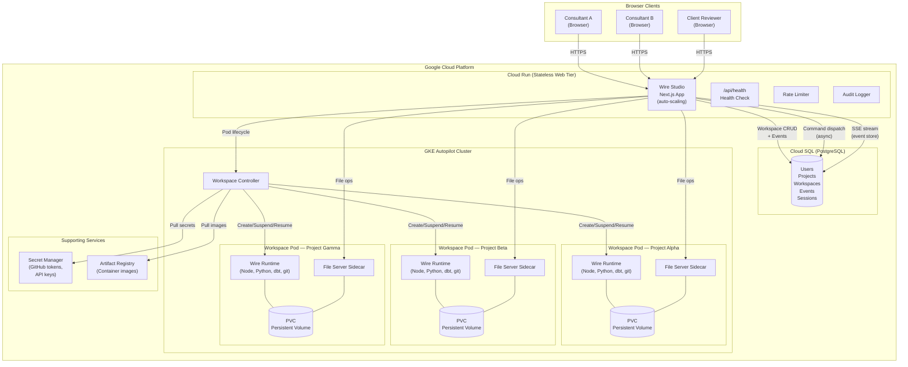

#### Component breakdown

**Cloud Run (stateless web tier)** — The Next.js application runs on Cloud Run with auto-scaling. It serves the frontend, handles API requests, and manages SSE streams. Because Cloud Run is stateless, any instance can serve any request — there is no session affinity. The application includes rate limiting and audit logging middleware.

**Cloud SQL (PostgreSQL)** — All persistent state lives in a managed PostgreSQL database: users, projects, workspaces, workspace events (the event store for async command dispatch), sessions, and execution history. This replaces SQLite from the local deployment.

**GKE Autopilot (workspace runtime)** — Each active workspace runs as an isolated Kubernetes pod on GKE Autopilot. GKE Autopilot automatically provisions and scales the underlying node pool — there are no nodes to manage. Each workspace pod contains:

- **Wire runtime container** — includes Node.js, Python, dbt, git, and the Wire Framework. Executes `/wire:*` commands within the workspace's cloned repository.
- **File server sidecar** — a lightweight HTTP server that provides low-latency file tree listing, read, write, move, rename, and delete operations. This avoids the overhead of spawning a new pod for every file operation.
- **Persistent Volume Claim (PVC)** — backs the workspace filesystem with persistent SSD storage. Files survive pod restarts, suspensions, and cluster upgrades.

**Secret Manager** — Stores GitHub tokens (for private repo cloning), API keys, and workspace credentials. The workspace controller pulls secrets at pod creation time and injects them as environment variables — no secrets are stored in the database or exposed to the browser.

**Artifact Registry** — Hosts the workspace runtime container images. The CI/CD pipeline builds and pushes new images on each release; the workspace controller pulls the latest image when provisioning new workspaces.

#### Multi-user, multi-project model

The hosted architecture uses a **one workspace per user-project pair** model. This means:

- Each consultant working on a project gets their own isolated workspace with its own filesystem, git branch state, and credentials
- Multiple consultants can work on the same project simultaneously, each in their own workspace pod
- A single consultant can have workspaces open across multiple projects
- Client reviewers get read-only access — they can view diagrams, browse files, and participate in reviews without needing their own workspace

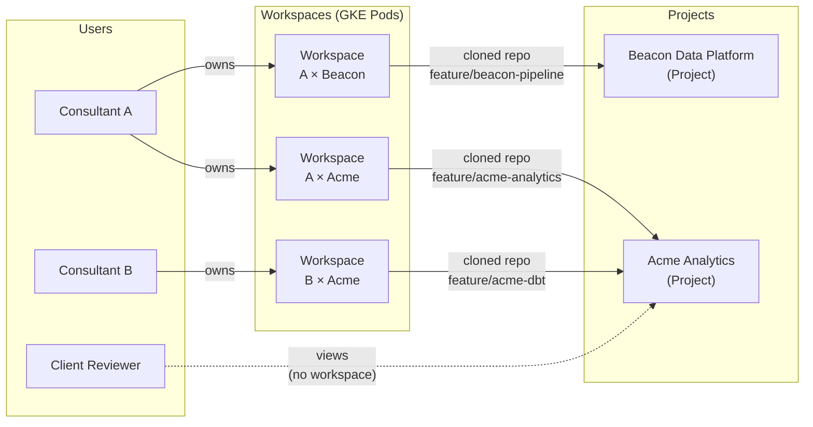

This model provides complete isolation — Consultant A's dbt changes in the Acme project cannot interfere with Consultant B's work on the same project, because each has their own git branch and filesystem. Changes are shared through the normal Git workflow: commit, push, pull, and PR.

#### Workspace lifecycle and scaling

Workspaces follow an explicit state machine that enables the system to scale efficiently across many projects and users:

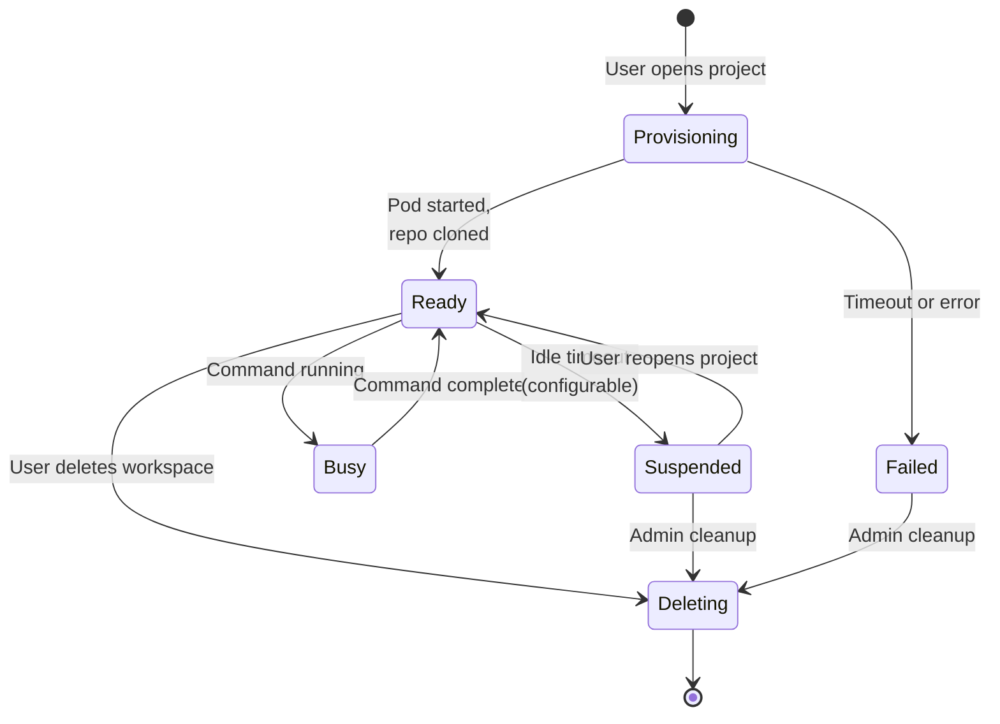

**Provisioning** — When a consultant opens a project for the first time (or after their workspace has been deleted), the system provisions a new workspace asynchronously. The UI shows a status badge ("Provisioning...") and polls for readiness. Provisioning clones the Git repository, pulls secrets, and starts the file server sidecar. This typically takes 15–30 seconds.

**Ready / Busy** — The workspace is running and available. Commands transition it to "busy" while executing and back to "ready" on completion. The file server sidecar remains available throughout.

**Suspended** — After a configurable idle timeout (default: 30 minutes of inactivity), the workspace pod is suspended. The PVC retains all files. When the consultant reopens the project, the workspace resumes from the suspended state — typically in under 10 seconds, since the repo and files are already on disk.

**Scaling characteristics:**

| Dimension | Approach | Limit |
|-----------|----------|-------|
| Concurrent active workspaces | GKE Autopilot auto-scales nodes | 100+ pods (tested) |
| Concurrent users | Cloud Run auto-scaling (stateless) | Effectively unlimited |
| Idle workspaces | Suspended (pod removed, PVC retained) | Storage-bound only |
| Total projects | Cloud SQL rows | Effectively unlimited |
| File storage per workspace | PVC size (configurable, default 10Gi) | Per-workspace limit |

The key to scaling is the suspend/resume cycle. At any given time, only workspaces with active users consume compute resources. Idle workspaces are suspended automatically, freeing GKE capacity. The system can support hundreds of total projects with only a fraction active at any time — which matches real-world usage patterns where consultants work on 2–3 projects concurrently.

#### Async command dispatch

In the local deployment, Wire commands execute synchronously — the browser sends a request, the server runs the command, and streams output back. In the hosted model, this would cause Cloud Run request timeouts (commands can run for several minutes).

The hosted architecture solves this with an **event store** pattern:

1. The browser sends a command request to the API
2. The API writes a command event to Cloud SQL and returns immediately (HTTP 202)
3. The workspace pod picks up the event and executes the command
4. Output is written back to the event store as streaming events
5. The browser subscribes to an SSE endpoint that tails the event store and delivers output in real-time

This decouples the browser connection from command execution. If the browser disconnects and reconnects, it can resume reading from where it left off — no output is lost.

#### Infrastructure as code

All cloud infrastructure is defined in Terraform under `wire-web-ui/infra/terraform/`:

| Module | Resources |
|--------|-----------|
| `networking` | VPC, subnets, Cloud NAT, firewall rules |
| `gke` | GKE Autopilot cluster |
| `cloudrun` | Cloud Run service with environment config |
| `cloudsql` | Cloud SQL PostgreSQL instance |
| `artifact-registry` | Container image registry |
| `iam` | Service accounts and IAM bindings |
| `secrets` | Secret Manager secrets |

Environments are parameterised via `.tfvars` files (`environments/dev.tfvars`, `environments/prod.tfvars`).

#### CI/CD

The `.github/workflows/wire-studio-deploy.yml` workflow automates the build and deploy cycle:

1. On push to the deployment branch, build the Next.js app and workspace runtime container images
2. Push images to Artifact Registry
3. Deploy the Cloud Run service with the new image
4. Run database migrations

#### Local vs. hosted deployment comparison

| Aspect | Local (Docker) | Hosted (GCP) |
|--------|---------------|--------------|
| Setup | Node.js (no Docker, no OAuth app) | Terraform apply + CI/CD |
| Runtime | Docker containers via dockerode | GKE Autopilot pods via @kubernetes/client-node |
| Database | SQLite (file-based) | Cloud SQL PostgreSQL (managed) |
| File access | Docker volumes (local) | PVCs + file server sidecars (persistent) |
| Provisioning | Synchronous (instant) | Async with status tracking (15–30s) |
| Command execution | Direct (synchronous) | Event store + SSE streaming (async) |
| Scaling | Single machine | Auto-scaling across all tiers |
| Multi-user | Shared localhost | Isolated workspaces per user-project |
| Availability | Runs when laptop is on | Always-on managed service |

---

## 15. Extending and Customising the Framework

The framework is designed to be extended. All delivery intelligence lives in plain markdown files. Adding a new capability means writing a new markdown file.

### Adding a new command

**Step 1: Write the workflow spec**

Create a file at `wire/specs/<phase>/<artifact>/<action>.md`. Use the standard frontmatter and structure:

```markdown
---
description: Brief description of what this command does
argument-hint: <project-folder>
---

# [Artifact] [Action] Command

## Purpose
[What this command does and why]

## Prerequisites
- [What must be complete before this runs]
- [Example: requirements artifact must be review:approved]

## Workflow

### Step 1: Read Inputs
[Which files to read, in what order, using which tools]

### Step 2: Generate / Validate / Review
[The core logic — templates, checks, or review gathering]

### Step 3: Update Status
[How to update status.md after completion]
Example:
```yaml
artifacts:
  <artifact_name>:
    generate: complete
    file: <output_path>
    generated_date: <today>
```

### Step 4: Confirm and Suggest Next Steps
[Output message to the user, next recommended command]

## Edge Cases
[What to do if inputs are missing, incomplete, or conflicting]

## Output
[List of files created or updated]
```

**Step 2: Register in the build script**

Add the command to the `COMMANDS` array in `wire/scripts/build-packages.sh` following the existing pattern:

```bash
"<phase>/<artifact>/<action>|<spec_path>|Description|<argument-hint>|yes"
```

**Step 3: Rebuild packages**

```bash
bash wire/scripts/build-packages.sh
```

The new command will be embedded in the next plugin/extension build.

### Modifying an existing command

Edit the workflow spec file directly (`wire/specs/<path>.md`). No reinstallation needed — changes take effect immediately on the next invocation.

Common modifications:
- **Adding a new validation check**: add a check to the validate spec for that artifact
- **Changing a code template**: update the SQL/YAML/LookML template embedded in the generate spec
- **Adding a new required section to a document**: add it to the generate spec's document structure and the validate spec's completeness checklist

### Adding support for a new technology stack

The current framework targets BigQuery + dbt + LookML. Adapting for another stack (e.g. Snowflake + dbt + Tableau) involves:

1. **Update the dbt generate spec** (`specs/development/dbt_generate.md`): change BigQuery-specific SQL syntax (e.g. `current_timestamp()` → `current_timestamp`) and materialisation options
2. **Update the semantic layer spec** (`specs/development/semantic_layer/generate.md`): replace LookML templates with Tableau / Power BI DAX equivalents
3. **Update the pipeline design spec** (`specs/design/pipeline_design/generate.md`): update the replication tool and architecture descriptions

The non-technology artifacts (requirements, data_model, training, documentation) require no changes.

### Adding a new project type

Each project type is a process definition - an ordered set of in-scope artifacts that defines a specific delivery workflow. If you have a recurring engagement type not covered by the six standard types:

1. Edit `specs/new.md` to add the new type to the project creation prompts and define which artifacts are in scope (the rest will be set to `not_applicable` when `status.md` is instantiated)
2. Add a case to the status template in `TEMPLATES/status-template.md` showing the artifact scope for the new type
3. Document the new type in this handbook

### Adjusting naming conventions

dbt naming conventions are embedded in the dbt generate and validate specs. To change them (e.g. to use `int__` prefix for integration models instead of no prefix):

1. Edit the naming section in `specs/development/dbt_generate.md`
2. Update the corresponding validation checks in `specs/development/dbt_validate.md`

The framework uses a 2-tier convention loading system. When generating or validating dbt models, it first checks for project-specific convention files (`.dbt-conventions.md`, `dbt_coding_conventions.md`, or `docs/dbt_conventions.md` in the project root). If found, those conventions take priority. If not found, the framework uses the comprehensive embedded conventions covering field naming, SQL style, CTE structure, testing requirements, and documentation standards.

---

## 16. FAQ

**Q: Do I need to run every command in order, or can I skip phases?**

The framework enforces phase dependencies through prerequisite checks in each workflow spec. You cannot generate dbt models before the data model is approved, for example — the generate command will check and block. That said, within a phase, some artifacts can be generated in parallel (pipeline_design and data_model; semantic_layer and dashboards). Use `/wire:status` to see exactly what is and isn't blocked.

---

**Q: A client has given feedback and wants to change the requirements after design has started. What do I do?**

Update the requirements document manually, then re-run validate and review to record the new approval. If the change affects the data model, re-run `data_model:generate` (the AI will read the updated requirements). Set the affected downstream artifacts back to `not_started` in `status.md` before regenerating. The framework will pick up from the updated state.

---

**Q: The dbt models generated don't compile. What should I check?**

1. Verify source table names in `_sources.yml` match exactly what is in the warehouse
2. Check that `ref()` calls in generated models point to models that exist
3. Run `/wire:dbt-validate` — it checks `ref()` targets and naming before you try to run
4. If the data model spec had incorrect column names (from a schema that changed), update the spec in `design/data_model_specification.md` and re-run `dbt:generate`

---

**Q: The AI generated something that doesn't match our client's specific conventions. How do I fix it?**

Two options:
1. **One-off fix**: Edit the generated file directly, then re-run validate and review
2. **Fix the root cause**: Edit the workflow spec template that produced the incorrect output (`wire/specs/<path>.md`), then re-run generate. This ensures future projects also get the correct output.

If a client has persistent conventions that differ from our standard templates (e.g. a different surrogate key pattern), update the template in the generate spec and note it in the project's `status.md` notes section.

---

**Q: Can I run multiple projects in the same repository?**

Yes. The `.wire/` directory supports multiple project subdirectories. `/wire:start` and `/wire:status` show all projects. Each project is isolated in its own `<project_id>/` folder and its own `status.md`. The generated code (dbt models, LookML) is shared in the repository root, so use clear naming conventions to avoid collisions between projects.

---

**Q: What do I put in the `artifacts/` folder?**

Anything the AI should use as source material:
- The SOW PDF (required)
- SQL examples showing source system schema (highly recommended — significantly improves data model quality)
- Meeting notes and transcript snippets
- Existing data model documentation or ERDs
- Existing dbt project files if you're extending an existing project
- Sample data files or column lists
- Any client-provided technical specifications

The AI will use Glob to discover everything in `artifacts/` at the start of each generate command.

---

**Q: How do I handle a project where the SOW is not a PDF?**

If the SOW is a Word document, ask the client to export it as PDF, or copy the key sections (deliverables, timeline, technical outcomes, out-of-scope items) into a markdown file in `artifacts/`. The AI can work with `.md` files directly. If it's in a Google Doc, copy the text into a markdown file.

---

**Q: The client changed the data model after development started. Do I have to regenerate everything?**

Not necessarily. If the change is additive (new columns or new models), you can:
1. Update `design/data_model_specification.md` with the additions
2. Run `dbt:generate` again — the AI will read the updated spec and produce the new models, leaving existing models intact
3. Re-run `dbt:validate` and get approval

If the change is breaking (renamed columns, changed grain, removed models), treat it as a change request: update the spec, regenerate the affected models, update the semantic layer if column names changed, re-run tests, and record the change in `status.md` notes.

---

**Q: Can I use the framework with Gemini CLI instead of Claude Code?**

Yes. The framework supports both Claude Code and Gemini CLI. Install the `wire` extension (`gemini extensions install <repo-url>`) and all commands are available as `/dp *`. The workflow specs are identical across both runtimes — the only difference is the command format. Both runtimes produce the same project structure and artifacts.

---

**Q: Can I use the framework without Claude Code or Gemini CLI — e.g. in a web browser chat interface?**

The `/wire:*` command system requires a CLI-based AI coding agent (Claude Code or Gemini CLI), which is what discovers and runs the command wrappers. However, the workflow specification files (`wire/specs/*.md`) are plain markdown — you can read them and follow them manually in any AI interface, using the specs as structured instructions. You'll lose the automated status tracking and command discovery, but the methodology still works.

---

**Q: How do I know when a project is complete?**

Run `/wire:status <project_id>`. When all in-scope artifacts show `review: approved` (or `not_applicable` for out-of-scope artifacts), the project is complete. Run `/wire:archive <project_id>` to close it out.

---

**Q: Why does `/wire:new` force me to create a branch?**

The framework requires all project work to happen on a feature branch, not directly on `main` or `master`. This is standard git hygiene — generated artifacts, dbt models, and LookML files should be reviewed via pull request before merging. If you're already on a feature branch when you run `/wire:new`, the check passes silently and you won't notice it. The suggested branch name is `feature/{folder_name}` (e.g., `feature/20260210_acme_marketing_analytics`), but you can choose any name.

---

**Q: How do I upgrade the framework on a client repo that's mid-project?**

Plugin/extension users get updates automatically when a new version is published. Your project data (`.wire/`), generated code (dbt models, LookML), and `status.md` files are completely separate and not affected. Workflow specs are defensively compatible — they check for fields before using them, so an older `status.md` works with newer specs. Jira tracking continues automatically if already configured.

---

**Q: When should I use Dashboard-First instead of Full Platform?**

Use Dashboard-First when: (1) the SOW is well-defined enough to mock dashboards early, (2) you want stakeholder feedback before committing to a data model, or (3) client data access may be delayed. Use Full Platform when: the engagement requires a conceptual entity model and pipeline architecture decisions upfront, or when the data sources are complex enough that understanding them must precede any dashboard design.

---

**Q: Can I switch from Dashboard-First to Full Platform mid-project?**

Not automatically — the project type determines the artifact scope at creation time. However, you can manually edit `status.md` to add artifacts that were marked `not_applicable` (e.g. add `pipeline_design` if you later decide you need it). The workflow specs will work correctly with manually added artifacts.

---

**Q: What if the client's real data schema is very different from what the seed data assumed?**

The `data_refactor:generate` command handles this by comparing the seed schema against the real one and generating a refactoring plan. Significant differences (renamed tables, different grain, additional source systems) will produce a larger refactoring plan, but the command still works. In extreme cases, you may need to regenerate the data model specification and re-run dbt generation. The seed-based prototype is still valuable even if the refactor is substantial — it validated the dashboard design and business logic.

---

**Q: Do I need a Lovable account for dashboard-first projects?**

Yes. The mockups command for `dashboard_first` projects uses Lovable (via `getmock.rittmananalytics.com`) to create interactive dashboard mocks. You need to be a member of the RA Lovable account. Ask to be invited if you're not already a member. If Lovable is unavailable, you can use the standard mockups workflow (ASCII wireframes) by selecting a different project type.

---

**Q: What is Wire Autopilot and when should I use it?**

Wire Autopilot (`/wire:autopilot`) is an autonomous execution mode that takes a SOW and runs through the entire project lifecycle without further human input. It generates, validates, and self-reviews every artifact. Use it for rapid prototyping, standard engagements with well-defined SOWs, internal projects, or proof-of-concept work. For client-facing engagements requiring human approval at each gate, use the individual commands instead.

---

**Q: Can I resume Autopilot if it gets interrupted?**

Yes. Re-run `/wire:autopilot` on the same project. It reads `status.md` and `autopilot_checkpoint.md` to determine where it left off and continues from the next incomplete artifact. It will not re-generate already-completed and approved artifacts.

---

**Q: Can I mix Autopilot with manual commands?**

Yes. Autopilot and manual commands share the same state files (`status.md`, `execution_log.md`). You can start with Autopilot for the bulk of the work, then use manual commands for specific phases. Or fix a blocked artifact manually and re-run Autopilot to continue.

---

**Q: What is Wire Studio and do I need it?**

Wire Studio is an experimental web-based visual interface for the Wire Framework. It provides the same functionality as the CLI but with a graphical artifact flow diagram, rendered mermaid diagrams, a file explorer, and multi-user team access. You do not need it — the CLI is fully sufficient. Wire Studio is useful when you want visual project overviews, diagram exploration, team collaboration, or client demonstrations.

---

**Q: Can I use Wire Studio and the CLI on the same project?**

Yes. Wire Studio and the CLI share the same project structure (`.wire/`), the same `status.md`, and the same Git repository. You can create a project with the CLI and open it in Wire Studio, or vice versa. Changes made in one are visible in the other after a Git push/pull.

---

**Q: Does Wire Studio require Docker?**

No. Wire Studio runs Wire commands directly on your local filesystem via Node.js — no Docker volumes or containers required. The only requirement is Node.js 18+. Install via the plugin command `/wire:studio-install`, or directly with: `curl -fsSL https://raw.githubusercontent.com/rittmananalytics/wire/main/install-wire-studio.sh | bash`

---

**Q: How do I connect Wire Studio to GitHub for cloning private repos?**

The installer will prompt you automatically. It tries two options in order:

1. **GitHub CLI** — if `gh` is installed and authenticated (`gh auth login`), the installer detects the token automatically and you won't be prompted
2. **Personal Access Token** — if no CLI is found, you'll be prompted to paste a PAT (generate one at github.com/settings/tokens with `repo` scope). Press Enter to skip and configure later.

Either way, the token is stored once and reused silently for all future clones — you won't be asked again. If you skipped the install-time prompt, open Wire Studio, click **Clone from GitHub**, and you'll see the same options: use the GitHub CLI or paste a PAT.

Public repos can be cloned without a token.

---

**Q: How does Autopilot handle dashboard-first mockups?**

For dashboard-first projects, Autopilot offers two modes during its clarifying questions: (1) wireframe mode (default), which generates ASCII wireframes autonomously, or (2) pause mode, which pauses at the mockup stage for you to complete a Lovable session manually, then resumes. Wireframe mode is adequate for driving the downstream data model and dbt generation.

---

**Q: What are safety gates and which phases trigger them?**

Safety gates are automatic pause points that prevent Autopilot from touching external systems without your explicit confirmation. Four artifacts are gated: `pipeline` (activates data connectors), `data_refactor` (runs dbt against real data), `data_quality` (executes SQL tests against a database), and `deployment` (deploys to live environments). All other phases — including dbt model generation, LookML, dashboards, and documentation — run fully autonomously since they only write files to the repository.

---

## 17. Troubleshooting

**"Project not found"**
- Verify the project exists: `/wire:status`
- Check the folder name matches the project_id
- Ensure you're in the correct repository root directory

**"Artifact already exists"**
- Use `--force` flag to regenerate: `/wire:dbt-generate <project_id> --force`
- Or manually review/update the existing artifact

**dbt tests failing**
- Review test output in the terminal
- Check data quality in BigQuery/warehouse directly
- Update dbt models to fix issues
- Re-run: `/wire:utils-run-dbt <project_id>`

**Validation failing**
- Read the validation error messages carefully
- Check against the conventions and templates in the workflow spec
- Fix issues and re-run the validate command

**Missing context / poor generation quality**
- Add more source materials to `artifacts/` (SQL examples, schema docs, sample data)
- Reference related documentation in the artifacts folder
- Provide additional context when running the command

---

**Q: Someone left the project midway through. How does a new consultant pick it up?**

Run `/wire:start`. The framework reads `status.md` and tells the new consultant exactly where the project is, what was last completed, and what comes next. The audit trail in `status.md` shows who approved what and when. Read the `artifacts/` folder and the generated artifacts in `requirements/` and `design/` to get up to speed on the project context. The framework is designed so that anyone who can read the status file can resume from where it left off.

---

**Q: Where do I go if something goes wrong or a command doesn't work as expected?**

1. Check `execution_log.md` in the project folder — it shows the timestamped history of every command run and its result, which helps identify when and where things went wrong
2. Check `status.md` to see the current project state
3. Re-read the relevant workflow spec in `wire/specs/<path>.md` — it describes what the command should do in detail
4. Check the `artifacts/` folder to confirm source materials are present and readable
5. If the issue is a bug in a workflow spec, edit the spec and re-run the command
6. Raise with the team — include the project_id, the command you ran, and what the AI produced

---

*This handbook is a living document. Update it when the framework changes, when new project types are added, or when new FAQs emerge from delivery experience.*
