# The Wire Framework: Consultant Handbook

**Rittman Analytics — Internal Use**

**Version**: 3.4.10 | **Date**: April 2026

---

## Contents

1. [What Is the Wire Framework?](#1-what-is-the-wire-framework)
2. [The Problem It Solves](#2-the-problem-it-solves)
3. [Engagements and Releases](#3-engagements-and-releases)
4. [Release Types](#4-release-types)
5. [Installation and Setup](#5-installation-and-setup)
6. [Core Concepts You Need to Know](#6-core-concepts-you-need-to-know)
7. [Running a Discovery Release (Shape Up Planning)](#7-running-a-discovery-release-shape-up-planning)
8. [Generating a Client Kick-off Deck](#8-generating-a-client-kick-off-deck)
9. [Running a Full Platform Release (End-to-End)](#9-running-a-full-platform-release-end-to-end)
10. [Running a Pipeline + dbt Release](#10-running-a-pipeline--dbt-release)
11. [Running a dbt Development Release](#11-running-a-dbt-development-release)
12. [Running a Dashboard Extension Release](#12-running-a-dashboard-extension-release)
13. [Running a Dashboard-First Rapid Development Release](#13-running-a-dashboard-first-rapid-development-release)
14. [Running an Enablement Release](#14-running-an-enablement-release)
15. [Running an Agentic Commerce Release](#15-running-an-agentic-commerce-release)
16. [Worked Example: Barton Peveril Live Pastoral Analytics](#16-worked-example-barton-peveril-live-pastoral-analytics)
17. [Wire Autopilot: Autonomous Execution](#17-wire-autopilot-autonomous-execution)
18. [Wire Studio: Web-Based Interface](#18-wire-studio-web-based-interface)
19. [Issue Tracking: Jira and Linear](#19-issue-tracking-jira-and-linear)
20. [Document Store: Confluence and Notion](#20-document-store-confluence-and-notion)
21. [Extending and Customising the Framework](#21-extending-and-customising-the-framework)
22. [FAQ](#22-faq)
23. [Troubleshooting](#23-troubleshooting)
24. [Framework Management Commands](#24-framework-management-commands)

---

## 1. What Is the Wire Framework?

The Wire Framework is Rittman Analytics' proprietary AI-accelerated delivery system for data platform engagements. It uses an AI coding agent — either **Claude Code** (Anthropic) or **Gemini CLI** (Google) — as its runtime, and encodes 20+ years of analytics engineering methodology as structured, executable workflow specifications.

In practical terms: instead of a consultant manually writing dbt models, LookML, pipeline code, training materials, and documentation over several weeks, the framework directs the AI to produce all of these artifacts in a fraction of the time — with embedded quality gates ensuring the output meets our standards.

**The framework does not replace consultants.** It gives them an AI that works at machine speed and never forgets a naming convention, freeing the consultant to focus on client relationships, design decisions, and the creative problem-solving that AI cannot do.

### What it looks like in practice

You open Claude Code in a git repository where the framework is installed. You type `/wire:new` and answer a few questions about the client and project. You copy the SOW PDF into a folder. Then you work through a sequence of `/wire:*` commands — generating requirements, then designs, then code, then tests, then a deployment runbook, then training materials. At each step the framework validates the output and asks you or the client to approve it before moving on. Alternatively, you can use `/wire:autopilot` to have the AI run through the entire lifecycle autonomously — it asks a few clarifying questions upfront, then generates, validates, and self-reviews every artifact without further input.

At the end, you have: a production-ready dbt project, a LookML semantic layer, deployed Looker dashboards, data quality tests, a deployment runbook, and training materials — all version-controlled in git with a complete audit trail.

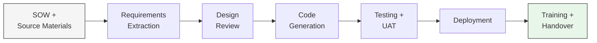

---

## 2. The Problem It Solves

### The methodology gap

Naive AI code generation tools (GitHub Copilot, raw ChatGPT prompting) can produce syntactically valid SQL. What they fail at is *methodology*:

- Consistent naming conventions across 15+ models (`stg_focus__student_notes`, not `staging_notes` or `stg_notes`)
- Correct surrogate key patterns and grain management
- Relationship test coverage on every foreign key
- Traceability from business requirements to warehouse columns
- Cross-system join integrity (Focus `assignment_marks.enrolment_id` → ProSolution `Enrolment.EnrolmentID`)
- Requirements-driven design rather than improvised structure

These failures are not knowledge failures — the models know the conventions. They are *context and control* failures. Without a structured methodology constraining the generation process, LLMs improvise, and the accumulated inconsistencies across a project erode the value proposition entirely.

### How the Wire Framework closes the gap

The framework encodes the methodology itself as workflow specifications that the AI reads before generating anything. Each specification tells the AI:

- Which upstream artifacts to read as inputs
- What templates to follow for naming, structure, and testing
- What validation checks to apply before presenting output for review
- How to update the project state tracker

The AI fills in the blanks within a tightly constrained template rather than inventing structure from scratch. The result looks like it was written by a senior analytics engineer who has been on the project for months — because it was generated by an AI that read every design decision and requirement that a senior analytics engineer would have absorbed.

---

## 3. Engagements and Releases

### Key terminology

Wire v3.4.0 introduces a two-tier structure with precise terminology. Understanding these two concepts is essential before using the framework.

**Engagement** — a complete client engagement from start to finish. The engagement holds all context that spans the whole relationship with that client: the Statement of Work, call transcripts and meeting notes, org charts, stakeholder lists, and the current-state architecture of their systems. This context belongs to the engagement, not to any specific unit of delivery.

**Release** — a scoped, time-boxed unit of delivery within an engagement. Every piece of work the team does for a client is a release. Releases have a type (discovery, full_platform, pipeline_only, etc.), a defined scope, a planned start and end date, and their own `status.md` tracking file.

An engagement typically contains several releases in sequence. A typical engagement might look like:

```
01-discovery       ← Shape Up planning: what do we build and why?
02-data-foundation ← Pipeline + dbt: get data into the warehouse
03-reporting       ← Dashboard extension: client-facing dashboards
04-enablement      ← Training and documentation
```

### The two-tier folder structure

Every Wire engagement uses this structure in the `.wire/` directory:

```
.wire/
  engagement/
    context.md          ← engagement overview, objectives, key stakeholders
    sow.md              ← statement of work (copied at engagement setup)
    calls/              ← call transcripts and meeting notes
    org/                ← org charts and roles/responsibilities
  releases/
    01-discovery/       ← discovery release type
      status.md
      planning/
        problem_definition.md
        pitch.md
        release_brief.md
        sprint_plan.md
    02-data-foundation/  ← delivery release type (e.g. pipeline_only)
      status.md
      requirements/
      design/
      dev/
      test/
      deploy/
      enablement/
    03-reporting/        ← another delivery release
      status.md
      ...
  research/
    sessions/            ← persisted technical research (auto-populated)
      2026-03-01-1430/
        summary.md
```

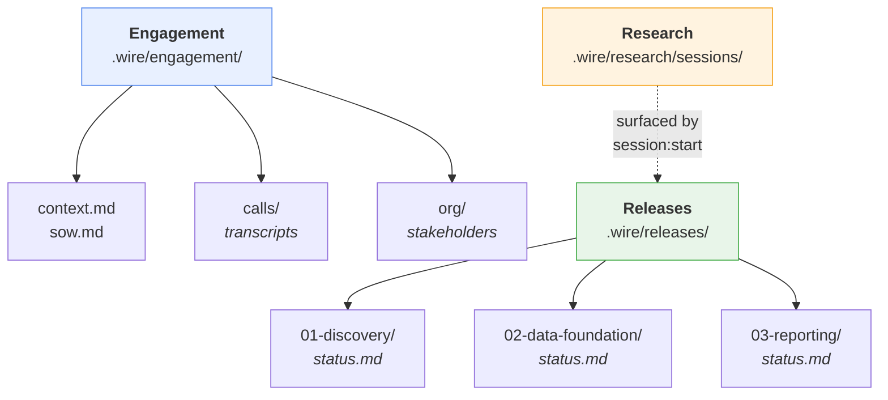

### Setting up a new engagement

Run `/wire:new`. The framework asks:

1. **Client and engagement name** — for folder naming and status files
2. **Repo mode**:
   - *Combined* (default): `.wire/` lives directly in the client's code repo — the simplest setup, suitable for most engagements
   - *Dedicated delivery repo*: this repo is exclusively for Wire artifacts; client code lives in a separate repo (stored in `engagement/context.md`). Use for regulated clients where adding files to their code repo is not acceptable, or clients with multiple code repos
3. **First release type** — usually `discovery` for a new engagement, or a delivery type if joining mid-stream
4. **SOW path** — optional; copied to `engagement/sow.md`

To add a subsequent release to an existing engagement, run `/wire:new` again. The framework detects the existing engagement context and skips directly to asking for the new release type.

### Repo mode: combined vs dedicated delivery

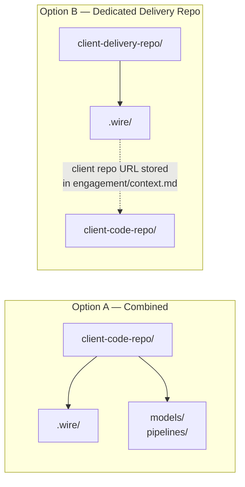

**Option A** is the default. Wire artifacts live in the same repo as the client's code. Simple, no extra configuration.

**Option B** is for engagements where adding files directly to the client's code repo is not acceptable (regulated industries, multi-stakeholder repos) or where the client has several code repos and it's unclear which one should hold the Wire artifacts. The delivery repo is typically named `<client_name>-delivery`. Client repo details are stored in `engagement/context.md` so Wire commands can reference the codebase when needed.

### Session lifecycle

Every working session on any release should begin and end with Wire's session commands:

```
/wire:session:start [release-folder]   ← starts a focused session
/wire:session:end   [release-folder]   ← closes the session, updates history
```

`session:start` enters Plan Mode, scans the current release status and prior research, and proposes a focused 3–5 step session plan before any work begins. `session:end` records what was accomplished in the release's `session_history` table and suggests the focus for the next session.

These commands ensure every session is grounded in current state — not re-establishing context from scratch — and that progress is captured automatically.

---

## 4. Release Types

The framework encodes delivery methodology as seven release types, each defining a different ordered set of in-scope artifacts and the commands that apply to them. When you run `/wire:new` and select a release type, the framework instantiates that process definition into the release's `status.md` file — writing the in-scope artifacts and their gate states as YAML frontmatter. Artifacts that are out of scope for the selected type are marked `not_applicable` and skipped.

| Type | Scope | Typical Duration | Artifacts in Scope |
|------|-------|------------------|--------------------|
| **Discovery** | Shape Up planning: problem definition → pitch → release brief → sprint plan | 1–2 weeks | problem_definition, pitch, release_brief, sprint_plan |
| **Full Platform** | SOW → production dashboards + trained users | 2–3 weeks | All 15 delivery artifact types |
| **Dashboard-First** | Interactive mocks drive data model; seed data enables immediate dbt | 1–2 weeks | 14 artifacts (omits workshops, conceptual_model, pipeline_design, pipeline; adds viz_catalog, seed_data, data_refactor) |
| **Pipeline + dbt** | New data pipeline + dbt transformation layer | 1–2 weeks | requirements, pipeline_design, data_model, pipeline, dbt, data_quality, deployment |
| **dbt Development** | Analytics engineering on existing infrastructure | 1 week | requirements, data_model, dbt, data_quality |
| **Dashboard Extension** | New dashboards on an existing semantic layer | 3–5 days | requirements, mockups, dashboards, uat |
| **Enablement** | Training and documentation for an existing platform | 2–3 days | training, documentation |
| **Agentic Commerce** | AI-powered ecommerce storefront: Lovable base build + 9 AI features via Claude Code | 1–4 weeks | ac_storefront, ac_semantic_search, ac_conversational_assistant, ac_virtual_tryon, ac_visual_similarity, ac_llm_tools, ac_personalisation, ac_ucp_server, ac_demo_orchestration |

### Choosing the right release type

- **Starting a new engagement where scope is unclear or needs shaping**: **Discovery** first, then delivery releases
- **Client needs a new data source connected end-to-end through to a dashboard**: **Full Platform**
- **Early stakeholder feedback via interactive mocks before building the data layer**: **Dashboard-First**
- **Client has a BI tool / semantic layer and just needs new data flowing in**: **Pipeline + dbt**
- **Data is already in the warehouse; need to build the transformation layer**: **dbt Development**
- **Semantic layer already has the data; adding new dashboards**: **Dashboard Extension**
- **Platform exists; engaged to train and document it**: **Enablement**
- **Building an AI-powered ecommerce storefront**: **Agentic Commerce**

**When to start with Discovery**: Any engagement where the scope is not already well-defined in a signed SOW, where the client isn't sure what they need built, or where the team wants to formally validate the problem and shape the solution before committing to a delivery estimate. Discovery produces a release brief and sprint plan — the formal inputs to a delivery release.

**Full Platform vs Dashboard-First**: Both produce the same end result (production dashboards with a dbt warehouse). The difference is the *order of operations*. Full Platform follows the traditional flow: requirements → conceptual model → pipeline design → data model → dbt → dashboards. Dashboard-First inverts this: requirements → interactive dashboard mocks → visualization catalog → data model → seed data → dbt → dashboards → data refactor. Choose Dashboard-First when getting visual feedback early is more valuable than following the traditional top-down design sequence — typically when the SOW is well-defined enough to mock dashboards immediately but client data access may take time.

---

## 5. Installation and Setup

### Prerequisites

**Required:**
- Git repository initialised (`git init` or cloned)
- **One of** the following AI coding agents:
  - **Claude Code** — installed and authenticated (`claude` CLI). Requires Claude Pro, Max, Team, or Enterprise subscription. VS Code (1.98.0+) with Claude Code extension, or Claude Code CLI.
  - **Gemini CLI** — installed and authenticated (`gemini` CLI). Requires Gemini Code Assist subscription or Google Cloud project with Gemini API access.
- Python 3.8+ (for dbt and pipeline development)

**Recommended:**
- GitHub Desktop (for non-technical team members)
- dbt Cloud account (or dbt Core installed locally)

**Cloud platform access** (varies by project stack):
- Google Cloud: BigQuery access, Looker access, dbt Cloud connected to BigQuery, GCP service account credentials
- Other platforms: Snowflake/Databricks/Redshift credentials, BI platform access (Tableau, Power BI, etc.), dbt Cloud or dbt Core configured

### Step 1: Install the plugin or extension

**Claude Code users:**

In any Claude Code session, register the marketplace and install:
```
/plugin marketplace add rittmananalytics/wire-plugin
/plugin install wire@rittman-analytics
```
When prompted for scope, select **"Install for you (user scope)"** to make Wire available across all repositories.

Restart Claude Code. All commands are available as `/wire:*` after restart.

**Gemini CLI users:**
```bash
gemini extensions install https://github.com/rittmananalytics/wire-extension
```
All commands are available immediately as `/dp *` — no further setup required.

Each command has its full workflow specification embedded inline. No framework files need to exist in the repository. MCP servers (Atlassian, Fathom, Context7) are configured automatically.

### Step 2: Verify

Open your AI coding agent in the repository root:

```bash
claude     # Claude Code
gemini     # Gemini CLI
```

Run `/wire:start` (Claude Code) or `/dp start` (Gemini CLI) to confirm everything works.

To authenticate optional MCP integrations:
- **Claude Code**: use the `/mcp` command
- **Gemini CLI**: use `gemini mcp` commands

### Wire Studio prerequisites (optional)

Wire Studio is a separate web-based interface that runs alongside (not instead of) the CLI. If you want to use Wire Studio locally, you need:

- **Node.js 18+** and npm

No Docker required. No GitHub OAuth app required.

See [Section 16: Wire Studio](#16-wire-studio-web-based-interface) for full setup and usage instructions.

### Upgrading

Plugin and extension users get updates automatically when a new version is published. Project data in `.wire/` is never touched by upgrades — workflow specs are defensively compatible with existing project state.

---

## 6. Core Concepts You Need to Know

> **Command notation:** Commands in this handbook are shown in Claude Code format (`/wire:*`). If you are using Gemini CLI, drop the `/wire:` prefix and replace colons with spaces — e.g., `/wire:requirements-generate my_project` becomes `/dp requirements generate my_project`.

### Self-contained command architecture

Every `/wire:*` command is a single, self-contained file — the command file *is* the complete workflow specification. There is no separation between a discovery layer and a logic layer. In Claude Code, these are `.md` files distributed as a plugin; in Gemini CLI, `.toml` files distributed as an extension.

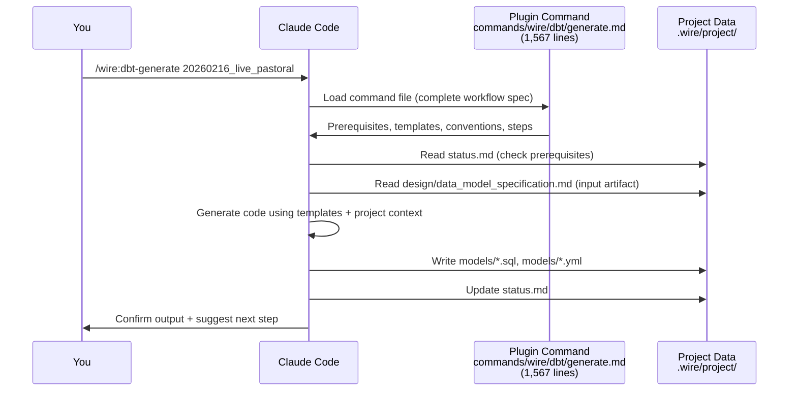

Each command file contains the full workflow inline — from 100 lines for a simple review command to over 1,500 lines for dbt generation. No external files are referenced. This means:
- Adding a new command = write one command file, rebuild the plugin/extension
- Modifying a command's behaviour = edit that one file. The change applies on the next invocation — no build step, no reinstallation

### Session lifecycle

Every working session should begin and end with Wire's session commands:

```
/wire:session:start [release-folder]   ← enter Plan Mode, scan status + research, get a session plan
/wire:session:end   [release-folder]   ← record accomplishments, surface next focus
```

`session:start` reads the release's `status.md`, surfaces any prior research from `.wire/research/sessions/`, and proposes a focused 3–5 step plan before any work begins. This ensures every session starts from current state rather than reconstructing context from scratch.

`session:end` records what was accomplished in the release's `session_history` table and suggests the focus for the next session. The session history table is appended to `status.md` and builds into a running audit trail over the course of the release.

### Research persistence

When the AI performs technical research during a session (looking up warehouse schemas, reading documentation, investigating a library), it automatically saves structured summaries to `.wire/research/sessions/YYYY-MM-DD-HHMM/summary.md` — one file per research session at the engagement level (not inside any individual release).

At the start of the next session, `session:start` checks these saved summaries before any new research begins. If a relevant finding already exists, it surfaces it rather than re-doing the work. This means:
- **Cross-release knowledge carries over**: research done during the discovery release is available when working on the delivery release
- **Re-starting a session doesn't lose context**: prior technical findings are always available
- **Less AI context consumed**: the AI reads a condensed summary instead of re-running the same web searches

### The artifact lifecycle

Every artifact produced by the framework follows three gates:

- **Generate**: AI produces the artifact from upstream inputs and templates
- **Validate**: Automated checks run (naming, test coverage, completeness, etc.)
- **Review**: You or the client approves the artifact

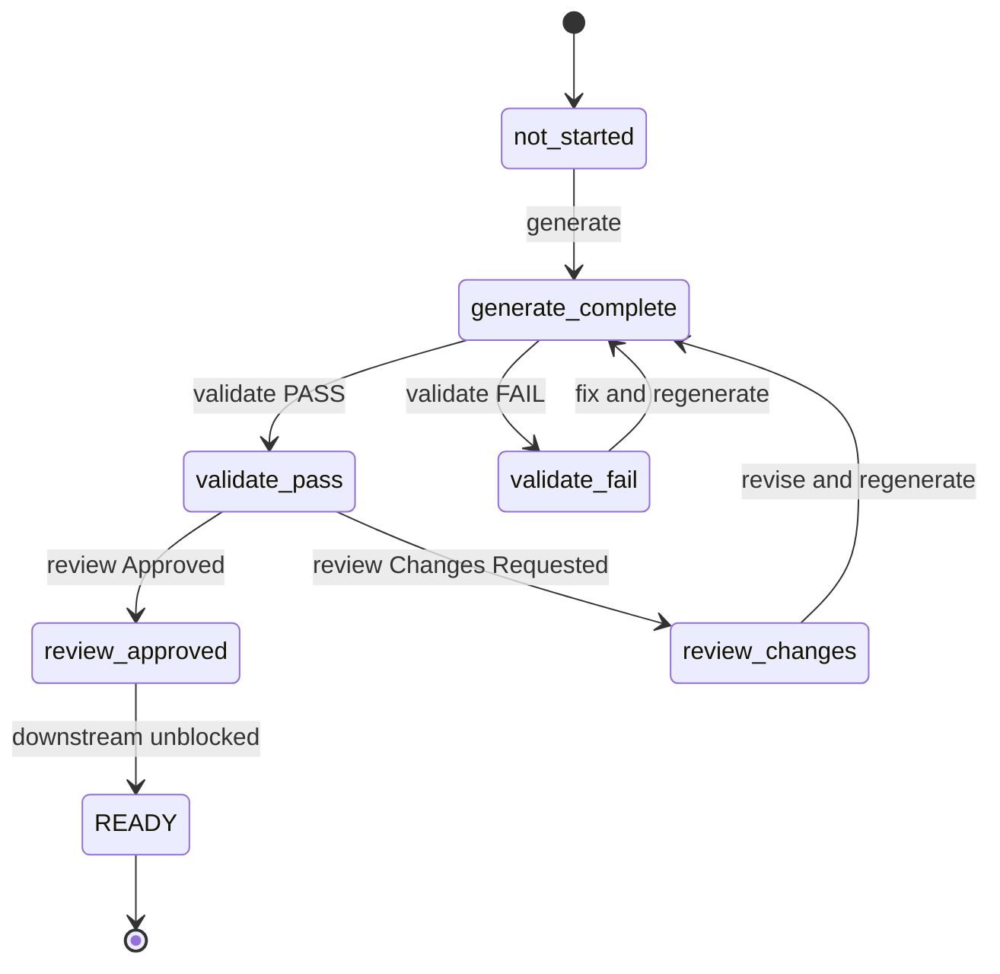

An artifact should not progress until all three gates are passed. Downstream artifacts check upstream readiness before they generate. This enforces phase discipline automatically although you can over-ride if you need to.

### Git branching

`/wire:new` enforces a mandatory branch check. If you run it while on `main` or `master`, the framework will stop and ask you to create a feature branch before any project files are created. It suggests `feature/{folder_name}` (e.g., `feature/20260210_acme_marketing_analytics`) but you can choose your own name.

If you're already on a feature branch, the check passes silently — no action required.

This ensures all release work lives on a branch that can be reviewed via pull request before merging. When all releases in the engagement are complete, create a PR to merge the work.

### The status file

Each release has a `status.md` file at `.wire/releases/<release-folder>/status.md`. This is the running instance of the delivery process — created by `/wire:new` when you select a release type, and updated by every subsequent command. It has two roles:

1. **Human-readable**: release overview, notes, blockers, and session history
2. **Machine-readable YAML frontmatter**: the instantiated process definition — which artifacts are in scope, which gates have been passed, and what comes next

The YAML frontmatter lists every in-scope artifact with its generate/validate/review gate states. Out-of-scope artifacts (determined by the release type) are marked `not_applicable`. Each command reads this state before executing — that's how the framework enforces phase discipline and prerequisite ordering. The framework updates `status.md` automatically after each command. You can also edit it manually to add notes or record decisions.

At the bottom of `status.md`, a `Session History` table is maintained by `session:end` — providing a running record of every working session, what was accomplished, and what the next focus should be.

When you run `/wire:start`, the framework reads all `status.md` files across all releases and tells you the suggested next action.

### The execution log

In addition to `status.md`, each project maintains an `execution_log.md` file that records a timestamped entry for every command that changes state. This provides a complete, append-only history of the delivery process — what was run, when, what the result was, and a brief summary.

```markdown
| Timestamp | Command | Result | Detail |
|-----------|---------|--------|--------|
| 2026-02-22 14:40 | /wire:requirements-generate | complete | Generated requirements spec (3 files) |
| 2026-02-22 15:12 | /wire:requirements-validate | pass | 14 checks passed, 0 failed |
| 2026-02-22 16:00 | /wire:requirements-review | approved | Reviewed by Jane Smith |
```

The log is useful for handovers (a new consultant can see the full history of what was done), for auditing (confirming when artifacts were generated and who approved them), and for debugging (identifying when a failure occurred and what preceded it).

### The chain of derivation

Each artifact constrains the next. By the time the AI generates LookML, the dimension names, measure definitions, and join paths are fully determined by upstream artifacts — there is no room for improvisation.

```mermaid
graph LR
    SOW["SOW PDF<br/><i>Client scope</i>"]
    REQ["Requirements<br/><i>FR-1..FR-N, NFR-1..NFR-N</i>"]
    CM["Conceptual Model<br/><i>Business entities<br/>+ relationships</i>"]
    PD["Pipeline Design<br/><i>Sources, replication,<br/>architecture + DFD</i>"]
    DM["Data Model<br/><i>Tables, columns,<br/>joins, seeds + ERD</i>"]
    DBT["dbt Code<br/><i>SQL models,<br/>YAML tests</i>"]
    LML["LookML<br/><i>Views, explores,<br/>measures</i>"]
    DASH["Dashboards<br/><i>Tiles, filters,<br/>layouts</i>"]

    SOW -->|"extract"| REQ
    REQ -->|"model"| CM
    CM -->|"informs"| PD
    CM -->|"informs"| DM
    PD -->|"informs"| DM
    DM -->|"generate"| DBT
    DBT -->|"expose"| LML
    LML -->|"compose"| DASH

    style SOW fill:#f9f,stroke:#333
    style DASH fill:#9f9,stroke:#333
```

The `dashboard_first` project type follows an alternative chain where interactive dashboard mocks produce a visualization catalog that drives the data model directly — the measures and dimensions the dashboards need determine what the warehouse must provide. Seed data enables dbt to run immediately without client data access, and a later data refactor step transitions from seeds to real client data.

```mermaid
graph LR
    SOW["SOW PDF"]
    REQ["Requirements"]
    MOCK["Dashboard Mocks<br/><i>HTML interactive</i>"]
    VIZ["Viz Catalog<br/><i>Measures + dimensions</i>"]
    DM["Data Model"]
    SEED["Seed Data<br/><i>CSV files</i>"]
    DBT["dbt Code<br/><i>seed-based</i>"]
    LML["LookML"]
    DASH["Dashboards"]
    REFACTOR["Data Refactor<br/><i>seeds → real data</i>"]

    SOW -->|"extract"| REQ
    REQ -->|"mock"| MOCK
    MOCK -->|"catalog"| VIZ
    VIZ -->|"informs"| DM
    DM -->|"generate"| SEED
    SEED -->|"generate"| DBT
    DBT -->|"expose"| LML
    LML -->|"compose"| DASH
    DASH -->|"refactor"| REFACTOR

    style SOW fill:#f9f,stroke:#333
    style DASH fill:#9f9,stroke:#333
    style REFACTOR fill:#e8f5e9,stroke:#333
```

---

## 7. Running a Discovery Release (Shape Up Planning)

A discovery release is the scoping and planning phase for a new engagement. It answers the question: *what do we build and why?* The output is a release brief and sprint plan — the formal inputs to a delivery release.

Discovery uses the **Shape Up** methodology: fixed time, variable scope. You work within an *appetite* (how much time this is worth) and produce a shaped solution — specific enough to build from, but leaving room for implementation decisions. Scope is adjusted to fit the appetite, not the other way around.

### When to start with Discovery

- The client is not sure exactly what they need built
- The scope needs to be negotiated before a fixed SOW is signed
- The team wants to formally validate the problem before committing to a delivery estimate
- There are multiple competing priorities that need to be shaped into a coherent release brief

If you already have a signed, well-scoped SOW, you may not need a discovery release — go straight to the appropriate delivery type.

### Discovery artifact flow

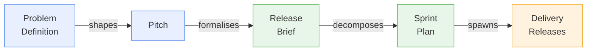

### Discovery workflow

```
/wire:new                                          # release_type: discovery

# Begin each session:
/wire:session:start 01-discovery

# Step 1: Problem Definition
/wire:problem-definition-generate 01-discovery
/wire:problem-definition-validate 01-discovery
/wire:problem-definition-review 01-discovery

# Step 2: Pitch
/wire:pitch-generate 01-discovery
/wire:pitch-validate 01-discovery
/wire:pitch-review 01-discovery                    # betting table review

# Step 3: Release Brief
/wire:release-brief-generate 01-discovery
/wire:release-brief-validate 01-discovery
/wire:release-brief-review 01-discovery            # client sign-off

# Step 4: Sprint Plan
/wire:sprint-plan-generate 01-discovery
/wire:sprint-plan-validate 01-discovery
/wire:sprint-plan-review 01-discovery              # team approval

# Spawn the downstream delivery releases:
/wire:release:spawn 01-discovery

# End each session:
/wire:session:end 01-discovery
```

### Step 1: Problem Definition

```
/wire:problem-definition-generate 01-discovery
```

The AI reads the engagement context (`engagement/context.md`, `engagement/sow.md`) and any call transcripts in `engagement/calls/`, and produces a structured problem framing with six components:
- **Who has the problem**: the specific role or team experiencing the friction
- **What they are trying to do**: the goal or job to be done
- **What the current friction is**: the specific obstacle or pain
- **Why it matters**: business impact if not addressed
- **Current workarounds**: what people are doing instead
- **Constraints**: time, budget, technology, regulatory

```
/wire:problem-definition-validate 01-discovery
```

Validation checks that the problem is specific (not vague), measurable (impact is quantifiable), and framed as a problem (not a solution). Flags any "solution-baked-in" problem statements for revision.

```
/wire:problem-definition-review 01-discovery
```

Review with stakeholders. The goal is to reach agreement that the problem statement accurately reflects the real friction — before any solution design begins. Problems with poor framing produce pitches that solve the wrong thing.

### Step 2: Pitch

```
/wire:pitch-generate 01-discovery
```

Produces a 10-section Shape Up pitch:
1. **Problem** — the approved problem statement
2. **Appetite** — how much time this is worth (1–2 weeks small batch, or 6 weeks big batch)
3. **Solution sketch** — a fat-marker description (specific enough to be actionable, not so detailed it locks the team in)
4. **Rabbit holes** — known implementation traps to avoid
5. **No-gos** — scope items explicitly excluded
6. **Risks** — technical or business risks that need monitoring
7. **Success criteria** — how we'll know this release succeeded
8. **Downstream releases** — delivery releases this pitch would spawn
9. **Timeline** — proposed start date, end date, and key milestones
10. **The bet** — the decision to commit: why this is the right thing to build now

```
/wire:pitch-validate 01-discovery
```

Validates appetite specificity (must be a concrete timeframe, not "TBD"), section completeness, and that the solution sketch is shaped — not a wireframe or a vague goal, but a directional description leaving room for implementation.

```
/wire:pitch-review 01-discovery
```

**The betting table review.** This is where the pitch is presented to decision-makers — typically the engagement lead and client sponsor. The purpose is to make an explicit commitment: "We bet [appetite] that building [solution] will [success criteria]." The outcome is recorded in the pitch document (bet approved, modified, or deferred). If deferred, the reasons are captured for future consideration.

### Step 3: Release Brief

```
/wire:release-brief-generate 01-discovery
```

Formalises the approved pitch as a client-facing release brief — a commitment document. Includes: the approved problem statement, solution description, deliverables list, constraints and assumptions, dependencies, downstream releases, timeline with milestones, and a sign-off section.

```
/wire:release-brief-review 01-discovery
```

**Client sign-off.** The brief is presented to the client for approval. Once signed off, it becomes the authorising document for the downstream delivery releases. If the client requests changes, update the brief and re-review.

### Step 4: Sprint Plan

```
/wire:sprint-plan-generate 01-discovery
```

Decomposes the approved release brief into a sprint plan: epics, stories, and tasks with Fibonacci point estimates (1, 2, 3, 5, 8 — no 13-point stories; anything larger must be broken down). The total points are checked against the appetite budget.

```
/wire:sprint-plan-validate 01-discovery
```

Validates that: no single story is 13 points or more, total points fit the appetite budget, every deliverable from the release brief has at least one story, and no orphan tasks exist without a parent story.

```
/wire:sprint-plan-review 01-discovery
```

Team review and approval. Once approved, the sprint plan marks the discovery release as complete. The AI suggests running `release:spawn`.

### Spawning delivery releases

```
/wire:release:spawn 01-discovery
```

Reads the approved release brief to identify the planned downstream delivery releases, then creates the folder structure and `status.md` for each one:

```
.wire/releases/
  01-discovery/         ← source
    status.md
    planning/
      problem_definition.md
      pitch.md
      release_brief.md
      sprint_plan.md
  02-data-foundation/   ← spawned (pipeline_only or full_platform)
    status.md
    requirements/
    design/
    dev/
    test/
    deploy/
    enablement/
  03-reporting/         ← spawned (dashboard_extension)
    status.md
    ...
```

The spawned releases are ready to start immediately — their `status.md` files are pre-populated with the correct artifact scope for each release type, and their first session can begin with `/wire:session:start`.

### Engagement artifacts and the discovery release

The `.wire/engagement/` folder holds context that belongs to the whole engagement — context that any release can draw on:

```
.wire/engagement/
  context.md          ← engagement objectives, stakeholders, working agreements
  sow.md              ← statement of work or proposal (if available)
  calls/              ← meeting transcripts (added manually as engagements progress)
  org/                ← org charts, RACI, stakeholder maps
```

The discovery release reads from `engagement/` heavily — the problem definition draws from `context.md`, the pitch references the SOW, and reviews use Fathom call transcripts from `calls/`. The delivery releases that follow also read `engagement/context.md` for client background and stakeholder details. The engagement folder is never generated by a command — it is built up over time by the consultant adding transcripts, org charts, and context notes.

### Discovery release: worked example

A new engagement with an uncertain scope:

```
# Set up the engagement and first release
/wire:new
→ Client: Acme Corp
→ Repo mode: A (combined — .wire/ lives in this repo)
→ First release type: discovery
→ Release ID: 01-discovery
→ SOW path: ./proposals/acme_sow_draft.pdf   ← copied to engagement/sow.md

# Add meeting transcript from kick-off call
# Copy transcript to .wire/engagement/calls/2026-03-10-kickoff.md

# Start the first discovery session
/wire:session:start 01-discovery
→ [Plan Mode] Scans status.md and research sessions
→ Proposes 4-step session plan: Problem Definition → Pitch draft → ...

/wire:problem-definition-generate 01-discovery
→ Reads engagement/sow.md + engagement/calls/2026-03-10-kickoff.md
→ Produces structured problem framing

/wire:problem-definition-validate 01-discovery
→ PASS

/wire:problem-definition-review 01-discovery
→ Stakeholder review — approved with one change (friction statement refined)

/wire:pitch-generate 01-discovery
→ Produces 10-section pitch
→ Appetite set: 6 weeks (big batch — full pipeline + dbt + dashboards)

/wire:session:end 01-discovery
→ Records session in session_history: "Problem Definition complete and approved. Pitch drafted."
→ Suggests next session focus: Pitch review (betting table)

# Session 2 (next day)
/wire:session:start 01-discovery
→ Surfaces prior research saved from session 1
→ Proposes: pitch review → brief generation

/wire:pitch-validate 01-discovery  → PASS
/wire:pitch-review 01-discovery    → Bet approved: 6-week full_platform release
/wire:release-brief-generate 01-discovery
/wire:release-brief-validate 01-discovery  → PASS
/wire:release-brief-review 01-discovery    → Client sign-off received

/wire:sprint-plan-generate 01-discovery
/wire:sprint-plan-validate 01-discovery    → PASS
/wire:sprint-plan-review 01-discovery      → Team approved

/wire:release:spawn 01-discovery
→ Creates .wire/releases/02-acme-data-foundation/ (full_platform)
→ Creates .wire/releases/03-acme-enablement/ (enablement)
→ Both releases ready to start

/wire:session:end 01-discovery
→ Discovery release complete.
```

---

## 8. Generating a Client Kick-off Deck

The Wire Framework can generate a branded, client-specific kick-off presentation deck in HTML (exportable to PDF via headless Chrome). This works immediately after `/wire:new` — the primary source is the Statement of Work. If you run a discovery release first, you can re-run the generate command to enrich the deck with approved discovery artifacts.

### When to use it

Use the kickoff deck for:
- **Delivery kickoff** — opening the delivery phase with shared problem framing, sprint plan, and access requirements
- **Discovery sprint kickoff** — opening a discovery engagement; the deck automatically adjusts its wording when `engagementType` is `"Discovery"`

### Workflow

```
# Right after /wire:new (just SoW):
/wire:kickoff-generate

# Or after discovery artifacts are approved (enriched deck):
/wire:kickoff-generate 01-discovery

# Validate structure and content:
/wire:kickoff-validate

# Internal review, then PDF export instructions on approval:
/wire:kickoff-review
```

### What the generate command does

1. Reads `engagement/context.md` (client name, engagement type, team, SoW reference)
2. Reads the SoW — extracts objectives, approach, key metrics, data sources, and timeline
3. If a release folder is specified and discovery artifacts are approved, enriches the deck: problem framing from `problem_definition.md`, outcomes from `pitch.md`, sprint plan from `sprint_plan.md`, access requirements from `requirements_specification.md`
4. Populates the EDITMODE JSON block inside the deck HTML template
5. Writes output to `.wire/kickoff-deck.html` (engagement-level) or `.wire/releases/<release>/artifacts/kickoff-deck.html` (release-enriched)

### Discovery sprint mode

When the engagement type is `discovery`, the deck automatically sets `engagementType: "Discovery"`, which switches the deck's slide wording to frame the kickoff as a discovery sprint opening rather than a delivery build. No extra flags needed.

### Slide-by-slide content sources

| Slide | Content | Source |
|-------|---------|--------|
| 01 — Title | Client name, date, engagement type, presenters | `context.md` |
| 04 — Diagnosis | Current state / desired state narrative | SoW objectives, or `problem_definition.md` |
| 05 — Big number | Headline metric | SoW impact figures, or `problem_definition.md` Section 4 |
| 07 — Problems grid | Up to 8 root causes | SoW, or `problem_definition.md` Sections 3 & 7 |
| 09 — Outcomes | Up to 5 success criteria | SoW approach, or `pitch.md` Section 7 |
| 11 — Architecture | Mermaid diagram | `pipeline_design.md` (if present) |
| 13 — Two-week timeline | Sprint goals and stories | SoW timeline, or `sprint_plan.md` |
| 15 — Access requirements | Up to 4 data systems | SoW data sources, or `requirements_specification.md` |
| 16 — Team | Presenter names and roles | `context.md` / SoW |

### Re-running and manual edits

The generate command is safe to re-run. On re-run it merges generated values with any manual edits you have made directly to the EDITMODE block — fields like `titlePhoto`, `accentColor`, and `showPartnerBadge` are preserved unless a new generated value is available. You can always open the deck in a browser and use the built-in tweaks panel to make manual adjustments.

### PDF export

After the deck is reviewed and approved, the review command provides the exact headless Chrome command:

```bash
"/Applications/Google Chrome.app/Contents/MacOS/Google Chrome" \
  --headless \
  --print-to-pdf="kickoff.pdf" \
  --print-to-pdf-no-header \
  "file://$PWD/.wire/kickoff-deck.html"
```

If the Mermaid architecture diagram appears blank in the PDF, add `--virtual-time-budget=5000`.

### Template location

The blank deck template is at `wire/decks/kickoff/Project Kickoff.html` in the Wire repo. Never edit this file directly — the generate command reads it and writes a populated copy to the engagement directory.

---

## 9. Running a Full Platform Release (End-to-End)

Use this for releases that go from SOW to production dashboards and trained users. All 15 artifact types are in scope. If you are starting from a discovery release, the release brief and sprint plan from discovery serve as additional inputs alongside the SOW.

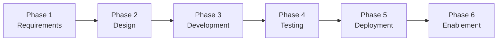

### Workflow

```
/wire:new                                          # release_type: full_platform
/wire:session:start <release-folder>               # begin each session

# Phase 1: Requirements
/wire:requirements-generate <release-folder>
/wire:requirements-validate <release-folder>
/wire:requirements-review <release-folder>

# Phase 2: Design
/wire:conceptual_model-generate <release-folder>
/wire:conceptual_model-validate <release-folder>
/wire:conceptual_model-review <release-folder>

/wire:pipeline_design-generate <release-folder>
/wire:pipeline_design-validate <release-folder>
/wire:pipeline_design-review <release-folder>

/wire:data_model-generate <release-folder>
/wire:data_model-validate <release-folder>
/wire:data_model-review <release-folder>

/wire:mockups-generate <release-folder>
/wire:mockups-review <release-folder>

# Phase 3: Development
/wire:pipeline-generate <release-folder>
/wire:pipeline-validate <release-folder>
/wire:pipeline-review <release-folder>

/wire:dbt-generate <release-folder>
/wire:dbt-validate <release-folder>
/wire:utils-run-dbt <release-folder>
/wire:dbt-review <release-folder>

/wire:orchestration-generate <release-folder>    # choose Dagster or dbt Cloud
/wire:orchestration-validate <release-folder>
/wire:orchestration-review <release-folder>

/wire:semantic_layer-generate <release-folder>
/wire:semantic_layer-validate <release-folder>
/wire:semantic_layer-review <release-folder>

/wire:dashboards-generate <release-folder>
/wire:dashboards-validate <release-folder>
/wire:dashboards-review <release-folder>

# Phase 4: Testing
/wire:data_quality-generate <release-folder>
/wire:data_quality-validate <release-folder>
/wire:data_quality-review <release-folder>

/wire:uat-generate <release-folder>
/wire:uat-review <release-folder>

# Phase 5: Deployment
/wire:deployment-generate <release-folder>
/wire:deployment-validate <release-folder>
/wire:deployment-review <release-folder>
/wire:utils-deploy-to-dev <release-folder>
/wire:utils-deploy-to-prod <release-folder>

# Phase 6: Enablement
/wire:training-generate <release-folder>
/wire:training-validate <release-folder>
/wire:training-review <release-folder>

/wire:documentation-generate <release-folder>
/wire:documentation-validate <release-folder>
/wire:documentation-review <release-folder>

/wire:archive <release-folder>
/wire:session:end <release-folder>               # end each session
```

### Session start

Begin every session on this release with:

```
/wire:session:start <release-folder>
```

The framework scans `status.md`, surfaces relevant research from `.wire/research/sessions/`, and proposes the session plan.

### Phase 1: Requirements (Day 1)

```
/wire:new
```
Answer the prompts: release type (`full_platform`), client name, engagement name, SOW path. Selecting `full_platform` instantiates the complete delivery process into the release's `status.md` — all 15 artifacts across six phases, each with generate/validate/review gates set to `not_started`. A `pipeline_only` release would only activate seven artifacts; a `dashboard_extension` just four. If you're on `main` or `master`, the framework will ask you to create a feature branch before creating any files. Optionally set up Jira tracking.

**After `/wire:new` completes**: Copy the SOW PDF (and any other source materials — meeting notes, SQL examples, existing data model docs) into the release's `requirements/` directory. Also ensure `engagement/sow.md` and `engagement/context.md` are populated — these are read by all commands throughout the release.

```
/wire:requirements-generate <release-folder>
```
The AI reads the SOW and engagement context, extracts structured requirements (functional, non-functional, data, technical, user), maps each SOW deliverable to the framework artifacts that will produce it, and writes `requirements/requirements_specification.md`.

```
/wire:requirements-validate <release-folder>
```
Checks completeness across all 13 sections, verifies each deliverable has acceptance criteria, and flags any timeline feasibility concerns.

```
/wire:requirements-review <release-folder>
```
Present the requirements to the client stakeholder. Record their approval (or requested changes) in the framework. If changes are needed: address them and re-run generate + validate + review.

**If requirements need workshop clarification**:
```
/wire:workshops-generate <release-folder>
/wire:workshops-review <release-folder>
```

**Ready criteria**: requirements artifact is `review: approved`.

### Phase 2: Design (Days 2–4)

The design phase follows a defined sequence. The conceptual model gates everything else.

#### Step 1: Conceptual entity model (Day 2 morning)

```
/wire:conceptual_model-generate <release-folder>
```
Produces a business-level entity model: an inventory of domain entities, a Mermaid `erDiagram` (entity names and relationships, no columns), and a relationship narrative. Any ambiguous entity boundaries or scope questions are surfaced as Open Questions.

```
/wire:conceptual_model-validate <release-folder>
```
Checks entity coverage against functional requirements, cardinality completeness, diagram syntax, PascalCase naming, and that no column-level detail has leaked in.

```
/wire:conceptual_model-review <release-folder>
```
**Review audience: business stakeholders, not just the technical team.** The goal is to confirm the entity landscape — what the business cares about — before pipeline architecture and detailed modelling begins. Approving entities here constrains everything that follows.

**Ready criteria**: `conceptual_model: review: approved` — this unblocks pipeline_design and data_model.

#### Step 2: Pipeline design + data flow diagram (Day 2–3)

```
/wire:pipeline_design-generate <release-folder>
```
Produces the full pipeline architecture document — source system analysis, replication scenarios with cost analysis, scheduling, error handling, design decisions requiring client input — **plus an embedded Data Flow Diagram (DFD)** as a Mermaid flowchart showing the end-to-end movement of data from source systems through ingestion, staging, warehouse, to BI dashboards.

```
/wire:pipeline_design-validate <release-folder>
```
Validates the architecture text and the DFD: all sources present, entity coverage through the flow, staging naming conventions, node labels populated (no placeholders), and Mermaid syntax.

```
/wire:pipeline_design-review <release-folder>
```
Technical review with the data engineering lead. Resolve any open design decisions (replication scenarios, scheduling choices) before this is approved.

#### Step 3: Data model specification + physical ERD (Day 3–4)

```
/wire:data_model-generate <release-folder>
```
Produces the complete dbt-layer data model specification — source definitions with freshness thresholds, staging models with grain and column mappings, integration models, warehouse models with surrogate keys and FK paths, seed files — **plus an embedded Physical ERD** as a Mermaid `erDiagram` with every warehouse model, all columns with types, PKs, FKs, and relationship lines. This is the most consequential design artifact.

```
/wire:data_model-validate <release-folder>
```
Validates naming conventions, grain definitions, PK/FK traceability, test coverage plan, and ERD consistency (every ERD entity matches the model spec, every FK has a corresponding join definition).

```
/wire:data_model-review <release-folder>
```
**This is the most important review gate in the full-platform workflow.** Approving a model with incorrect grain, wrong join keys, or missing entities is expensive to fix after dbt code is generated. Reviewer: analytics engineering lead. Allow adequate time.

#### Step 4: Dashboard mockups (Day 4)

```
/wire:mockups-generate <release-folder>
```
Produces dashboard wireframes based on the requirements. Review with end users, not the technical stakeholder.

**Ready criteria**: all four design artifacts are `review: approved`.

### Phase 3: Development (Days 5–8)

```
/wire:pipeline-generate <release-folder>
```
Generates data pipeline code (Python, Cloud Functions, or equivalent) based on the approved pipeline design. Includes extract logic, load logic, error handling, and scheduling configuration.

```
/wire:dbt-generate <release-folder>
```
Generates all dbt models — staging, integration, and warehouse layers — from the approved data model specification. The generation workflow embeds comprehensive analytics engineering conventions: field naming rules (`_pk`, `_fk`, `_natural_key`, `_ts`, `is_`/`has_` prefixes), field ordering (keys → dates → attributes → metrics → metadata), SQL style rules (4-space indentation, 80-char lines, explicit joins, `s_` CTE prefix, `final` CTE pattern), and multi-source framework support for releases with multiple source systems (configuration-driven source management, entity deduplication with `merge_sources` macro, `IN UNNEST()` join patterns). Convention loading follows a 2-tier system: project-specific conventions (`.dbt-conventions.md`) take priority over embedded defaults. Includes YAML documentation files and automated tests (not_null + unique on every PK, relationships on every FK, typically 40–50 tests for a mid-sized engagement).

```
/wire:utils-run-dbt <release-folder>
```
Runs the generated dbt models in dbt Cloud or locally. Verify all models build and tests pass before proceeding.

```
/wire:dbt-validate <release-folder>
```
Validates dbt models against a comprehensive checklist: file and model naming conventions (singular names, correct layer prefixes/suffixes), field naming conventions (`_pk`, `_fk`, `_ts`, boolean prefixes), field ordering, SQL structure (CTE patterns, style compliance), model configuration (materialization by layer), testing coverage (PK tests, FK relationships, integration model unique combinations), documentation coverage (100% for staging and warehouse layers), and optionally runs sqlfluff linting. Produces a structured validation report with severity-rated issues (critical, important, nice-to-have) and actionable recommendations.

```
/wire:orchestration-generate <release-folder>
```
Sets up the orchestration layer. Prompts you to choose between **Dagster** (Python-native, assets-first) and **dbt Cloud** (managed scheduling):

- **Dagster**: scaffolds a Dagster project, adds `dagster-dbt` integration via a `DbtProjectComponent` YAML (one asset per dbt model), generates `@dg.asset` definitions per source system, and creates schedules/sensors matching the pipeline design cadences. Run locally with `dg dev` (Dagster UI at localhost:3000) and `dg launch --assets "*"`.
- **dbt Cloud**: generates environment configs (dev/prod), job definitions per cadence, a CI/PR job, and a `.env.template` for credentials. Includes Terraform HCL snippets for IaC management.

The tool choice is stored in `status.md` as `orchestration_tool` and reused by validate and review.

```
/wire:orchestration-validate <release-folder>
```
For Dagster: runs `dg check defs` to verify the asset graph loads, checks all dbt models have corresponding assets, and verifies schedule cadences match the pipeline design. For dbt Cloud: validates config completeness, model selectors, and cron expressions.

```
/wire:semantic_layer-generate <release-folder>
```
Generates LookML views, explores, measures, and dimension definitions from the approved dbt models. The generation follows a 9-phase workflow: understand the task, examine existing LookML project, parse schema information (with full data type mapping), design the LookML structure, create view files (with embedded templates for primary keys, string/date/numeric dimensions, derived fields, measures, and drill sets), update model files, validate syntax, and provide a handover summary. Includes 5 embedded patterns (dimension table, fact table, aggregated PDT, multi-join explore, native derived table with parameters) and BigQuery-specific support (nested/repeated fields with UNNEST, partitioned table optimization, JSON field handling). Validation includes mandatory table/column reference cross-checking against source DDL and `preferred_slug` compliance checking.

```
/wire:dashboards-generate <release-folder>
```
Generates Looker dashboard LookML from the approved mockups and semantic layer. Validate and review.

**Ready criteria**: all four development artifacts are `review: approved` and dbt tests passing.

### Phase 4: Testing (Days 9–10)

```
/wire:data_quality-generate <release-folder>
```
Generates additional data quality tests beyond the embedded dbt tests: freshness checks, row count reconciliation, cross-system validation, custom business rules.

```
/wire:utils-run-dbt <release-folder>
```
Run dbt tests (use `--test` flag). Review any failures and fix the underlying data or model issues.

```
/wire:uat-generate <release-folder>
```
Generates a UAT plan mapped to the functional requirements. Conduct UAT sessions with end users, record outcomes, and iterate on any issues.

```
/wire:uat-review <release-folder>
```
Records UAT sign-off. Do not proceed to deployment without this.

**Ready criteria**: all dbt tests passing, UAT approved.

### Phase 5: Deployment (Day 11)

```
/wire:deployment-generate <release-folder>
```
Generates the deployment runbook (step-by-step production deployment instructions), CI/CD pipeline configuration, monitoring and alerting setup, and rollback procedures.

```
/wire:deployment-validate <release-folder>
```
Pre-deployment checklist: verifies all upstream artifacts are ready, no outstanding blockers, monitoring configuration complete.

```
/wire:utils-deploy-to-dev <release-folder>
```
Test the deployment process in the dev environment.

```
/wire:utils-deploy-to-prod <release-folder>
```
Follow the runbook. Smoke-test after deployment. Monitor for the first 24 hours.

**Ready criteria**: production deployment successful, monitoring operational.

### Phase 6: Enablement (Days 12–13)

```
/wire:training-generate <release-folder>
```
Generates two training packages:
- **Data team enablement**: technical session plan (2 hours), covering how to extend the models, add new data sources, interpret monitoring alerts
- **End user training**: dashboard usage session (90 minutes), including responsible interpretation of data signals

```
/wire:training-review <release-folder>
```
Rehearse sessions internally before delivering. Record any adjustments.

Deliver the training sessions. Record attendance in status.

```
/wire:documentation-generate <release-folder>
```
Generates technical architecture documentation and end-user guides. Validate and finalise.

```
/wire:archive <release-folder>
```
Archives the completed release and produces a release summary. Run `session:end` to record the final session.

### Utility commands available at any phase

In addition to the phase-specific commands above, the framework provides utility commands that can be used at any point during a release:

- **`/wire:utils-run-dbt <release-folder>`** — Runs the generated dbt models in dbt Cloud or locally
- **`/wire:utils-deploy-to-dev <release-folder>`** — Deploys to the development environment
- **`/wire:utils-deploy-to-prod <release-folder>`** — Deploys to the production environment
- **`/wire:utils-meeting-context <release-folder>`** — Retrieves Fathom meeting transcripts for context, useful for capturing client decisions and requirements discussed in calls
- **`/wire:utils-jira-sync <release-folder>`** — Syncs artifact status to Jira issues, keeping project management tools in sync with framework state
- **`/wire:utils-jira-status-sync <release-folder>`** — Full reconciliation of all artifact states to Jira, ensuring complete alignment between framework status and Jira
- **`/wire:utils-jira-create <release-folder>`** — Creates or links Jira issues for a release. Can create a new Epic/Task/Sub-task hierarchy from scratch, or search an existing Jira project for matching issues and link to them
- **`/wire:utils-atlassian-search <release-folder>`** — Searches Confluence for documentation, useful for finding existing client documentation and prior engagement materials

---

## 10. Running a Pipeline + dbt Release

Use this when a new data source needs connecting through to the dbt layer, but a BI tool / semantic layer is already in place or out of scope.

**In-scope artifacts**: `requirements`, `workshops` (if needed), `pipeline_design`, `data_model`, `pipeline`, `dbt`, `data_quality`, `deployment`

**Out of scope**: `mockups`, `semantic_layer`, `dashboards`, `uat`, `training`, `documentation`

### Workflow

```
/wire:new                                   # release_type: pipeline_dbt
/wire:session:start <release-folder>

/wire:requirements-generate <release-folder>
/wire:requirements-validate <release-folder>
/wire:requirements-review <release-folder>

/wire:pipeline_design-generate <release-folder>
/wire:pipeline_design-validate <release-folder>
/wire:pipeline_design-review <release-folder>

/wire:data_model-generate <release-folder>
/wire:data_model-validate <release-folder>
/wire:data_model-review <release-folder>

/wire:pipeline-generate <release-folder>
/wire:pipeline-validate <release-folder>
/wire:pipeline-review <release-folder>

/wire:dbt-generate <release-folder>
/wire:dbt-validate <release-folder>
/wire:utils-run-dbt <release-folder>
/wire:dbt-review <release-folder>

/wire:data_quality-generate <release-folder>
/wire:data_quality-validate <release-folder>
/wire:data_quality-review <release-folder>

/wire:deployment-generate <release-folder>
/wire:deployment-validate <release-folder>
/wire:deployment-review <release-folder>
/wire:utils-deploy-to-prod <release-folder>

/wire:archive <release-folder>
/wire:session:end <release-folder>
```

---

## 11. Running a dbt Development Release

Use this when data is already in the warehouse (e.g. via Fivetran, Stitch, or manual loads) and you need to build or extend the dbt transformation layer.

**In-scope artifacts**: `requirements`, `conceptual_model`, `data_model`, `dbt`, `data_quality`

### Workflow

```
/wire:new                                         # release_type: dbt_development
/wire:session:start <release-folder>

/wire:requirements-generate <release-folder>      # Focus on transformation requirements
/wire:requirements-validate <release-folder>
/wire:requirements-review <release-folder>

/wire:conceptual_model-generate <release-folder>
/wire:conceptual_model-validate <release-folder>
/wire:conceptual_model-review <release-folder>

/wire:data_model-generate <release-folder>        # Read existing source schema + requirements
/wire:data_model-validate <release-folder>
/wire:data_model-review <release-folder>

/wire:dbt-generate <release-folder>
/wire:dbt-validate <release-folder>
/wire:utils-run-dbt <release-folder>
/wire:dbt-review <release-folder>

/wire:data_quality-generate <release-folder>
/wire:data_quality-validate <release-folder>
/wire:data_quality-review <release-folder>

/wire:archive <release-folder>
/wire:session:end <release-folder>
```

**Tips for dbt-only releases**:
- Add any existing dbt project files (existing `schema.yml`, source definitions, SQL examples) to `requirements/` before running `data_model:generate` — the AI will use them to understand the existing model structure and extend it correctly
- Store SQL examples from the source database (schema introspection results, sample queries) so the AI understands actual column names and types

---

## 12. Running a Dashboard Extension Release

Use this when the semantic layer already has the data, and you're adding new dashboards on top.

**In-scope artifacts**: `requirements`, `mockups`, `dashboards`, `uat`

### Workflow

```
/wire:new                                         # release_type: dashboard_extension
/wire:session:start <release-folder>

/wire:requirements-generate <release-folder>      # Focus on dashboard/user requirements
/wire:requirements-validate <release-folder>
/wire:requirements-review <release-folder>

/wire:mockups-generate <release-folder>           # Wireframes for review with end users
/wire:mockups-review <release-folder>

/wire:dashboards-generate <release-folder>
/wire:dashboards-validate <release-folder>
/wire:dashboards-review <release-folder>

/wire:uat-generate <release-folder>
/wire:uat-review <release-folder>

/wire:archive <release-folder>
/wire:session:end <release-folder>
```

**Tips**:
- Add existing LookML view files to `requirements/` before generating dashboards — the AI needs to know which dimensions and measures are available
- Screenshots of existing Looker explores also help

---

## 13. Running a Dashboard-First Rapid Development Release

Use this when you want early stakeholder feedback via interactive dashboard mocks before building the data layer. This approach is especially effective when the SOW is well-defined but client data access may be delayed — you can have a working prototype with seed data before the client provides database credentials.

**In-scope artifacts**: `requirements`, `mockups`, `viz_catalog`, `data_model`, `seed_data`, `dbt`, `semantic_layer`, `dashboards`, `data_refactor`, `data_quality`, `uat`, `deployment`, `training`, `documentation`

**Out of scope**: `workshops`, `conceptual_model`, `pipeline_design`, `pipeline`

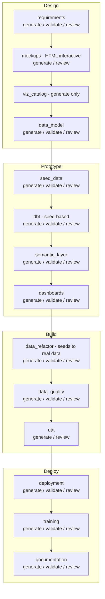

### Workflow

```
/wire:new                                               # release_type: dashboard_first
/wire:session:start <release-folder>

# Phase 1: Requirements (Day 1)
/wire:requirements-generate <release-folder>
/wire:requirements-validate <release-folder>
/wire:requirements-review <release-folder>

# Phase 2: Interactive Dashboard Mocks (Day 1–2)
/wire:mockups-generate <release-folder>                 # HTML interactive mockups
/wire:mockups-review <release-folder>

# Phase 3: Visualization Catalog (Day 2)
/wire:viz_catalog-generate <release-folder>             # Generate-only, no validate/review

# Phase 4: Data Model (Day 2–3)
/wire:data_model-generate <release-folder>              # Driven by viz_catalog, not conceptual model
/wire:data_model-validate <release-folder>
/wire:data_model-review <release-folder>

# Phase 5: Seed Data (Day 3)
/wire:seed_data-generate <release-folder>               # CSV files with referential integrity
/wire:seed_data-validate <release-folder>
/wire:seed_data-review <release-folder>

# Phase 6: Development — seed-based (Days 3–5)
/wire:dbt-generate <release-folder>                     # Uses ref() to seeds, not source()
/wire:dbt-validate <release-folder>
/wire:utils-run-dbt <release-folder>                    # dbt seed && dbt run && dbt test
/wire:dbt-review <release-folder>

/wire:semantic_layer-generate <release-folder>
/wire:semantic_layer-validate <release-folder>
/wire:semantic_layer-review <release-folder>

/wire:dashboards-generate <release-folder>
/wire:dashboards-validate <release-folder>
/wire:dashboards-review <release-folder>

# Phase 7: Data Refactor — seeds → real data (when client data available)
/wire:data_refactor-generate <release-folder>           # Compares seed schema to real schema
/wire:data_refactor-validate <release-folder>           # Verifies dbt compiles against real data
/wire:data_refactor-review <release-folder>

# Phase 8: Testing
/wire:data_quality-generate <release-folder>
/wire:data_quality-validate <release-folder>
/wire:data_quality-review <release-folder>

/wire:uat-generate <release-folder>
/wire:uat-review <release-folder>

# Phase 9: Deployment + Enablement
/wire:deployment-generate <release-folder>
/wire:deployment-validate <release-folder>
/wire:deployment-review <release-folder>
/wire:utils-deploy-to-prod <release-folder>

/wire:training-generate <release-folder>
/wire:training-validate <release-folder>
/wire:training-review <release-folder>

/wire:documentation-generate <release-folder>
/wire:documentation-validate <release-folder>
/wire:documentation-review <release-folder>

/wire:archive <release-folder>
/wire:session:end <release-folder>
```

### Phase 1: Requirements (Day 1)

Same as Full Platform — ensure `engagement/sow.md` is present, run requirements generate/validate/review. The key difference is that requirements approval unblocks **mockups** (not conceptual model).

### Phase 2: Interactive Dashboard Mockups (Day 1–2)

This is the key differentiator. Instead of generating ASCII wireframes, the mockups command for `dashboard_first` projects generates **pixel-accurate, interactive HTML Looker mockups** directly inside Claude Code — no external tools required.

```
/wire:mockups-generate <release-folder>
```

The framework:
1. Reads the approved requirements and plans the dashboard structure — pages, KPI tiles, charts, tables, and filters
2. Reads the Looker design system reference (teal sidebar, Google Sans, Chart.js charts) from the bundled skill
3. Generates one or more **self-contained HTML files** that faithfully reproduce the Looker UI, with interactive Chart.js charts and filter controls
4. Simultaneously produces `design/dashboard_visualization_catalog.csv` and `design/dashboard_spec.md` — the downstream inputs for the visualization catalog command
5. All files are saved to `design/mockups/` and ready immediately

```
/wire:mockups-review <release-folder>
```

Review the HTML mockups with end users and stakeholders. Open the HTML files in a browser — they are fully interactive. Attach them to emails or share via a file share for async feedback.

**Tips**:
- Open the HTML file in a browser to experience the full interactive dashboard before sharing with stakeholders — the charts respond to hover and the tabs switch.
- Iterate on the mockups by asking Claude to modify specific tiles, charts, or data before running `viz_catalog:generate`. Changes after the catalog is generated require regenerating downstream artifacts.
- For dashboard-first engagements where the data domain is complex, share the mockup with the client early — even before requirements are fully approved — to validate the direction.

### Phase 3: Visualization Catalog (Day 2)

```
/wire:viz_catalog-generate <release-folder>
```

This is a **generate-only** artifact (no separate validate or review gates). The command parses the CSV and markdown generated by `/wire:mockups-generate` into a structured catalog: a dashboard inventory, measures index, dimensions index, and requirements coverage analysis. This answers the question: exactly which measures and dimensions must the data model provide?

### Phase 4: Data Model (Day 2–3)

```
/wire:data_model-generate <release-folder>
```

For `dashboard_first`, the data model is driven by the **visualization catalog** instead of a conceptual model and pipeline design. The prerequisites are `requirements: approved` and `viz_catalog: complete` (not `conceptual_model: approved` + `pipeline_design: approved` as in Full Platform).

The command also generates `source_tables_ddl.sql` and `target_warehouse_ddl.sql` in the design folder — SQL DDL files that define the expected source and target schemas.

### Phase 5: Seed Data (Day 3)

```
/wire:seed_data-generate <release-folder>
```

After the data model is approved, the framework generates **internally consistent CSV seed data files** — one per source table — with realistic, domain-appropriate values that maintain referential integrity across all foreign key relationships.

The seed data validation gate checks:
- PK uniqueness (no duplicate primary keys)
- FK integrity (every foreign key value exists in the referenced table)
- Date consistency (no future dates in historical fields, chronological ordering)
- Value distributions (realistic for meaningful dashboard visualizations)

### Phase 6: Development — seed-based (Days 3–5)

```
/wire:dbt-generate <release-folder>
```

For `dashboard_first`, dbt generation uses `ref('seed_name')` instead of `source()` — meaning `dbt seed && dbt run && dbt test` works immediately without any client data access. You have a working dbt project, populated warehouse, and functional dashboards before the client provides database credentials.

The rest of development (semantic layer, dashboards) proceeds as in Full Platform.

### Phase 7: Data Refactor (when client data available)

```
/wire:data_refactor-generate <release-folder>
```

Once the client provides access to their actual data sources (DDLs, database credentials, or standard SaaS connector schemas), this command:
1. Compares the seed-based source schema against the real one
2. Generates a refactoring plan documenting every change needed
3. Executes the changes: updates source definitions, staging model SQL, and dbt configuration
4. Preserves seed files as reference

The transition from `ref('customers_seed')` to `source('salesforce', 'accounts')` is a mechanical operation guided by the schema comparison. This step — which would be expensive to do manually — is straightforward because the staging models were designed from the start to be refactorable.

### Tips for dashboard-first engagements

- **Start mocking early**: You can run `/wire:mockups-generate` during the SOW preparation phase or even before project kick-off. The earlier stakeholders see something visual, the better the feedback.
- **Seed data quality matters**: Realistic seed data makes the prototype convincing. The framework generates domain-appropriate values, but review the seeds for realism before showing to stakeholders.
- **Don't delay the refactor**: Once client data is available, run the data refactor promptly. The longer you wait, the more the seed-based version diverges from what the client expects.
- **The prototype is disposable**: The seed-based dbt project exists to validate the design. The real value is the iteration it enables, not the seed data itself.

---

## 14. Running an Enablement Release

Use this when an existing platform needs training and documentation — either as a standalone release or as the final phase of a delivery that was not originally run through the Wire Framework.

**In-scope artifacts**: `training`, `documentation`

### Workflow

```
/wire:new                                         # release_type: enablement
/wire:session:start <release-folder>

/wire:requirements-generate <release-folder>      # Capture training audience and learning objectives

/wire:training-generate <release-folder>
/wire:training-validate <release-folder>
/wire:training-review <release-folder>

/wire:documentation-generate <release-folder>
/wire:documentation-validate <release-folder>
/wire:documentation-review <release-folder>

/wire:archive <release-folder>
/wire:session:end <release-folder>
```

**Tips**:
- Add any existing technical documentation, data dictionaries, or architecture diagrams to `requirements/` — the AI will use them as the basis for generated materials
- Add the client stakeholder list (names, roles, technical levels) so training materials can be calibrated appropriately

---

## 15. Running an Agentic Commerce Release

The Agentic Commerce release type (`project_type: agentic_commerce`) is for engagements where the deliverable is an AI-powered ecommerce storefront — not a data platform. It combines Lovable (rapid frontend scaffolding), Shopify (product catalog and cart), GitHub (code hosting), Supabase (backend state), Google Cloud (AI/search), and optionally Stripe (payments via the UCP merchant server).

**In-scope features**: `ac_storefront`, `ac_semantic_search`, `ac_conversational_assistant`, `ac_virtual_tryon`, `ac_visual_similarity`, `ac_llm_tools`, `ac_personalisation`, `ac_ucp_server`, `ac_demo_orchestration`

### Prerequisites before starting

Ensure the following accounts and access tokens are ready before running `/wire:new`:

| Service | What you need | Used by |
|---------|--------------|---------|
| Lovable | Account + new project | `ac_storefront` and all AI features via AI Gateway |
| Shopify | Store + Storefront API access token (Headless channel) | `ac_storefront`, `ac_personalisation` |
| GitHub | Account + Lovable GitHub App authorised | `ac_storefront` (code sync) |
| Supabase | Project enabled in Lovable Cloud | `ac_storefront`, `ac_personalisation` |
| GCP | Project with Vertex AI Retail API + BigQuery APIs enabled + service account key | `ac_semantic_search`, `ac_conversational_assistant`, `ac_personalisation` |
| Stripe | Account + secret key | `ac_ucp_server` |

See `agentic_commerce_release/00a-prerequisites-and-worked-examples.md` for a full step-by-step setup guide.

### Workflow

```
/wire:new                                          # release_type: agentic_commerce
/wire:session:start <release-folder>

# Phase 1 — Base storefront (prerequisite for all other features)
/wire:ac_storefront-generate <release-folder>      # Guided Lovable prompt sequence + GitHub sync
/wire:ac_storefront-validate <release-folder>      # Shopify products loading, cart working, Supabase connected
/wire:ac_storefront-review <release-folder>        # Stakeholder sign-off before agentic features begin

# Phase 2 — Agentic features (can be developed in parallel after storefront approved)
/wire:ac_semantic_search-generate <release-folder>
/wire:ac_semantic_search-validate <release-folder>
/wire:ac_semantic_search-review <release-folder>

/wire:ac_conversational_assistant-generate <release-folder>
/wire:ac_conversational_assistant-validate <release-folder>
/wire:ac_conversational_assistant-review <release-folder>

/wire:ac_virtual_tryon-generate <release-folder>
/wire:ac_virtual_tryon-validate <release-folder>
/wire:ac_virtual_tryon-review <release-folder>

/wire:ac_visual_similarity-generate <release-folder>
/wire:ac_visual_similarity-validate <release-folder>
/wire:ac_visual_similarity-review <release-folder>

/wire:ac_llm_tools-generate <release-folder>
/wire:ac_llm_tools-validate <release-folder>
/wire:ac_llm_tools-review <release-folder>

/wire:ac_personalisation-generate <release-folder>
/wire:ac_personalisation-validate <release-folder>
/wire:ac_personalisation-review <release-folder>

/wire:ac_ucp_server-generate <release-folder>
/wire:ac_ucp_server-validate <release-folder>
/wire:ac_ucp_server-review <release-folder>

/wire:ac_demo_orchestration-generate <release-folder>
/wire:ac_demo_orchestration-validate <release-folder>
/wire:ac_demo_orchestration-review <release-folder>

/wire:archive <release-folder>
/wire:session:end <release-folder>
```

### What each generate command does

**`/wire:ac_storefront-generate`** — walks through a 5-phase Lovable prompt sequence: brand foundation → product grid layout → Shopify Storefront API wiring → cart and checkout flow → GitHub sync. Each phase presents the exact Lovable prompt to paste, then waits for confirmation before proceeding.

**`/wire:ac_semantic_search-generate`** — implements AI-powered product search. By default uses the Google Cloud Retail API (Vertex AI for Retail) for semantic vector search. Presents the implementation prompts for Lovable/Claude Code, sets up the search index sync from Shopify to Vertex AI, and wires the search UI component to the API.

**`/wire:ac_conversational_assistant-generate`** — builds a multi-turn shopping assistant using Google Cloud Retail API Conversational Search. Implements intent detection (browse, filter, compare, checkout), maintains session state, and integrates with the cart.

**`/wire:ac_virtual_tryon-generate`** — adds a "Try it on" button to product pages. Photo upload modal → Lovable AI Gateway (Gemini Flash) → composite image generation → display result. Handles retries, timeouts, and graceful degradation.

**`/wire:ac_visual_similarity-generate`** — adds "Find similar" on product cards. Sends the product image to Gemini multimodal, generates embeddings, and returns visually similar products from the catalog.

**`/wire:ac_llm_tools-generate`** — implements Gemini 2.5 Flash with function calling. Defines tool schemas for `search_products`, `get_product_details`, `add_to_cart`, `get_recommendations`. The assistant decides autonomously when to call tools.

**`/wire:ac_personalisation-generate`** — sets up anonymous user profiles in Supabase (UUID-based, no PII), event tracking (views, searches, purchases), and dynamic UX elements (returning-user greeting, previously-viewed products, personalised search boost).

**`/wire:ac_ucp_server-generate`** — implements a Universal Commerce Protocol merchant server: `/discover` endpoint for capability advertisement, full checkout lifecycle (`/checkout/start` → `/checkout/update` → `/checkout/confirm`), Stripe payment intent integration, idempotency, and CORS configuration.

**`/wire:ac_demo_orchestration-generate`** — adds a floating demo control panel with a 5-phase state machine (Introduction → Product Discovery → AI Shopping → Personalisation → Checkout). Each phase activates the relevant AI feature, displays contextual callouts, and advances on timer or manual trigger.

### Dependency order

`ac_storefront` must reach **Approved** status before any other `ac_*` feature can begin — all features build on the GitHub-synced codebase produced by the storefront command. After that:

- Features can be developed in parallel
- `ac_personalisation` enriches `ac_conversational_assistant` and `ac_semantic_search` when completed (adds personalised ranking and search boost)
- `ac_demo_orchestration` should be the final feature — it wraps all others into a cohesive demo flow

### Tips

- Run the full Lovable prompt sequence from `ac_storefront-generate` **before** making any code edits in GitHub — the Lovable sync is one-directional during the initial build phase
- After GitHub sync is complete, all subsequent development happens in the GitHub repo via Claude Code — do not return to the Lovable UI for feature development
- Keep the Shopify Storefront API token out of the frontend bundle — it should be passed via Supabase Edge Functions or a server-side proxy
- Use `VITE_` prefix only for environment variables that are safe to expose to the browser

---

## 16. Worked Example: Barton Peveril Live Pastoral Analytics

This section shows how a real engagement — a Full Platform release for Barton Peveril Sixth Form College — was run through the framework, including the actual commands used and the decisions made at each step. This engagement was run directly from a signed SOW (no discovery release needed — scope was already well-defined), so it starts with the full_platform delivery release.

### Engagement overview

| | |
|-|-|
| **Client** | Barton Peveril Sixth Form College, Hampshire |
| **Engagement** | Live Pastoral Analytics (SOW 2) |
| **Duration** | 2 weeks (Feb 2–13, 2026) |
| **Budget** | $7,100 / 35 hours |
| **Release type** | Full Platform |

**SOW deliverables**:

| ID | Deliverable | Framework Artifacts |
|----|-------------|-------------------|
| D1 | Live Pastoral Data Pipeline (ProSolution + Focus → BigQuery) | `pipeline_design`, `pipeline`, `data_quality` |
| D2 | Looker Semantic Layer Extension (risk signals) | `data_model`, `dbt`, `semantic_layer` |
| D3 | SPA Operational Dashboard | `mockups`, `dashboards` |
| D4 | Data Team Enablement Session | `training` (technical) |
| D5 | End User Training Session | `training` (end-user) |

### Data architecture

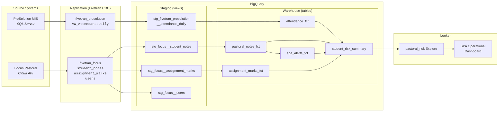

### Week 1: Requirements → Design → Development (Part 1)

#### Day 1 — Engagement setup and requirements

```bash
# Set up the engagement and the delivery release
/wire:new
# → Client: Barton Peveril Sixth Form College
# → Engagement name: barton_peveril
# → Repo mode: A (combined — .wire/ in this repo)
# → First release type: full_platform (activates all 15 artifact workflows)
# → Release ID: 01-barton-peveril-live-pastoral
# → Branch: feature/barton-peveril-live-pastoral (created automatically if on main)
# → .wire/engagement/context.md and sow.md created
# → .wire/releases/01-barton-peveril-live-pastoral/status.md created
#   with full delivery process: requirements through enablement

/wire:session:start 01-barton-peveril-live-pastoral
# → Scans status.md: all artifacts at not_started
# → No prior research found
# → Proposes session plan: requirements → design kick-off
```

Selecting `full_platform` instantiated the complete delivery process into the release's `status.md` — all 15 artifacts across six phases, each with generate/validate/review gates set to `not_started`. This is the process definition that will govern the entire release.

The SOW PDF was copied to `.wire/engagement/sow.md` during `/wire:new`.

Also add to the engagement folder:
- Client SQL examples showing the ProSolution schema (`vw_AttendanceDaily`, `RegisterMark`, `RegisterStudent`, etc.) → place in `releases/01-barton-peveril-live-pastoral/requirements/`
- Meeting notes from the pre-engagement call → add to `engagement/calls/2026-02-01-kickoff.md`

```
/wire:requirements-generate 01-barton-peveril-live-pastoral
```

**What the AI produced**:
- 13-section requirements specification (150+ lines)
- Functional requirements FR-1 through FR-9 with measurable acceptance criteria
- Non-functional requirements NFR-1 through NFR-7 (performance, security, freshness SLAs)
- D1–D5 deliverable-to-artifact mapping
- Key design flags requiring workshop resolution: attendance granularity (register-level vs daily snapshot), Fivetran replication cost vs data refresh frequency

```
/wire:requirements-validate 01-barton-peveril-live-pastoral
→ PASS (all 13 sections complete, acceptance criteria present for all deliverables)

/wire:requirements-review 01-barton-peveril-live-pastoral
→ Approved by Head of MIS, 2026-02-03
```

```
/wire:mockups-generate 01-barton-peveril-live-pastoral
```

Dashboard wireframes for the SPA Operational Dashboard:
- At-risk student list (attendance + pastoral note indicators)
- Unanswered SPA alert tracker
- Student detail drillthrough panel

Reviewed with SPAs and pastoral leads on Day 2.

#### Day 2 — Design review and development start

```
/wire:pipeline_design-generate 01-barton-peveril-live-pastoral
```

**What the AI produced** (using the SQL examples from artifacts/):
- Source schema analysis: ProSolution — `StudentDetail` → `Enrolment` → `RegisterStudent` → `RegisterMark` → `MarkType` → `RegisterSession`
- Three Fivetran replication scenarios with cost analysis:
  - Scenario A: Raw register-level tables (high granularity, high MAR cost)
  - Scenario B: Server-side view `vw_AttendanceDaily` (moderate cost, DBA creates)
  - Scenario C: Hybrid (daily view for dashboard, raw tables for drill-through)
- Architecture diagrams for all scenarios
- 10 design decisions (PD-1 through PD-10) requiring client input

**Decision taken**: Scenario C (Hybrid). Client DBA created `vw_AttendanceDaily` on the ProSolution SQL Server. Pipeline design went through two versions (v2.0 added Markbook/Assignment data to scope).

```
/wire:data_model-generate 01-barton-peveril-live-pastoral
```

**What the AI produced**:
- Complete `_sources.yml` for `fivetran_focus` and `fivetran_prosolution` with column-level descriptions and freshness thresholds (`warn_after: 30 min / error_after: 60 min` for Focus live data; `warn_after: 120 min / error_after: 1560 min` for ProSolution daily view)
- Staging models: `stg_fivetran_prosolution__attendance_daily`, `stg_focus__student_notes`, `stg_focus__assignment_marks`, `stg_focus__users`
- Warehouse models: `attendance_fct`, `pastoral_notes_fct`, `spa_alerts_fct`, `assignment_marks_fct`, `student_risk_summary` (aggregate)
- Seed files: `note_type_mappings.csv`, `attendance_mark_types.csv`
- Cross-system join keys documented: Focus `assignment_marks.enrolment_id` → ProSolution `Enrolment.EnrolmentID`

Note: the AI flagged that note body text should be excluded at the Fivetran level for safeguarding reasons — the `student_notes.body` column was explicitly marked as not replicated.

#### Days 3–4 — Development: Pipeline and dbt

```
/wire:pipeline-generate 01-barton-peveril-live-pastoral
```

Generated Fivetran connector configuration and supplementary Python Cloud Functions for transformations outside Fivetran's capability. Error handling and alerting on pipeline failures.

```
/wire:dbt-generate 01-barton-peveril-live-pastoral
```

**Generated models** (using templates from the workflow spec):
- 4 staging models (views, `tags=['staging', 'focus'/'prosolution']`)
- 5 warehouse models (tables, `tags=['warehouse', 'fact']`)
- Surrogate keys on all models using `dbt_utils.generate_surrogate_key()`
- 47 automated tests: not_null + unique on every PK, relationship tests on every FK, custom freshness tests on live data

```
/wire:utils-run-dbt 01-barton-peveril-live-pastoral
→ 9 models built successfully
→ 47 tests passing
```

```
/wire:dbt-validate 01-barton-peveril-live-pastoral
→ PASS
→ Naming conventions: compliant
→ Test coverage: 100% PK and FK coverage
→ Documentation: all columns described
```

### Week 2: Development (Part 2) → Testing → Deployment → Enablement

#### Day 5 — Semantic layer and dashboard development

```
/wire:semantic_layer-generate 01-barton-peveril-live-pastoral
```

Generated LookML:
- Views for all 5 warehouse models
- Risk signal measures: `attendance_deterioration_flag`, `pastoral_note_spike_flag`, `unanswered_alert_flag`
- `pastoral_risk` explore with joins across student, attendance, notes, and alerts

```
/wire:dashboards-generate 01-barton-peveril-live-pastoral
```

Generated SPA Operational Dashboard from approved mockups:
- Tile: At-risk students (ranked by composite risk score)
- Tile: Unanswered SPA alerts (overdue indicators)
- Tile: Workload prioritisation (alerts by SPA)
- Student drillthrough

#### Day 6 — Testing and iteration

```
/wire:data_quality-generate 01-barton-peveril-live-pastoral
→ Added: freshness alerts (data older than 90 minutes triggers Slack notification)
→ Added: row count reconciliation (ProSolution register count vs attendance_fct row count)
→ Added: null rate monitoring on attendance mark fields

/wire:uat-generate 01-barton-peveril-live-pastoral
```

UAT conducted with SPAs and pastoral leads on Day 6 (as per SOW timeline):
- All primary UAT scenarios passed
- One change request: add "days since last SPA contact" to student risk tile
- Dashboard iterated and re-reviewed

```
/wire:uat-review 01-barton-peveril-live-pastoral
→ Approved by Head of Student Services, 2026-02-10
```

#### Day 7 — Deployment

```
/wire:deployment-generate 01-barton-peveril-live-pastoral
→ Generated: deployment runbook, dbt Cloud job configuration, Looker deployment steps, rollback procedures

/wire:utils-deploy-to-dev 01-barton-peveril-live-pastoral
→ Dev deployment verified

/wire:utils-deploy-to-prod 01-barton-peveril-live-pastoral
→ Production deployment successful
→ Fivetran connectors active
→ dbt Cloud jobs scheduled
→ Dashboards published to Looker production
```

#### Day 8 — Enablement

```
/wire:training-generate 01-barton-peveril-live-pastoral
```

**D4 — Data Team Enablement** (morning, Chris, Joanne, Ethan):
- Session plan: How the live pipeline works, how dbt models are structured, how to add a new live data source, how to extend LookML
- Hands-on exercise: trace a data point from ProSolution SQL Server to the Looker dashboard

**D5 — End User Training** (afternoon, SPAs and pastoral leads):
- Session plan: Dashboard navigation, interpreting risk signals responsibly, when to act vs when to investigate further, data freshness expectations

```
/wire:archive 01-barton-peveril-live-pastoral
```

---

## 17. Wire Autopilot: Autonomous Execution

Wire Autopilot takes a Statement of Work and executes the **entire engagement lifecycle** — starting with a full discovery sprint (problem definition → pitch → release brief → sprint plan), then autonomously creating and executing every downstream delivery release identified by that discovery. Each release is executed with the artifact sequence appropriate for its type.

Safety gates automatically pause execution before any phase that could affect external systems (activating pipelines, running dbt against databases, deploying to environments), requiring explicit confirmation before proceeding.

### When to use Autopilot

- **Rapid prototyping**: You need a complete set of deliverables quickly to demonstrate the approach to a client
- **Standard engagements**: The SOW is well-defined and follows a familiar pattern
- **Internal projects**: Where speed matters more than stakeholder approval at every gate
- **Proof of concept**: Creating a working prototype from a proposal before the engagement formally begins

### When NOT to use Autopilot

- **Complex, ambiguous SOWs**: When the SOW needs significant interpretation or clarification before planning
- **Client-facing review gates required**: When the client must approve each phase before moving forward
- **Novel architectures**: When the project involves unfamiliar technologies or unconventional patterns
- **Single-release engagements**: If you only need one delivery release without a discovery phase, use `/wire:new` + `/wire:session:start` instead

### How it works

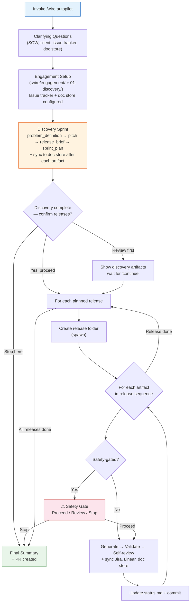

### Invoking Autopilot

```
/wire:autopilot path/to/SOW.pdf
```

Or without a path argument (Autopilot will ask for it):

```
/wire:autopilot
```

### Clarifying questions

Autopilot asks a small set of questions before going autonomous — notably, it does **not** ask for a project type upfront. The delivery release types are determined by the discovery sprint.

The questions are asked in this order:

1. **SOW file path** (if not provided as argument)
2. **Supporting documents** — org charts, call transcripts, architecture diagrams (optional)
3. **Client name and engagement name**
4. **Engagement lead name**
5. **Repo mode** — combined (default) or dedicated delivery repo
6. **Issue tracker** — Jira, Linear, both, or none (see below)
7. **Document store** — Confluence, Notion, both, or none (see below)
8. **Additional context** — technologies, naming conventions, preferences (optional)

#### Issue tracker setup

When you select Jira or Linear, Autopilot asks follow-up questions immediately:

**Jira**: asks for the project key and whether to create new issues or link to existing ones.

**Linear**: asks three separate questions in sequence:
1. Linear team identifier (e.g. `ENG`, `DATA`, `ACME`)
2. Setup mode:
   - *Create new project + new issues* — Wire creates a project and populates it
   - *Use existing project + create new issues* — paste a project URL or ID; Wire creates fresh issues inside it
   - *Link to existing project + existing issues* — Wire searches for matching issues and links them
3. Project URL or ID (only asked if mode 2 or 3 was chosen)

#### Document store setup

When you select Confluence, Notion, or both, Autopilot asks follow-up questions immediately:

- **Confluence**: asks for the space key (e.g. `PROJ`, `ACME`) where Wire documents should be published
- **Notion**: asks for the parent page URL or ID where Wire documents should be created as sub-pages

The document store is configured during engagement setup. Once set, every generated artifact is automatically published to the store — no manual action required.

After all questions are answered, Autopilot presents a confirmation of the execution plan before going autonomous.

### Phase 1: Discovery Sprint

Before any delivery work begins, Autopilot runs a complete discovery sprint to plan the engagement:

| Artifact | How Autopilot handles it |
|----------|--------------------------|
| **Problem Definition** | Generated from SOW and context. Pre-populates all 7 problem-framing questions from source material. Auto-approved if all 10 sections are complete. |
| **Pitch** | Generated from problem definition. Autopilot decides appetite from SOW timeline (6+ weeks → big batch, 2–3 weeks → small batch). Shapes the solution from SOW deliverables. Identifies downstream release types from SOW scope. Auto-approved if all 10 sections complete and at least one release identified. |
| **Release Brief** | Formalised from the approved pitch. Downstream releases table is the canonical list of delivery releases. Auto-approved if deliverables table and releases are populated. |
| **Sprint Plan** | Generated from release brief. Sprint length and story estimates set autonomously. Includes a Downstream Releases table used by Phase 2. Auto-approved if all deliverables have epics with point estimates. |

After each discovery artifact is approved, Autopilot syncs it to the configured document store (if any). This means all four discovery documents are available for client review in Confluence or Notion by the time the discovery sprint is complete.

After the discovery sprint, Autopilot presents the planned releases and asks for your confirmation before proceeding with delivery:

```
Discovery sprint complete. Ready to execute 3 delivery releases:
  02-data-foundation   (pipeline_only)
  03-reporting         (dashboard_extension)
  04-enablement        (enablement)

Proceed with autonomous execution?
  ○ Yes, execute all releases
  ○ Review discovery artifacts first
  ○ Stop here
```

### Phase 2: Delivery Release Execution

For each planned delivery release, Autopilot:

1. Creates the release folder structure (equivalent to `/wire:release:spawn`)
2. Creates the release `status.md` with the correct artifact scope for the release type
3. Runs the full artifact sequence for that release type
4. Commits all artifacts after the release is complete before moving to the next

**Artifact sequences by release type:**

| Type | Artifacts |
|------|-----------|
| `full_platform` | requirements → workshops → conceptual_model → pipeline_design → data_model → mockups → pipeline → dbt → semantic_layer → dashboards → data_quality → uat → deployment → training → documentation |
| `pipeline_only` | requirements → pipeline_design → pipeline → data_quality → deployment |
| `dbt_development` | requirements → data_model → dbt → semantic_layer → data_quality → deployment |
| `dashboard_extension` | requirements → mockups → dashboards → training |
| `dashboard_first` | requirements → mockups → viz_catalog → data_model → seed_data → dbt → semantic_layer → dashboards → data_refactor → data_quality → uat → deployment → training → documentation |
| `enablement` | training → documentation |

Each artifact follows the same generate → validate (up to 3 retries) → self-review (up to 2 retries) cycle. After each artifact is generated and again after it is approved, Autopilot syncs to Jira, Linear, and the document store (whichever are configured).

### Safety gates

Autopilot automatically pauses before any phase that could affect systems outside the repository:

| Gated Artifact | Risk | What happens |
|----------------|------|-------------|
| `pipeline` | Activates data connectors (Fivetran, Airbyte) that replicate from production sources | Warns about connector activation, asks to confirm target environment |
| `data_refactor` | Switches dbt from seed data to real client data | Warns about database connection, asks to confirm non-production environment |
| `data_quality` | Executes SQL queries against the database | Warns about database queries, asks to confirm target database |
| `deployment` | Creates deployment scripts that, if executed, affect live environments | Warns about live environment impact, asks to confirm readiness |

At each safety gate, Autopilot presents:
1. A summary of everything completed so far (across all releases)
2. A risk-specific warning for the upcoming phase
3. Three options: **Proceed**, **Review first** (inspect generated files before continuing), or **Stop here** (end Autopilot, continue manually)

### Self-review

For each artifact (including discovery artifacts), Autopilot performs structured self-review instead of pausing for human review:

- Generated artifact cross-referenced against the SOW (traceability)
- Artifact cross-referenced against predecessor artifacts (consistency)
- Artifact cross-referenced against validation results (quality)

Self-reviewed artifacts are marked `review: approved` with `reviewed_by: "Wire Autopilot (self-review)"` in status.md.

### Integration syncs

At each step of the execution loop, Autopilot syncs to all configured integrations:

| Integration | When synced |
|-------------|-------------|
| **Jira** | After generate, validate, and self-review for every artifact |
| **Linear** | After generate, validate, and self-review for every artifact |
| **Document store** (Confluence/Notion) | After generate for every artifact; re-synced after self-review approval to capture any revision-cycle changes |

All syncs are fail-graceful — if an integration is unavailable, Autopilot logs the failure and continues. No integration failure will block or stop execution.

### Context window management

Autopilot writes a single checkpoint file (`.wire/autopilot_checkpoint.md`) after each phase, containing a condensed summary of all completed work. Each delivery release also has its own `execution_log.md`. If the context window compresses, Autopilot reads the checkpoint to resume.

### Resuming from partial completion

If an Autopilot session is interrupted, re-run the same command:

```
/wire:autopilot path/to/SOW.pdf
```

Autopilot checks `.wire/autopilot_checkpoint.md` and `.wire/releases/*/status.md` to identify what is already complete and resumes from the first incomplete artifact in the first incomplete release. It does not re-generate already-approved artifacts.

### Switching between Autopilot and manual commands

Autopilot and the individual `/wire:*` commands share the same state files. You can:

- Start with Autopilot for the discovery sprint, then switch to manual commands for delivery
- Fix a blocked artifact manually using `/wire:session:start`, then re-run Autopilot to continue
- Use Autopilot for the bulk of the work, then run manual reviews for client-facing phases

### Error handling

| Situation | Autopilot behaviour |
|-----------|-------------------|
| Validation fails | Re-generates with specific fixes (up to 3 retries) |
| Self-review rejects | Re-generates with feedback (up to 2 retries) |
| Jira API unavailable | Skips Jira sync, continues |
| Linear API unavailable | Skips Linear sync, continues |
| Document store unavailable | Skips sync, continues |
| Prerequisite blocked | Skips downstream artifacts in the same release, reports in final summary |
| All retries exhausted | Marks artifact as blocked, continues to next artifact |

### Final summary

When complete, Autopilot outputs a results table showing the discovery sprint status and each delivery release's artifact statuses, file counts, blocked phases (if any), and deliverables ready for demo. A pull request is created automatically.

**Tips**:
- Always review discovery artifacts (problem definition and pitch) with the client before they are used to drive delivery — they are generated from the SOW and may need refinement
- If you configured a document store, all four discovery documents are already published and ready for client review by the time the discovery sprint ends
- Check `.wire/autopilot_checkpoint.md` for the full execution summary and `.wire/releases/*/execution_log.md` for per-release audit trails
- Use `/wire:status` to see the detailed artifact status across all releases after Autopilot completes
- If you want to run just a single release without discovery, use `/wire:new` + `/wire:session:start` instead

### Walkthrough: Autopilot in use

This walkthrough shows a realistic Autopilot session for an Acme Corporation engagement. The SOW covers data foundation (pipeline + dbt) and a reporting layer (dashboards). The team uses Linear for issue tracking and Confluence for client document review.

#### 1. Invoking Autopilot

```
> /wire:autopilot proposals/acme_analytics_sow.pdf
```

#### 2. Clarifying questions

```
What is the client name for this engagement?
> Acme Corporation

What is the engagement name?
> acme_data_platform

What is your name (engagement lead)?
> Sarah Chen

Is this repo the client's code repo, or a dedicated delivery repo? (A/B)
> A

Do you have any other supporting documents? (org charts, transcripts, etc.)
> no

Would you like to track this engagement in an issue tracker?
  ○ Jira
  ○ Linear
  ○ Both Jira and Linear
  ○ No, skip issue tracking
> Linear

What is the Linear team identifier? (e.g., ENG, DATA, ACME)
> DATA

How would you like to set up Linear?
  ○ Create new project + new issues
  ○ Use existing project + create new issues
  ○ Link to existing project + existing issues
> Use existing project + create new issues

Paste the Linear project URL or ID:
> https://linear.app/acme/project/data-platform-abc123

Would you like to replicate documents to a document store?
  ○ Confluence
  ○ Notion
  ○ Both Confluence and Notion
  ○ No, skip document store
> Confluence

What is the Confluence space key where Wire documents should be published?
> ACME

Additional context? (technologies, naming conventions, preferences)
> BigQuery + dbt Cloud + Looker. Target dataset: analytics_prod.
```

Autopilot presents the execution plan and asks for confirmation.

#### 3. Engagement setup

```
--- Engagement Setup Complete ---
Client: Acme Corporation
Engagement: acme_data_platform
Branch: feature/acme_data_platform
Linear: DATA / existing project assigned / new issues will be created
Document store: Confluence / space ACME / Wire Documents page created
Discovery release: .wire/releases/01-discovery/
Beginning discovery sprint...
---
```

#### 4. Discovery sprint (autonomous)

Each artifact is generated, validated, self-approved, and then synced to Confluence and Linear automatically:

```
--- Discovery: Problem Definition ---
Status: approved (self-reviewed)
Synced to Confluence: ACME / Acme Corporation acme_data_platform — Wire Documents / Problem Definition
Linear: DATA-42 (Generate → Done, Review → Done)
File: .wire/releases/01-discovery/planning/problem_definition.md
---

--- Discovery: Pitch ---
Status: approved (self-reviewed)
Appetite: Big batch (6 weeks)
Downstream releases identified:
  02-data-foundation   (pipeline_only)
  03-reporting         (dashboard_extension)
Synced to Confluence: ACME / ... / Pitch
Linear: DATA-43 (Generate → Done, Review → Done)
File: .wire/releases/01-discovery/planning/pitch.md
---

--- Discovery: Release Brief ---
Status: approved (self-reviewed)
Synced to Confluence: ACME / ... / Release Brief
File: .wire/releases/01-discovery/planning/release_brief.md
---

--- Discovery: Sprint Plan ---
Status: approved (self-reviewed)
Total: 42 points across 3 sprints
Synced to Confluence: ACME / ... / Sprint Plan
File: .wire/releases/01-discovery/planning/sprint_plan.md
---
```

#### 5. Confirm delivery releases

```
Discovery sprint complete. Ready to execute 2 delivery releases:
  02-data-foundation   (pipeline_only)
  03-reporting         (dashboard_extension)

Proceed with autonomous execution?
  ○ Yes, execute all releases
  ○ Review discovery artifacts first
  ○ Stop here
```

You select **Yes, execute all releases**.

#### 6. Release 02-data-foundation (pipeline_only)

```
--- Starting Release: 02-data-foundation (pipeline_only) ---
Artifact sequence: requirements → pipeline_design → pipeline → data_quality → deployment
---

--- Artifact Complete: requirements (02-data-foundation) ---
Status: approved
Synced to Confluence + Linear (DATA-48 generate → Done, review → Done)
Progress: 1/5 artifacts, 1/2 releases done
---

--- Artifact Complete: pipeline_design (02-data-foundation) ---
Status: approved
Synced to Confluence + Linear
Progress: 2/5 artifacts, 1/2 releases done
---
```

Autopilot hits the `pipeline` safety gate:

```
⚠ SAFETY GATE — pipeline (02-data-foundation)

Completed: requirements ✓ | pipeline_design ✓

This phase will generate pipeline configuration. When activated, this could start
replicating data from your production source systems. Please confirm the target
environment and connector credentials are correct before proceeding.

  ○ Proceed — I have verified the target environment
  ○ Review first
  ○ Stop here
```

You select **Proceed**. Execution continues through `pipeline`, then pauses again at `data_quality` and `deployment`. After both, release 02 is committed:

```
--- Release Complete: 02-data-foundation ---
Type: pipeline_only
Committed: a3f8b21
1/2 releases done. Moving to next release...
---
```

#### 7. Release 03-reporting (dashboard_extension)

Autopilot creates the folder, sets artifact scope to `requirements → mockups → dashboards → training`, and runs through all four artifacts autonomously, syncing each to Confluence and Linear:

```
--- Release Complete: 03-reporting ---
Type: dashboard_extension
Committed: 7c2d904
2/2 releases done.
---
```

#### 8. Final summary

```
## Wire Autopilot — Engagement Complete

Client: Acme Corporation
Engagement: acme_data_platform
Branch: feature/acme_data_platform
PR: https://github.com/acme/acme-analytics/pull/14
Linear: DATA project — 18 issues updated
Confluence: ACME space — 9 pages published

### Discovery Sprint
problem_definition  complete / pass / approved
pitch               complete / pass / approved
release_brief       complete / pass / approved
sprint_plan         complete / pass / approved

### Release: 02-data-foundation (pipeline_only)
requirements        complete / pass / approved
pipeline_design     complete / pass / approved
pipeline            complete / pass / approved
data_quality        complete / pass / approved
deployment          complete / pass / approved

### Release: 03-reporting (dashboard_extension)
requirements        complete / pass / approved
mockups             complete / N/A / approved
dashboards          complete / pass / approved
training            complete / pass / approved

Total files: 47 | Blocked: 0
```

The entire session — from SOW to complete multi-release deliverables with all discovery documents published to Confluence — took approximately 25 minutes of AI processing time.

---

## 18. Wire Studio: Web-Based Interface

> **Status: Active** — Wire Studio v3.4.0 is deployed at [wirestudio.rittmananalytics.com](https://wirestudio.rittmananalytics.com). Access is restricted to members of the `wire-studio-users` GitHub team.

Wire Studio is a web-based visual interface for the Wire Framework. It provides a multi-user, browser-based console as an alternative to the CLI for managing Wire projects, running commands, viewing artifact diagrams, and browsing project files.

### When to use Wire Studio

- **Visual project overview**: You want to see all artifacts and their statuses at a glance in a flow diagram or icon table, rather than reading raw `status.md`
- **Diagram exploration**: You want to view rendered mermaid diagrams (ER diagrams, pipeline architectures, DAGs) interactively rather than as raw text
- **PDF and document viewing**: You want to view PDF proposals, CSV data files, or images inline without switching applications
- **Validation reports**: You want AI-summarised validation results as clean markdown instead of raw terminal output
- **Full repo browsing**: You want to browse the entire repository (dbt models, LookML, config files) alongside Wire project files with copy/cut/paste support
- **Team collaboration**: Multiple consultants need to work on the same project with role-based access
- **Client demonstrations**: You want to present the project's deliverables in a visual format
- **File browsing**: You want to browse and preview project documents without switching to a file manager

### When NOT to use Wire Studio

- **Speed**: The CLI is faster for executing individual commands — Wire Studio adds the overhead of a browser interface
- **Simple projects**: If you're running a quick `dbt_development` engagement solo, the CLI is sufficient
- **Constrained environments**: Wire Studio requires Node.js 18+ and an internet connection for the initial install

### Installation

Wire Studio installs with a single command. You need **Node.js 18+** — no Docker, no GitHub OAuth app.

If you have the Wire Framework plugin installed in Claude Code, run:

```
/wire:studio-install
```

Alternatively, install directly from the terminal:

```bash
curl -fsSL https://raw.githubusercontent.com/rittmananalytics/wire/main/install-wire-studio.sh | bash
```

Either method will:
1. Download Wire Studio to `~/.wire-studio/`
2. Install npm dependencies and build the app
3. Prompt for your Anthropic API key
4. Optionally prompt for a GitHub token (for cloning private repos — see below)
5. Create a `wire-studio` CLI command

**After installation:**

```bash
wire-studio start          # Start Wire Studio (opens browser at localhost:3000)
wire-studio stop           # Stop
wire-studio update         # Download latest version and rebuild
wire-studio logs           # Tail the server log
```

Wire Studio opens at [http://localhost:3000](http://localhost:3000) — no sign-in required for local use.

### The Wire Studio interface

Wire Studio has four main areas:

```
┌─────────────────────────────────────────────────────────┐
│  Menu Bar  (File | Project | Actions)   repo ↑↓ Ready   │
├──────────┬──────────────────────────────────────────────┤
│          │  Workflow │ status.md │ report.md │ ...      │
│  File    │                                              │
│  Explorer│     Artifact Graph / Document / PDF / CSV    │
│  (tree)  │                                              │
│          │                                              │
├──────────┴──────────────────────────────────────────────┤
│  Execution Log  (Output │ Activity Feed)                │
└─────────────────────────────────────────────────────────┘
```

1. **Menu Bar** — File menu (New, Open, Close, Save, Settings, Light/Dark/System theme), Project menu (View Status, Pull, Push, Project Settings), and Actions menu (Generate/Validate/Review for selected artifact). Includes remote URL display and push/pull badges with arrows. Keyboard shortcuts: Cmd+O (open), Cmd+N (new), Cmd+S (save/push), Cmd+W (close tab).

2. **File Explorer** (left panel) — Hierarchical tree view with Project/Repo toggle. In Project view, shows `.wire/` project files with dotfiles hidden. In Repo view, shows the full repository. Supports:
   - Expand/collapse folders
   - Right-click files to open them — supports markdown, PDF, CSV, images, code, and text files
   - Copy/cut/paste files and folders
   - Right-click folders → **New Folder**, **Upload File**
   - Right-click any item → **Rename**, **Delete**
   - Drag files between folders to move them
   - Toolbar: Upload, New Folder, Refresh, Project/Repo Toggle

3. **Tabbed Workspace** (centre) — The main content area with browser-style tabs:
   - **Workflow tab** (always open) — the artifact flow diagram
   - **Document tabs** — markdown rendered with GitHub-flavoured formatting, tables, and mermaid diagrams
   - **PDF tabs** — rendered inline via react-pdf with pagination and scrolling
   - **CSV/TSV tabs** — displayed in a sortable grid table
   - **Image tabs** — inline preview for PNG, JPG, GIF, SVG
   - **Code tabs** — monospace syntax display for SQL, YAML, JSON, Python, etc.
   - **status.md** — rendered as an icon table with green check/red X indicators instead of raw markdown
   - Tabs are closable (X button) and re-orderable via drag-and-drop

4. **Execution Log** (bottom panel) — Dark terminal-style output panel with gradient accent line. The **Output** tab shows real-time streaming from the current command. The **Activity Feed** tab shows command history with timestamps, success/failure, cost, and duration. Resizable via drag handle.

### Walkthrough: Using Wire Studio

#### 1. Creating a project

Click **File > New Project** (or Cmd+N). The wizard collects all parameters upfront:
- **Project Type** — select the engagement type (e.g. full_stack, dbt_development, looker_development)
- **Client Name** — e.g. "Acme Corp"
- **Project Name** — e.g. "Marketing Analytics"
- **GitHub Repository** — select from your accessible repos (auto-loaded on dialog open)
- **SOW/Proposal** — optionally attach a Statement of Work or proposal document
- **Jira Configuration** — optionally configure Jira Epic creation and issue tracking

Click **Create**. Wire Studio creates the environment, provisions a workspace, and runs `/wire:new` with all pre-collected parameters.

When no project is open, Wire Studio shows the welcome screen with **Open Project** and **New Project** buttons:


Clicking **Open Project** opens the project selection dialog:


#### 2. Viewing the artifact graph

After opening a project, the **Workflow** tab shows all artifacts as a left-to-right flow diagram:

- **Grey nodes** — not started
- **Blue nodes** — currently generating
- **Green nodes** — complete or approved
- **Red nodes** — failed validation
- **Yellow nodes** — needs review

Use the mouse to pan (click-drag background) and zoom (scroll wheel). The bottom-left controls offer zoom in/out, percentage display, and fit-to-view. Click the export button to save the diagram as PNG, JPEG, or PDF.

#### 3. Viewing artifact documents

Right-click any artifact node to see the context menu:

- **View Document** — opens the artifact's output document in a new tab, rendering markdown with formatting, tables, and mermaid diagrams as interactive SVGs. This option is only enabled when Generate has been run for the artifact.
- **Refresh Document** — reloads the content (useful after running a Generate command)
- **Close Document** — closes the tab


For example, right-clicking the **Data Model** node and selecting "View Document" opens a tab showing the ER diagram rendered from the mermaid code in the data model specification:


#### 4. Running commands from the artifact graph

The right-click context menu on artifact nodes also includes **Generate**, **Validate**, and **Review** actions. These correspond to the same Wire commands available in the CLI (e.g. `/wire:data_model:generate`, `/wire:data_model:validate`):

- **Generate** — runs the generate command for that artifact, creating or recreating its output document
- **Validate** — runs the validation command, producing a PASS/FAIL report
- **Review** — initiates the review workflow for stakeholder approval

These actions are greyed out while another command is running. Output streams to the **Execution Log** in real time, and the node colour updates as the command progresses.

#### 5. Browsing and previewing files

The file explorer on the left shows the project's file tree. Right-click any file to open it in a tab. Supported formats include:

- **Markdown** (.md) — rendered with GitHub-flavoured formatting, tables, code blocks, and embedded mermaid diagrams
- **PDF** (.pdf) — rendered inline via react-pdf with pagination and scrolling
- **CSV/TSV** — displayed in a sortable grid table
- **Images** (.png, .jpg, .gif, .svg) — inline preview
- **Code files** (.sql, .yml, .json, .py, .js, etc.) — monospace syntax display

This is useful for reading requirements specifications, design documents, training materials, or reviewing PDF proposals and CSV data files without leaving Wire Studio.

#### 6. Running commands from the file explorer

When a file in the file explorer corresponds to a Wire artifact (matched by filename keywords and output directory), the right-click context menu also shows **Generate**, **Validate**, and **Review** actions:


This provides a second way to trigger Wire commands — directly from the file tree rather than the artifact graph. The same command is executed either way, and output streams to the Execution Log.

#### 7. Opening validation reports

After running a Validate command, the AI automatically summarises the raw output into a clean markdown report saved as a hidden file. To view it:

- Right-click the artifact node and select **Open Validation Report** (only available after validate has been run)
- The report opens in a new tab with formatted pass/fail results, findings, and recommendations

#### 8. Viewing project status

Select **Project > View Status** from the menu bar. This opens the project's `status.md` file with a custom renderer that displays artifact statuses as an icon table with green check and red X indicators, rather than raw markdown text.

#### 9. File explorer modes

The file explorer supports two viewing modes, toggled via the Project/Repo button in the toolbar:

- **Project view** (default) — shows only the `.wire/` project files, with dotfiles hidden. This is the focused view for day-to-day Wire work.
- **Repo view** — shows the full repository file tree, including all directories and files. Useful for browsing dbt models, LookML files, or other project assets.

Both modes support copy/cut/paste operations for files and folders.

#### 10. Save & Git

Wire Studio automatically commits file operations and command outputs to the local git repository. To push changes to the remote:

- Press **Cmd+S** or select **File > Save** — this pushes all local commits to the remote repository
- The menu bar shows **push/pull badges with arrows** indicating how many commits are ahead or behind the remote
- The remote URL is displayed in the menu bar for reference
- **Project > Pull** pulls the latest changes from the remote
- **Project > Push** is an alternative to Cmd+S for pushing

If you have unpushed local commits and try to close the project, open another project, or sign out, a dialog prompts you to save first.

#### 11. Collaborating with team members

Wire Studio supports multi-user access. The project owner can invite team members via the Project Settings modal. Members can run commands; viewers can browse files and diagrams. Login is restricted to members of the `rittmananalytics/wire-studio-users` GitHub team.

### Relationship to the CLI

Wire Studio and the CLI are complementary interfaces to the same framework:

| Aspect | Wire CLI | Wire Studio |
|--------|----------|-------------|
| Interface | Terminal (Claude Code / Gemini CLI) | Browser |
| Users | Single user per session | Multi-user with roles (team-restricted) |
| Artifact view | `status.md` (text) | Visual flow diagram + icon table status |
| Diagrams | Raw mermaid in markdown | Rendered SVG with zoom |
| Validation reports | Raw terminal output | AI-summarised markdown reports |
| File management | Local filesystem | Docker volumes + file explorer with copy/cut/paste |
| File viewing | Text editor | Multi-format (markdown, PDF, CSV, images, code) |
| Repo browsing | Full filesystem access | Project view + full repo toggle |
| Git workflow | Manual git commands | Auto-commit, Cmd+S push, pull/push badges |
| Command execution | Direct in terminal | Streamed via web API |
| Speed | Faster (no Docker overhead) | Slightly slower |

Projects are fully portable between the two interfaces — they share the same `.wire/` structure and Git repository.

### Wire Studio Hosted Architecture (v3.4.0)

As of v3.2.1, Wire Studio can be deployed as a fully hosted, multi-tenant service on Google Cloud Platform. This replaces the local Docker Desktop requirement with production-grade cloud infrastructure, enabling teams to share a single Wire Studio instance across multiple consultants, clients, and projects without any local setup beyond a web browser.

#### Why hosted?

The local deployment model (Docker + SQLite + localhost) works well for individual consultants, but creates friction for teams:

- Each consultant must install Node.js and run Wire Studio locally
- Projects cannot be shared without Git push/pull cycles
- There is no central visibility into project status across engagements
- Client demonstrations require screen-sharing from a consultant's laptop

The hosted model eliminates all of these by running Wire Studio as a managed web service. Consultants access it via a URL, authenticate with GitHub, and workspaces are provisioned on-demand in the cloud.

#### Architecture overview

The hosted architecture separates the stateless web application from the stateful workspace runtimes, connected by a managed database and event streaming layer:

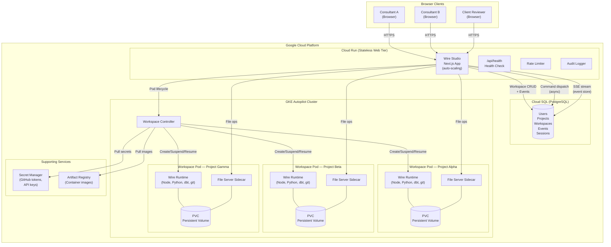

#### Component breakdown

**Cloud Run (stateless web tier)** — The Next.js application runs on Cloud Run with auto-scaling. It serves the frontend, handles API requests, and manages SSE streams. Because Cloud Run is stateless, any instance can serve any request — there is no session affinity. The application includes rate limiting and audit logging middleware.

**Cloud SQL (PostgreSQL)** — All persistent state lives in a managed PostgreSQL database: users, projects, workspaces, workspace events (the event store for async command dispatch), sessions, and execution history. This replaces SQLite from the local deployment.

**GKE Autopilot (workspace runtime)** — Each active workspace runs as an isolated Kubernetes pod on GKE Autopilot. GKE Autopilot automatically provisions and scales the underlying node pool — there are no nodes to manage. Each workspace pod contains:

- **Wire runtime container** — includes Node.js, Python, dbt, git, and the Wire Framework. Executes `/wire:*` commands within the workspace's cloned repository.
- **File server sidecar** — a lightweight HTTP server that provides low-latency file tree listing, read, write, move, rename, and delete operations. This avoids the overhead of spawning a new pod for every file operation.
- **Persistent Volume Claim (PVC)** — backs the workspace filesystem with persistent SSD storage. Files survive pod restarts, suspensions, and cluster upgrades.

**Secret Manager** — Stores GitHub tokens (for private repo cloning), API keys, and workspace credentials. The workspace controller pulls secrets at pod creation time and injects them as environment variables — no secrets are stored in the database or exposed to the browser.

**Artifact Registry** — Hosts the workspace runtime container images. The CI/CD pipeline builds and pushes new images on each release; the workspace controller pulls the latest image when provisioning new workspaces.

#### Multi-user, multi-project model

The hosted architecture uses a **one workspace per user-project pair** model. This means:

- Each consultant working on a project gets their own isolated workspace with its own filesystem, git branch state, and credentials
- Multiple consultants can work on the same project simultaneously, each in their own workspace pod
- A single consultant can have workspaces open across multiple projects
- Client reviewers get read-only access — they can view diagrams, browse files, and participate in reviews without needing their own workspace

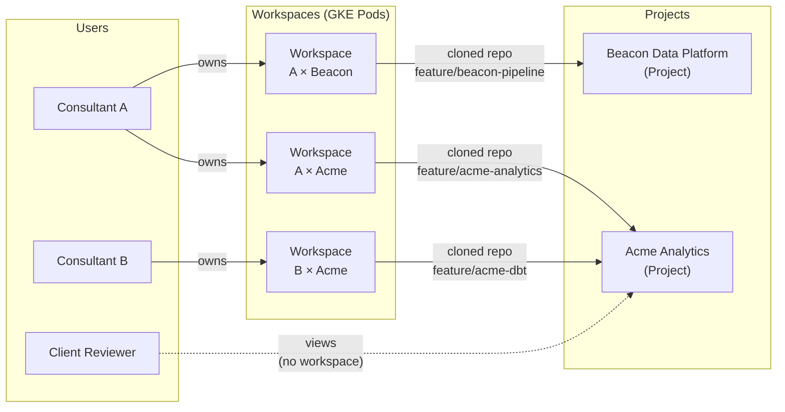

This model provides complete isolation — Consultant A's dbt changes in the Acme project cannot interfere with Consultant B's work on the same project, because each has their own git branch and filesystem. Changes are shared through the normal Git workflow: commit, push, pull, and PR.

#### Workspace lifecycle and scaling

Workspaces follow an explicit state machine that enables the system to scale efficiently across many projects and users:

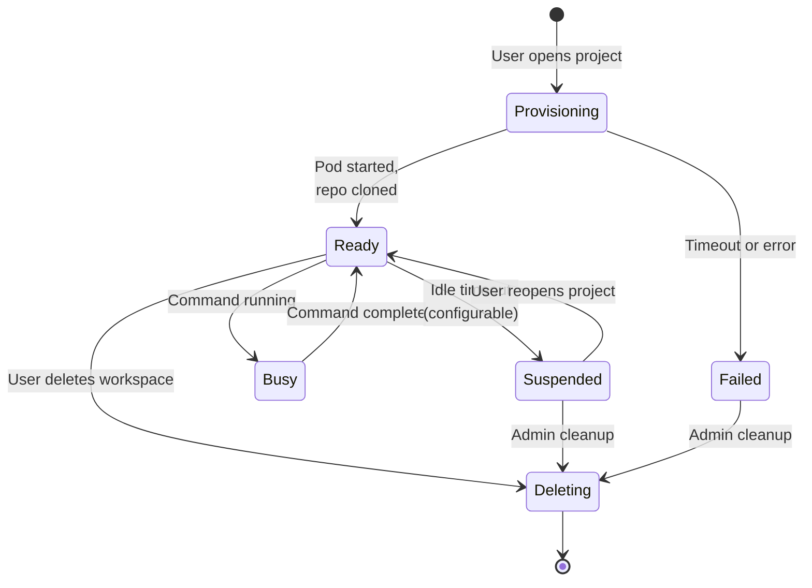

**Provisioning** — When a consultant opens a project for the first time (or after their workspace has been deleted), the system provisions a new workspace asynchronously. The UI shows a status badge ("Provisioning...") and polls for readiness. Provisioning clones the Git repository, pulls secrets, and starts the file server sidecar. This typically takes 15–30 seconds.

**Ready / Busy** — The workspace is running and available. Commands transition it to "busy" while executing and back to "ready" on completion. The file server sidecar remains available throughout.

**Suspended** — After a configurable idle timeout (default: 30 minutes of inactivity), the workspace pod is suspended. The PVC retains all files. When the consultant reopens the project, the workspace resumes from the suspended state — typically in under 10 seconds, since the repo and files are already on disk.

**Scaling characteristics:**

| Dimension | Approach | Limit |
|-----------|----------|-------|
| Concurrent active workspaces | GKE Autopilot auto-scales nodes | 100+ pods (tested) |
| Concurrent users | Cloud Run auto-scaling (stateless) | Effectively unlimited |
| Idle workspaces | Suspended (pod removed, PVC retained) | Storage-bound only |
| Total projects | Cloud SQL rows | Effectively unlimited |
| File storage per workspace | PVC size (configurable, default 10Gi) | Per-workspace limit |

The key to scaling is the suspend/resume cycle. At any given time, only workspaces with active users consume compute resources. Idle workspaces are suspended automatically, freeing GKE capacity. The system can support hundreds of total projects with only a fraction active at any time — which matches real-world usage patterns where consultants work on 2–3 projects concurrently.

#### Async command dispatch

In the local deployment, Wire commands execute synchronously — the browser sends a request, the server runs the command, and streams output back. In the hosted model, this would cause Cloud Run request timeouts (commands can run for several minutes).

The hosted architecture solves this with an **event store** pattern:

1. The browser sends a command request to the API
2. The API writes a command event to Cloud SQL and returns immediately (HTTP 202)
3. The workspace pod picks up the event and executes the command
4. Output is written back to the event store as streaming events
5. The browser subscribes to an SSE endpoint that tails the event store and delivers output in real-time

This decouples the browser connection from command execution. If the browser disconnects and reconnects, it can resume reading from where it left off — no output is lost.

#### Infrastructure as code

All cloud infrastructure is defined in Terraform under `wire-web-ui/infra/terraform/`:

| Module | Resources |
|--------|-----------|
| `networking` | VPC, subnets, Cloud NAT, firewall rules |
| `gke` | GKE Autopilot cluster |
| `cloudrun` | Cloud Run service with environment config |
| `cloudsql` | Cloud SQL PostgreSQL instance |
| `artifact-registry` | Container image registry |
| `iam` | Service accounts and IAM bindings |
| `secrets` | Secret Manager secrets |

Environments are parameterised via `.tfvars` files (`environments/dev.tfvars`, `environments/prod.tfvars`).

#### CI/CD

The `.github/workflows/wire-studio-deploy.yml` workflow automates the build and deploy cycle:

1. On push to the deployment branch, build the Next.js app and workspace runtime container images
2. Push images to Artifact Registry
3. Deploy the Cloud Run service with the new image
4. Run database migrations

#### Local vs. hosted deployment comparison

| Aspect | Local (Docker) | Hosted (GCP) |
|--------|---------------|--------------|
| Setup | Node.js (no Docker, no OAuth app) | Terraform apply + CI/CD |
| Runtime | Docker containers via dockerode | GKE Autopilot pods via @kubernetes/client-node |
| Database | SQLite (file-based) | Cloud SQL PostgreSQL (managed) |
| File access | Docker volumes (local) | PVCs + file server sidecars (persistent) |
| Provisioning | Synchronous (instant) | Async with status tracking (15–30s) |
| Command execution | Direct (synchronous) | Event store + SSE streaming (async) |
| Scaling | Single machine | Auto-scaling across all tiers |
| Multi-user | Shared localhost | Isolated workspaces per user-project |
| Availability | Runs when laptop is on | Always-on managed service |

---

## 19. Issue Tracking: Jira and Linear

Wire Framework supports both Jira and Linear as issue trackers. Both are optional — the framework works fully without either. When configured, issue tracking is automatic: generate, validate, and review commands sync artifact lifecycle steps to the chosen tracker without any manual action.

### Setting up issue tracking

When you run `/wire:new`, Step 9 asks which issue tracker to use:

| Choice | What happens |
|--------|-------------|
| **Jira** | Wire creates a Jira Epic for the engagement, one Task per artifact, and three Sub-tasks (generate, validate, review) per artifact. As lifecycle steps complete, Sub-tasks are transitioned to Done. |
| **Linear** | Wire creates a Linear Project for the engagement, one Issue per artifact, and three Sub-issues per artifact. As steps complete, Sub-issues transition through In Progress → Done. |
| **Both** | Both hierarchies are created and synced in parallel. A failure in one does not affect the other. |
| **None** | Track progress in `status.md` only — no external issue tracker. |

### Jira setup requirements

- Atlassian MCP must be connected and authenticated (it is included in the default MCP config)
- Provide a Jira project key (e.g. `DP`, `ACME`) when prompted during `/wire:new`
- Choose create (new Jira hierarchy) or link (map to existing Jira issues)

### Linear setup requirements

- Add the Linear MCP server with your API key:
  ```bash
  claude mcp add -s user -t sse linear https://mcp.linear.app/sse \
    -H "Authorization: Bearer <your-api-key>"
  ```
- Get your API key at linear.app → Settings → API
- When prompted during `/wire:new`, provide:
  1. Your Linear **team identifier** (e.g. `ENG`, `DATA`, `RIT`) — found in your Linear workspace URL or team settings
  2. Your preferred setup mode (see below)

### Linear setup modes

When you select Linear as an issue tracker, Wire asks how to set it up:

| Mode | What happens |
|------|-------------|
| **Create new project + new issues** | Wire creates a brand-new Linear project named `[Client Name] — [Project Name]`, then populates it with one Issue per artifact and Sub-issues for each lifecycle step. You can customise the project name before it is created. |
| **Use existing project + create new issues** | Paste a Linear project URL or ID. Wire verifies the project exists, then creates fresh Issues and Sub-issues inside it — no new project is created. Use this when the client already has a Linear project for the engagement. |
| **Link to existing project + existing issues** | Wire searches the Linear team for issues that match Wire artifact names and links them. Only unmatched artifacts get new issues created. Use this when the team has pre-existing issues you want to track against. |

**Tip**: "Use existing project + create new issues" is the most common choice for client engagements — it keeps Wire artifacts organised under a project you (or the client) already set up, while Wire handles all the issue and sub-issue creation automatically.

### How tracking works during delivery

Every generate, validate, and review command automatically calls `utils/jira_sync.md` and/or `utils/linear_sync.md` as its final step. You do not need to do anything manually — the sync happens as a natural part of the lifecycle.

`/wire:status` runs a full reconciliation (`utils/jira_status_sync.md` and/or `utils/linear_status_sync.md`) to bring the issue tracker fully in sync with the current `status.md` state. Run this if you suspect the tracker has drifted.

### Configuration in status.md

```yaml
jira:
  project_key: "DP"
  epic_key: "DP-10"
  artifacts:
    requirements:
      task_key: "DP-11"
      generate_key: "DP-12"
      validate_key: "DP-13"
      review_key: "DP-14"

linear:
  team_id: "abc-123"
  project_id: "def-456"
  artifacts:
    requirements:
      issue_id: "ghi-789"
      generate_id: "jkl-012"
      validate_id: "mno-345"
      review_id: "pqr-678"
```

---

## 20. Document Store: Confluence and Notion

The document store integration allows generated Wire artifacts to be replicated to Confluence or Notion, giving clients a familiar, annotatable view of deliverables. The Wire review command then retrieves client comments and any edits they have made, feeding them into the review as structured context.

### What it is for

On most engagements, the client does not have access to GitHub. Sending PDF exports or sharing screen is inefficient for document review. The document store integration solves this by:

1. Publishing each generated artifact to a Confluence page or Notion page that the client can access directly
2. Letting the client add comments and make minor edits in the document store
3. Surfacing those comments and edits automatically during the Wire review command, so the consultant has a complete picture of client feedback before the review meeting

### Setting up the document store

When you run `/wire:new`, Step 9.5 asks which document store to use:

| Choice | What happens |
|--------|-------------|
| **Confluence** | Wire creates a "Wire Documents" parent page in a Confluence space you specify. All artifact pages are created under it. Uses the existing Atlassian MCP. |
| **Notion** | Wire creates a "Wire Documents" parent page under a Notion page you specify. Uses the Notion MCP (OAuth). |
| **Both** | Creates parent pages in both stores. Artifacts are synced to both simultaneously. |
| **None** | No document store. Documents stay in GitHub only. |

You can also run `/wire:utils-docstore-setup <release>` directly to configure a store for an existing release.

### Confluence setup requirements

- Atlassian MCP must be connected (included in default MCP config)
- Provide your Confluence space key (e.g. `PROJ`, `DP`) when prompted
- Optionally provide a parent page — the "Wire Documents" folder will be created there

### Notion setup requirements

- Add the Notion MCP server:
  ```bash
  claude mcp add -s user -t http notion https://mcp.notion.com/mcp
  ```
- Complete the OAuth flow when prompted (first use only)
- Provide the URL or ID of the Notion page where Wire Documents should be created

### How it works during delivery

**On every generate command:**
- Wire generates the `.md` file to the repo as normal
- Then calls `utils/docstore_sync.md` to create or overwrite the document store page
- The page ID and URL are stored in `status.md` under the `docstore:` block
- If sync fails, the generate command continues — the failure is logged but does not block the workflow

**On every review command:**
- Wire calls `utils/docstore_fetch.md` to retrieve:
  - All comments on the document store page (inline and footer)
  - Any differences between the document store version and the canonical `.md` file
- This is surfaced as a "Document Store Context" block before the review:

```
## Document Store Context — Requirements Specification

### Reviewer Comments (2 total)
- Jane Smith (2026-03-28): "Section 3.2 — please add more detail on the CRM data source"
- Jane Smith (2026-03-28): "Timeline in Section 5 needs to move by 2 weeks"

### Document Edits Since Generation
Section 4.1 was edited: "Python 3.11" changed to "Python 3.12"

### Links
- Confluence: https://acme.atlassian.net/wiki/spaces/DP/pages/12345
```

**On review approval:**
- Wire re-syncs the canonical `.md` file to the document store, overwriting the page with the approved version

**On re-generate:**
- The existing page is overwritten in place (same page ID) — not duplicated

### Tips for working with clients

- Share the Confluence space or Notion parent page with the client during project kickoff
- Ask them to add comments rather than editing the document directly — this preserves the audit trail
- If they do edit the document directly, the Wire review command will flag the diff — you can decide whether to accept the change
- The document store is not the source of truth — the canonical `.md` file in GitHub is. The store is a collaboration layer.

---

## 21. Extending and Customising the Framework

The framework is designed to be extended. All delivery intelligence lives in plain markdown files. Adding a new capability means writing a new markdown file.

### Adding a new command

**Step 1: Write the workflow spec**

Create a file at `wire/specs/<phase>/<artifact>/<action>.md`. Use the standard frontmatter and structure:

```markdown
---
description: Brief description of what this command does
argument-hint: <project-folder>
---

# [Artifact] [Action] Command

## Purpose
[What this command does and why]

## Prerequisites
- [What must be complete before this runs]
- [Example: requirements artifact must be review:approved]

## Workflow

### Step 1: Read Inputs
[Which files to read, in what order, using which tools]

### Step 2: Generate / Validate / Review
[The core logic — templates, checks, or review gathering]

### Step 3: Update Status
[How to update status.md after completion]
Example:
```yaml
artifacts:
  <artifact_name>:
    generate: complete
    file: <output_path>
    generated_date: <today>
```

### Step 4: Confirm and Suggest Next Steps
[Output message to the user, next recommended command]

## Edge Cases
[What to do if inputs are missing, incomplete, or conflicting]

## Output
[List of files created or updated]
```

**Step 2: Register in the build script**

Add the command to the `COMMANDS` array in `wire/scripts/build-packages.sh` following the existing pattern:

```bash
"<phase>/<artifact>/<action>|<spec_path>|Description|<argument-hint>|yes"
```

**Step 3: Rebuild packages**

```bash
bash wire/scripts/build-packages.sh
```

The new command will be embedded in the next plugin/extension build.

### Modifying an existing command

Edit the workflow spec file directly (`wire/specs/<path>.md`). No reinstallation needed — changes take effect immediately on the next invocation.

Common modifications:
- **Adding a new validation check**: add a check to the validate spec for that artifact
- **Changing a code template**: update the SQL/YAML/LookML template embedded in the generate spec
- **Adding a new required section to a document**: add it to the generate spec's document structure and the validate spec's completeness checklist

### Proactive development skills

In addition to `/wire:*` commands, the plugin includes **skills** — contextual guides that activate automatically when working outside of Wire commands. Skills do not require a slash command; Claude loads them based on keywords and file types.

| Skill | Activates when | What it provides |
|---|---|---|
| **Research Persistence** | Performing technical research (schema lookups, library docs, technology investigations) | Checks `.wire/research/sessions/` for prior findings before researching; saves summaries for future sessions |
| **dbt Development** | Working with `.sql` model files, `schema.yml`, or asking about dbt conventions | Naming rules, SQL style, testing requirements, multi-source framework |
| **LookML Content Authoring** | Creating or editing LookML views, explores, or dashboards | LookML patterns, validation against source DDL |
| **LookML Content Authoring (MCP)** | LookML work with a Looker MCP server connected | Live schema validation via Looker API |
| **Dagster** | Creating or modifying Dagster assets, schedules, sensors | `@dg.asset` patterns, dagster-dbt integration, CLI reference |
| **Dignified Python** | Writing or reviewing Python code | LBYL, 3.10+ type syntax, pathlib, Click patterns |
| **dbt Unit Testing** | Creating dbt unit tests or asking about transformation testing | Model-Inputs-Outputs pattern, format selection, BigQuery caveats |
| **dbt Troubleshooting** | Diagnosing dbt job failures or test errors | Systematic error classification, investigation steps |
| **dbt Semantic Layer** | Building MetricFlow semantic models, metrics, or dimensions | Semantic model YAML structure, 5 metric types, validation |
| **dbt Migration** | Migrating a dbt project between platforms (BigQuery, Snowflake, Databricks) | Dialect differences, pre/post-migration testing, iterative fix workflow |
| **dbt Fusion Migration** | Upgrading from dbt Core to dbt Fusion runtime | 4-category error triage, dbt-autofix workflow, Fusion-specific errors |
| **dbt MCP Server** | Setting up the dbt MCP server for Claude Code | Configuration templates, credential security, Wire `.mcp.json` integration |
| **dbt Analytics Q&A** | Answering business data questions against a dbt project | 4-level escalation: Semantic Layer → compiled SQL → model discovery → manifest |
| **dbt DAG Visualisation** | Visualising dbt model lineage or dependencies | Mermaid `graph LR` diagrams, Wire colour-coding conventions |

#### Adding a new skill

Create a file at `wire/skills/<skill-name>/SKILL.md` with this frontmatter:

```markdown
---
name: skill-name
description: One-line description of what this skill does and when it activates.
---

# Skill Name

## Purpose
[What this skill does]

## When This Skill Activates
### User-Triggered Activation
[Keywords and phrases that trigger this skill]

### Self-Triggered Activation (Proactive)
[Conditions under which you should load this skill without being asked]

---
## Core Patterns
[The conventions, rules, and examples the skill provides]
```

Skills are automatically copied into the plugin build by `build-packages.sh`. No registration step is needed — any `.md` file in `wire/skills/<name>/SKILL.md` is included automatically.

### Adding support for a new technology stack

The current framework targets BigQuery + dbt + LookML. Adapting for another stack (e.g. Snowflake + dbt + Tableau) involves:

1. **Update the dbt generate spec** (`specs/development/dbt_generate.md`): change BigQuery-specific SQL syntax (e.g. `current_timestamp()` → `current_timestamp`) and materialisation options
2. **Update the semantic layer spec** (`specs/development/semantic_layer/generate.md`): replace LookML templates with Tableau / Power BI DAX equivalents
3. **Update the pipeline design spec** (`specs/design/pipeline_design/generate.md`): update the replication tool and architecture descriptions

The non-technology artifacts (requirements, data_model, training, documentation) require no changes.

### Adding a new release type

Each release type is a process definition — an ordered set of in-scope artifacts that defines a specific delivery workflow. If you have a recurring engagement pattern not covered by the seven standard types (discovery, full_platform, pipeline_only, dbt_development, dashboard_extension, dashboard_first, enablement):

1. Edit `specs/new.md` to add the new type to the release creation prompts and define which artifacts are in scope (the rest will be set to `not_applicable` when `status.md` is instantiated)
2. Add a case to the status template in `TEMPLATES/status-template.md` showing the artifact scope for the new type
3. Document the new type in this handbook

### Adjusting naming conventions

dbt naming conventions are embedded in the dbt generate and validate specs. To change them (e.g. to use `int__` prefix for integration models instead of no prefix):

1. Edit the naming section in `specs/development/dbt_generate.md`
2. Update the corresponding validation checks in `specs/development/dbt_validate.md`

The framework uses a 2-tier convention loading system. When generating or validating dbt models, it first checks for project-specific convention files (`.dbt-conventions.md`, `dbt_coding_conventions.md`, or `docs/dbt_conventions.md` in the project root). If found, those conventions take priority. If not found, the framework uses the comprehensive embedded conventions covering field naming, SQL style, CTE structure, testing requirements, and documentation standards.

---

## 22. FAQ

**Q: Do I need to run every command in order, or can I skip phases?**

The framework enforces phase dependencies through prerequisite checks in each workflow spec. You cannot generate dbt models before the data model is approved, for example — the generate command will check and block. That said, within a phase, some artifacts can be generated in parallel (pipeline_design and data_model; semantic_layer and dashboards). Use `/wire:status` to see exactly what is and isn't blocked.

---

**Q: A client has given feedback and wants to change the requirements after design has started. What do I do?**

Update the requirements document manually, then re-run validate and review to record the new approval. If the change affects the data model, re-run `data_model:generate` (the AI will read the updated requirements). Set the affected downstream artifacts back to `not_started` in `status.md` before regenerating. The framework will pick up from the updated state.

---

**Q: The dbt models generated don't compile. What should I check?**

1. Verify source table names in `_sources.yml` match exactly what is in the warehouse
2. Check that `ref()` calls in generated models point to models that exist
3. Run `/wire:dbt-validate` — it checks `ref()` targets and naming before you try to run
4. If the data model spec had incorrect column names (from a schema that changed), update the spec in `design/data_model_specification.md` and re-run `dbt:generate`

---

**Q: The AI generated something that doesn't match our client's specific conventions. How do I fix it?**

Two options:
1. **One-off fix**: Edit the generated file directly, then re-run validate and review
2. **Fix the root cause**: Edit the workflow spec template that produced the incorrect output (`wire/specs/<path>.md`), then re-run generate. This ensures future projects also get the correct output.

If a client has persistent conventions that differ from our standard templates (e.g. a different surrogate key pattern), update the template in the generate spec and note it in the release's `status.md` notes section.

---

**Q: Can I run multiple releases in the same repository?**

Yes. The `.wire/releases/` directory supports as many release folders as needed. `/wire:start` and `/wire:status` show all releases. Each release is isolated in its own folder with its own `status.md`. The generated code (dbt models, LookML) is shared in the repository root, so use clear naming conventions to avoid collisions between releases.

---

**Q: Where do I put source materials like the SOW, SQL examples, and meeting notes?**

- **SOW**: copy to `engagement/sow.md` (done automatically by `/wire:new`)
- **Meeting transcripts and call notes**: add to `engagement/calls/` (named by date, e.g. `2026-03-10-kickoff.md`)
- **SQL examples from the source database**: put in the release's `requirements/` folder — the AI reads this during requirements generation
- **Existing dbt project files or schema documentation**: put in `requirements/` for the relevant release
- **Org charts and stakeholder maps**: add to `engagement/org/`

The AI reads `engagement/` for background context and the release's `requirements/` folder for source materials at the start of each generate command.

---

**Q: How do I handle a project where the SOW is not a PDF?**

If the SOW is a Word document, export it as PDF, or copy the key sections (deliverables, timeline, technical outcomes, out-of-scope items) into `engagement/sow.md` as markdown. The AI can work with `.md` files directly. If it's in a Google Doc, copy the text into the file.

---

**Q: The client changed the data model after development started. Do I have to regenerate everything?**

Not necessarily. If the change is additive (new columns or new models), you can:
1. Update `design/data_model_specification.md` with the additions
2. Run `dbt:generate` again — the AI will read the updated spec and produce the new models, leaving existing models intact
3. Re-run `dbt:validate` and get approval

If the change is breaking (renamed columns, changed grain, removed models), treat it as a change request: update the spec, regenerate the affected models, update the semantic layer if column names changed, re-run tests, and record the change in `status.md` notes.

---

**Q: Can I use the framework with Gemini CLI instead of Claude Code?**

Yes. The framework supports both Claude Code and Gemini CLI. Install the `wire` extension (`gemini extensions install <repo-url>`) and all commands are available as `/dp *`. The workflow specs are identical across both runtimes — the only difference is the command format. Both runtimes produce the same project structure and artifacts.

---

**Q: Can I use the framework without Claude Code or Gemini CLI — e.g. in a web browser chat interface?**

The `/wire:*` command system requires a CLI-based AI coding agent (Claude Code or Gemini CLI), which is what discovers and runs the command wrappers. However, the workflow specification files (`wire/specs/*.md`) are plain markdown — you can read them and follow them manually in any AI interface, using the specs as structured instructions. You'll lose the automated status tracking and command discovery, but the methodology still works.

---

**Q: How do I know when a release is complete?**

Run `/wire:status <release-folder>`. When all in-scope artifacts show `review: approved` (or `not_applicable` for out-of-scope artifacts), the release is complete. Run `/wire:archive <release-folder>` to close it out. For a discovery release, completion means the sprint plan is approved and downstream releases have been spawned via `/wire:release:spawn`.

---

**Q: Why does `/wire:new` force me to create a branch?**

The framework requires all release work to happen on a feature branch, not directly on `main` or `master`. This is standard git hygiene — generated artifacts, dbt models, and LookML files should be reviewed via pull request before merging. If you're already on a feature branch when you run `/wire:new`, the check passes silently and you won't notice it. The suggested branch name is `feature/{engagement-name}` (e.g., `feature/acme-analytics`), but you can choose any name.

---

**Q: How do I upgrade the framework on a client repo that's mid-project?**

Plugin/extension users get updates automatically when a new version is published. Your project data (`.wire/`), generated code (dbt models, LookML), and `status.md` files are completely separate and not affected. Workflow specs are defensively compatible — they check for fields before using them, so an older `status.md` works with newer specs. Jira tracking continues automatically if already configured.

---

**Q: When should I use Dashboard-First instead of Full Platform?**

Use Dashboard-First when: (1) the SOW is well-defined enough to mock dashboards early, (2) you want stakeholder feedback before committing to a data model, or (3) client data access may be delayed. Use Full Platform when: the engagement requires a conceptual entity model and pipeline architecture decisions upfront, or when the data sources are complex enough that understanding them must precede any dashboard design.

---

**Q: Can I switch from Dashboard-First to Full Platform mid-project?**

Not automatically — the release type determines the artifact scope at creation time. However, you can manually edit `status.md` to add artifacts that were marked `not_applicable` (e.g. add `pipeline_design` if you later decide you need it). The workflow specs will work correctly with manually added artifacts.

---

**Q: What if the client's real data schema is very different from what the seed data assumed?**

The `data_refactor:generate` command handles this by comparing the seed schema against the real one and generating a refactoring plan. Significant differences (renamed tables, different grain, additional source systems) will produce a larger refactoring plan, but the command still works. In extreme cases, you may need to regenerate the data model specification and re-run dbt generation. The seed-based prototype is still valuable even if the refactor is substantial — it validated the dashboard design and business logic.

---

**Q: Do I need any external tools for dashboard-first projects?**

No. The mockups command for `dashboard_first` releases generates interactive HTML Looker mockups directly inside Claude Code — no external accounts, browser extensions, or subscriptions required. The HTML files are self-contained and can be opened in any browser or attached to emails.

---

**Q: What is Wire Autopilot and when should I use it?**

Wire Autopilot (`/wire:autopilot`) is an autonomous execution mode that takes a SOW and runs through the entire project lifecycle without further human input. It generates, validates, and self-reviews every artifact. Use it for rapid prototyping, standard engagements with well-defined SOWs, internal projects, or proof-of-concept work. For client-facing engagements requiring human approval at each gate, use the individual commands instead.

---

**Q: Can I resume Autopilot if it gets interrupted?**

Yes. Re-run `/wire:autopilot` on the same project. It reads `status.md` and `autopilot_checkpoint.md` to determine where it left off and continues from the next incomplete artifact. It will not re-generate already-completed and approved artifacts.

---

**Q: Can I mix Autopilot with manual commands?**

Yes. Autopilot and manual commands share the same state files (`status.md`, `execution_log.md`). You can start with Autopilot for the bulk of the work, then use manual commands for specific phases. Or fix a blocked artifact manually and re-run Autopilot to continue.

---

**Q: What is Wire Studio and do I need it?**

Wire Studio is an experimental web-based visual interface for the Wire Framework. It provides the same functionality as the CLI but with a graphical artifact flow diagram, rendered mermaid diagrams, a file explorer, and multi-user team access. You do not need it — the CLI is fully sufficient. Wire Studio is useful when you want visual project overviews, diagram exploration, team collaboration, or client demonstrations.

---

**Q: Can I use Wire Studio and the CLI on the same project?**

Yes. Wire Studio and the CLI share the same project structure (`.wire/`), the same `status.md`, and the same Git repository. You can create a project with the CLI and open it in Wire Studio, or vice versa. Changes made in one are visible in the other after a Git push/pull.

---

**Q: Does Wire Studio require Docker?**

No. Wire Studio runs Wire commands directly on your local filesystem via Node.js — no Docker volumes or containers required. The only requirement is Node.js 18+. Install via the plugin command `/wire:studio-install`, or directly with: `curl -fsSL https://raw.githubusercontent.com/rittmananalytics/wire/main/install-wire-studio.sh | bash`

---

**Q: How do I connect Wire Studio to GitHub for cloning private repos?**

The installer will prompt you automatically. It tries two options in order:

1. **GitHub CLI** — if `gh` is installed and authenticated (`gh auth login`), the installer detects the token automatically and you won't be prompted
2. **Personal Access Token** — if no CLI is found, you'll be prompted to paste a PAT (generate one at github.com/settings/tokens with `repo` scope). Press Enter to skip and configure later.

Either way, the token is stored once and reused silently for all future clones — you won't be asked again. If you skipped the install-time prompt, open Wire Studio, click **Clone from GitHub**, and you'll see the same options: use the GitHub CLI or paste a PAT.

Public repos can be cloned without a token.

---

**Q: How does Autopilot handle dashboard-first mockups?**

For dashboard-first projects, Autopilot generates interactive HTML Looker mockups autonomously as part of its standard execution — no manual intervention required. The mockup generation step is fully automated and produces both the HTML files and the visualization catalog inputs in one pass.

---

**Q: What are safety gates and which phases trigger them?**

Safety gates are automatic pause points that prevent Autopilot from touching external systems without your explicit confirmation. Four artifacts are gated: `pipeline` (activates data connectors), `data_refactor` (runs dbt against real data), `data_quality` (executes SQL tests against a database), and `deployment` (deploys to live environments). All other phases — including dbt model generation, LookML, dashboards, and documentation — run fully autonomously since they only write files to the repository.

---

**Q: Do I need to run a discovery release before every engagement?**

No. Discovery is optional. Use it when: (1) the client is not sure what they need built, (2) scope needs to be negotiated before a SOW is signed, or (3) you want to formally validate the problem and shape the solution before committing. If you already have a well-scoped, signed SOW, go directly to the appropriate delivery release type.

---

**Q: What is Shape Up and why does the discovery release use it?**

Shape Up is a product development methodology (from Basecamp) that emphasises fixed-time variable-scope delivery: you commit to an *appetite* (how much time this is worth), shape a solution within that appetite, and cut scope to fit the time rather than extending the time to fit the scope. Wire's discovery release implements Shape Up because it prevents the most common planning failure on analytics engagements — committing to a fixed scope in a fixed time without validating the problem or shaping the solution first. The betting table review and appetite-driven sprint plan are both Shape Up concepts.

---

**Q: What is the `.wire/engagement/` folder for, and who populates it?**

`engagement/` holds context that belongs to the whole engagement rather than any specific release: the SOW, call transcripts, org charts, and current-state architecture notes. It is populated by the consultant, not by Wire commands. `/wire:new` creates `engagement/context.md` and copies the SOW to `engagement/sow.md` during setup. After that, transcripts and notes are added manually as the engagement progresses. All Wire commands — discovery and delivery alike — read from `engagement/` for background context.

---

**Q: What is the `research/` folder and should I manage it?**

`.wire/research/sessions/` is managed automatically by the research persistence skill. You do not need to create or edit these files manually. When the AI performs technical research during a session (looking up schemas, reading library docs, investigating a technology), it saves a structured summary there automatically. `session:start` surfaces relevant prior research at the beginning of each session. Think of it as an automatically maintained research log — read it if you want to see what was investigated previously, but do not edit it.

---

**Q: Can I run a discovery release and a delivery release at the same time?**

Not recommended. The discovery release should be completed and delivery releases spawned via `release:spawn` before delivery work begins. Discovery is specifically about determining *what* to build — starting delivery before that is known creates rework risk. If you are joining an engagement mid-stream where discovery has already been done informally, create the delivery release directly without a discovery release.

---

**Q: What is `session:start` and do I need to use it every time?**

`session:start` is recommended but not required. It enters Plan Mode, reads the release's current `status.md`, surfaces prior research, and proposes a focused session plan. Its main value is grounding every session in current state — especially useful after a break, a context switch, or when a different consultant picks up the work. If you're mid-flow and know exactly what you're doing next, you can skip it. `session:end` is similarly optional but useful for capturing what was accomplished and what the next focus should be.

---

**Q: How does session history work?**

`session:end` appends a row to the `Session History` table at the bottom of `status.md`:

```markdown
| Date | Objective | Accomplished | Next Focus |
|------|-----------|--------------|------------|
| 2026-03-10 | Problem definition and pitch draft | Problem definition approved, pitch drafted | Pitch review (betting table) |
| 2026-03-11 | Pitch review and release brief | Bet approved, brief drafted and signed off | Sprint planning |
```

This provides a human-readable audit trail of every session without requiring any manual note-taking. When a new consultant picks up the release, reading the session history gives immediate context on what has happened and what comes next.

---

**Q: Can I have multiple engagements in the same repository?**

Yes, but it's unusual. The `.wire/` directory supports only one engagement (one `engagement/` folder). If you have two genuinely separate client engagements, they should be in separate repositories. However, a single engagement can have as many releases as needed — there is no limit on the number of release folders under `.wire/releases/`.

---

**Q: I have an existing project using the old layout (release folders directly under `.wire/`). How do I migrate to v3.4.0?**

Run `/wire:migrate` from the repository root. The command:

1. Detects old-style release folders directly under `.wire/` (any folder containing a `status.md`)
2. Proposes new names (`20260202_barton_peveril_live_pastoral` → `01-barton-peveril-live-pastoral`) and waits for your confirmation
3. Creates `.wire/engagement/`, `.wire/releases/`, `.wire/engagement/calls/`, `.wire/engagement/org/`, and `.wire/research/sessions/`
4. Moves each old folder to `.wire/releases/<new-name>/`
5. Finds SOW/proposal files and moves them to `.wire/engagement/`
6. Finds meeting notes and transcripts and moves them to `.wire/engagement/calls/`
7. Generates `.wire/engagement/context.md` from available metadata in the migrated `status.md` files
8. Produces a migration report listing every file moved

The command is safe to re-run — it skips anything already migrated. After running it, review `.wire/engagement/context.md` and fill in any missing engagement details.

---

## 23. Troubleshooting

**"Release not found"**
- Verify the release folder exists under `.wire/releases/`: `/wire:status`
- Check the folder name matches what you're passing to the command
- Ensure you're in the correct repository root directory

**"Artifact already exists"**
- Use `--force` flag to regenerate: `/wire:dbt-generate <release-folder> --force`
- Or manually review/update the existing artifact

**dbt tests failing**
- Review test output in the terminal
- Check data quality in BigQuery/warehouse directly
- Update dbt models to fix issues
- Re-run: `/wire:utils-run-dbt <release-folder>`

**Validation failing**
- Read the validation error messages carefully
- Check against the conventions and templates in the workflow spec
- Fix issues and re-run the validate command

**Missing context / poor generation quality**
- Ensure `engagement/sow.md` and `engagement/context.md` are populated
- Add more source materials (SQL examples, schema docs, sample data) to the release's `requirements/` folder
- For discovery releases: add call transcripts to `engagement/calls/`
- Run `session:start` at the beginning of the session — it surfaces prior research that may already have what you need

---

**Q: Someone left the release midway through. How does a new consultant pick it up?**

Run `/wire:session:start <release-folder>`. The framework reads `status.md`, shows the session history, surfaces prior research, and proposes a session plan. The session history table in `status.md` shows what was accomplished in each previous session and what the suggested next focus is. Read `engagement/context.md` and the generated artifacts in `requirements/` and `design/` to get up to speed on the project context. The framework is designed so that anyone can resume from where it left off.

---

**Q: Where do I go if something goes wrong or a command doesn't work as expected?**

1. Check `execution_log.md` in the release folder — it shows the timestamped history of every command run and its result, which helps identify when and where things went wrong
2. Check `status.md` to see the current release state
3. Re-read the relevant workflow spec in `wire/specs/<path>.md` — it describes what the command should do in detail
4. Check `engagement/sow.md` and the release's `requirements/` folder to confirm source materials are present and readable
5. If the issue is a bug in a workflow spec, edit the spec and re-run the command
6. Raise with the team — include the release folder, the command you ran, and what the AI produced

---

## 24. Framework Management Commands

v3.4.6 adds two commands for managing the Wire Framework itself, rather than delivery work.

### `/wire:mcp` — MCP Server Management

The Wire Framework connects to five MCP servers. `/wire:mcp` lets you inspect and manage these connections without editing JSON files:

```
/wire:mcp                        — Interactive menu
/wire:mcp list                   — Table of all servers: configured/not, URL, Wire purpose
/wire:mcp view <server>          — Full detail: transport type, auth method, which commands use it
/wire:mcp update <server>        — Change the server URL (e.g. point Atlassian at on-prem)
/wire:mcp auth <server>          — Guided re-authentication walkthrough
```

**Server keys**: `atlassian`, `linear`, `fathom`, `context7`, `notion`

All servers use OAuth2 managed by Claude Code. The `update` sub-command edits `.claude/settings.json` directly and shows a before/after diff. The `auth` sub-command prints the exact terminal commands (`claude mcp remove` + `claude mcp add`) to force a fresh OAuth2 flow.

### `/wire:help` — Command Reference

Man-page style documentation for any Wire command:

```
/wire:help                  — List all 89 commands grouped by phase
/wire:help <command>        — NAME, SYNOPSIS, DESCRIPTION, PREREQUISITES, STEPS, SEE ALSO
```

Supports alias forms (`/wire:help new`, `/wire:help wire:new`, `/wire:help /wire:new`), partial matching, and ambiguous-prefix disambiguation. The full command catalog is auto-generated from the build script on every release, so it is always current.

---

*This handbook is a living document. Update it when the framework changes, when new release types are added, or when new FAQs emerge from delivery experience.*
