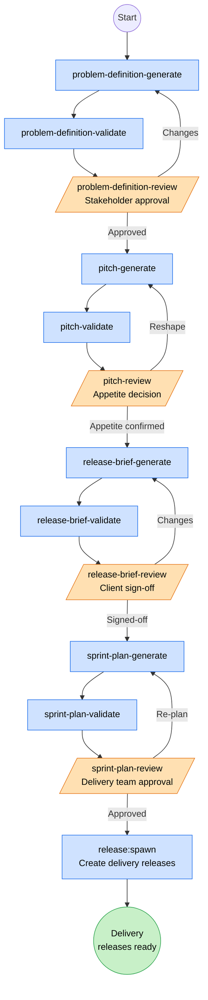
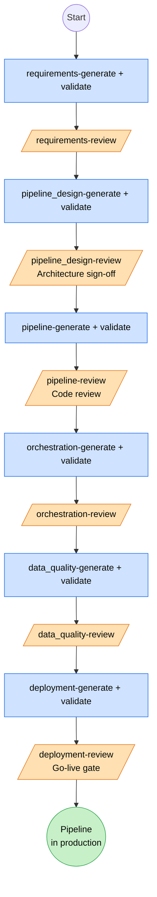
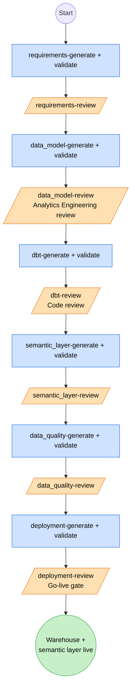
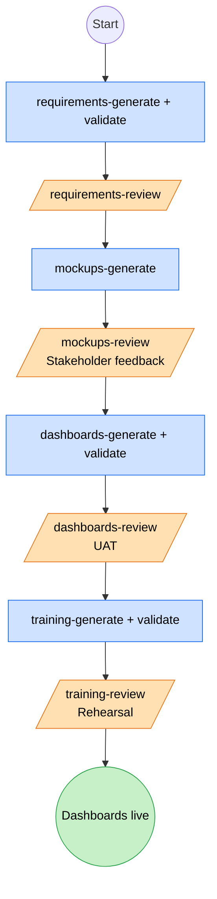
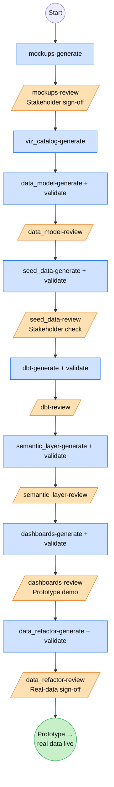
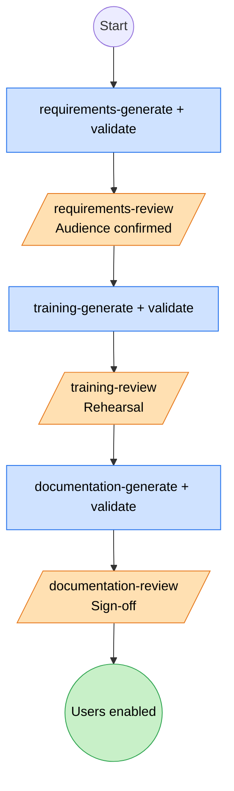
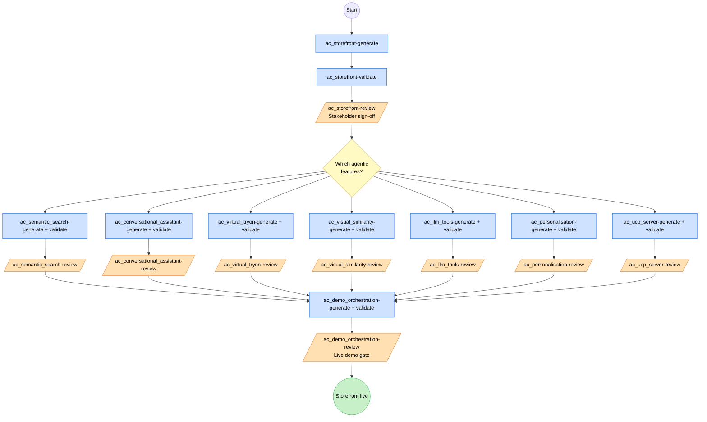
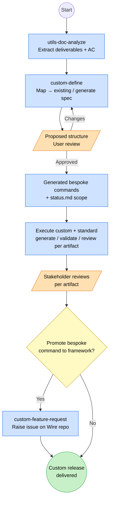

# Wire Framework — Release Types & Commands

A concise reference describing every release type the Wire Framework currently supports, the BPMN-style process flow for each, and the commands and skills used at every stage of the delivery lifecycle.

- **Notation**: Mermaid `flowchart` diagrams in BPMN style.
- **Shapes**:
  - `(( ))` — Start / End event
  - `[ ]` — Automated (AI / system) task
  - `[/ /]` — **Human-in-the-loop** task (manual review, approval, or input)
  - `{ }` — Gateway / decision
- **Colour key (applied via `classDef`)**:
  - Blue — AI-generated artifact
  - Orange — Human-in-the-loop touchpoint
  - Green — Approved gate / release outcome

---

## Release Types — At a Glance

| Release Type | Purpose | Exit Deliverable |
|---|---|---|
| `discovery` | Shape Up scoped problem-shaping for a single bet | Approved release brief + sprint plan |
| `sop_discovery` | RA Canonical wide-ranging discovery → go/no-go | Findings Playback deck + delivery roadmap |
| `full_platform` | End-to-end data platform build | Production platform + enabled users |
| `pipeline_only` | Data ingestion pipelines in isolation | Operational pipelines in production |
| `dbt_development` | dbt models + semantic layer | Modelled warehouse + semantic layer |
| `dashboard_extension` | New dashboards on an existing platform | Live dashboards + trained users |
| `dashboard_first` | Mockup-driven rapid prototype → data | Live dashboards backed by real data |
| `enablement` | Training + documentation only | Trained users + signed-off docs |
| `agentic_commerce` | AI-powered ecommerce storefront | Live AI-enabled storefront |
| `custom` | Bespoke scope derived from SoW | Tailored deliverables defined by `/wire:custom-define` |

---

# 1. Release Type Process Flows

## 1.1 `discovery` — Shape Up

Shape Up scoped problem-shaping. Used when the problem to solve is understood and a single, time-boxed bet needs shaping before commitment.

---

## 1.2 `sop_discovery` — RA Canonical Discovery

Wide-ranging structured discovery driving a sponsor-level go/no-go on a program of work. Used when scope is unclear at SoW signature or a new analytical domain is being introduced.

```mermaid
flowchart TD
    Start(( Start ))
    EB[engagement-brief-generate]
    EBV[engagement-brief-validate]
    EBR[/engagement-brief-review<br/>Internal RA review/]
    SM[stakeholder-map-generate]
    SMV[stakeholder-map-validate]
    SMR[/stakeholder-map-review<br/>Sponsor confirmation/]
    SI[stakeholder-interview-generate<br/>Per stakeholder]
    SIV[stakeholder-interview-validate]
    SIR[/stakeholder-interview-review<br/>Peer review/]
    RM[requirements-matrix-generate]
    RMV[requirements-matrix-validate]
    RMR[/requirements-matrix-review<br/>Internal RA review/]
    DA[discovery-analyses-generate<br/>HoN + PPT + Maturity]
    DAV[discovery-analyses-validate]
    DAR[/discovery-analyses-review<br/>Internal RA review/]
    FP[findings-playback-generate]
    FPV[findings-playback-validate]
    FPR[/findings-playback-review<br/>Sponsor playback &<br/>Go/No-Go gate/]
    DR[delivery-roadmap-generate]
    DRV{Go decision?}
    DRR[/delivery-roadmap-review<br/>Sponsor sign-off/]
    End(( Engagement<br/>scoped ))

    Start --> EB --> EBV --> EBR
    EBR -->|Approved| SM --> SMV --> SMR
    SMR -->|Confirmed| SI --> SIV --> SIR
    SIR -->|Approved| RM
    SIR -->|More interviews| SI
    RM --> RMV --> RMR
    RMR -->|Approved| DA --> DAV --> DAR
    DAR -->|Approved| FP --> FPV --> FPR
    FPR -->|Go| DR --> DRR
    FPR -->|No-Go| End
    DRR -->|Approved| End

    classDef ai fill:#cfe2ff,stroke:#1f6feb,color:#000
    classDef human fill:#ffe0b2,stroke:#e6791d,color:#000
    classDef gate fill:#ffd6d6,stroke:#c62828,color:#000
    classDef done fill:#c8f0c8,stroke:#2ea44f,color:#000
    class EB,EBV,SM,SMV,SI,SIV,RM,RMV,DA,DAV,FP,FPV,DR ai
    class EBR,SMR,SIR,RMR,DAR,DRR human
    class FPR gate
    class End done
```

---

## 1.3 `full_platform` — End-to-End Data Platform

Complete platform: requirements → pipelines + dbt + semantic layer + dashboards → tests → deploy → enable.

```mermaid
flowchart TD
    Start(( Start ))
    REQ[requirements-generate]
    REQV[requirements-validate]
    REQR[/requirements-review/]
    WS[workshops-generate]
    WSR[/workshops-review/]

    subgraph Design
      CM[conceptual_model-generate]
      CMR[/conceptual_model-review/]
      PIPED[pipeline_design-generate]
      PIPEDR[/pipeline_design-review/]
      DM[data_model-generate]
      DMR[/data_model-review/]
      MOCK[mockups-generate]
      MOCKR[/mockups-review/]
    end

    subgraph Development
      PIPE[pipeline-generate]
      PIPER[/pipeline-review/]
      DBT[dbt-generate]
      DBTR[/dbt-review/]
      SL[semantic_layer-generate]
      SLR[/semantic_layer-review/]
      ORCH[orchestration-generate]
      ORCHR[/orchestration-review/]
      DASH[dashboards-generate]
      DASHR[/dashboards-review/]
    end

    subgraph Testing
      DQ[data_quality-generate + validate]
      DQR[/data_quality-review/]
      UAT[uat-generate]
      UATR[/uat-review<br/>Stakeholder UAT/]
    end

    subgraph Deploy
      DEP[deployment-generate + validate]
      DEPR[/deployment-review<br/>Go-live gate/]
    end

    subgraph Enablement
      TRN[training-generate + validate]
      TRNR[/training-review<br/>Rehearsal/]
      DOC[documentation-generate + validate]
      DOCR[/documentation-review/]
    end

    End(( Platform<br/>live ))

    Start --> REQ --> REQV --> REQR --> WS --> WSR
    WSR --> CM --> CMR --> PIPED --> PIPEDR --> DM --> DMR --> MOCK --> MOCKR
    MOCKR --> PIPE --> PIPER --> DBT --> DBTR --> SL --> SLR --> ORCH --> ORCHR --> DASH --> DASHR
    DASHR --> DQ --> DQR --> UAT --> UATR
    UATR -->|Approved| DEP --> DEPR
    DEPR -->|Approved| TRN --> TRNR --> DOC --> DOCR --> End

    classDef ai fill:#cfe2ff,stroke:#1f6feb,color:#000
    classDef human fill:#ffe0b2,stroke:#e6791d,color:#000
    classDef done fill:#c8f0c8,stroke:#2ea44f,color:#000
    class REQ,REQV,WS,CM,PIPED,DM,MOCK,PIPE,DBT,SL,ORCH,DASH,DQ,UAT,DEP,TRN,DOC ai
    class REQR,WSR,CMR,PIPEDR,DMR,MOCKR,PIPER,DBTR,SLR,ORCHR,DASHR,DQR,UATR,DEPR,TRNR,DOCR human
    class End done
```

---

## 1.4 `pipeline_only` — Data Pipeline Development

Focuses on ingestion pipelines without modelling or BI work.

---

## 1.5 `dbt_development` — dbt + Semantic Layer

Build the modelled warehouse and semantic layer on top of existing ingestion.

---

## 1.6 `dashboard_extension` — New Dashboards on Existing Platform

Add dashboards on a platform that already exists. Lightweight scope.

---

## 1.7 `dashboard_first` — Mockup-Driven Rapid Prototype

Mockups and viz catalog come first, seed data backs a working prototype, then the data is refactored to real sources.

---

## 1.8 `enablement` — Training + Documentation Only

Stand-alone enablement engagement on an existing platform.

---

## 1.9 `agentic_commerce` — AI-Powered Ecommerce Storefront

Specialised release type: base storefront built via Lovable, agentic features added against the GitHub repo. Features are independently optional after the base storefront.

---

## 1.10 `custom` — Bespoke Scope from SoW

Wire analyses the SoW or project documents and proposes a tailored release structure — mapping deliverables to existing commands where possible, generating project-scoped specs for the rest.

---

# 2. Commands by Lifecycle Stage (and the Skills they use)

Every artifact follows the **generate → validate → review** triad. Reviews are human-in-the-loop. Skills listed for each stage activate automatically when relevant; they are not invoked directly but provide conventions, validation rules, and templates to the generating/validating command.

## 2.1 Engagement & Session Management

| Command | Purpose |
|---|---|
| `/wire:start` | Show all projects, select one to work on |
| `/wire:new` | Create a new engagement or add a release |
| `/wire:adopt` | Adopt an in-flight project into Wire |
| `/wire:migrate` | Migrate pre-v3.4.0 flat `.wire/` layout |
| `/wire:status` | Report engagement / release status |
| `/wire:autopilot` | Autonomous end-to-end SoW execution |
| `/wire:archive`, `/wire:remove` | Lifecycle management |
| `/wire:session-plan` | Optional planning ritual before work |
| `/wire:help`, `/wire:mcp`, `/wire:studio-install` | Utilities |

**Skills used**: `engagement-context` (auto-loads `.wire/` context at session start), `engagement-status-report`.

---

## 2.2 Discovery Stage

### Shape Up discovery (`discovery`)

| Command | Action |
|---|---|
| `/wire:problem-definition-generate / -validate / -review` | Structured problem definition |
| `/wire:pitch-generate / -validate / -review` | Shape Up pitch + appetite |
| `/wire:release-brief-generate / -validate / -review` | Formal release brief |
| `/wire:sprint-plan-generate / -validate / -review` | Sprint plan with point estimates |
| `/wire:release-spawn` | Spawn downstream delivery release folders |

### SOP discovery (`sop_discovery`)

| Command | Action |
|---|---|
| `/wire:engagement-brief-generate / -validate / -review` | Brief from SoW + deal context |
| `/wire:stakeholder-map-generate / -validate / -review` | Stakeholder map and priorities |
| `/wire:stakeholder-interview-generate / -validate / -review` | Four-tag interview write-ups |
| `/wire:requirements-matrix-generate / -validate / -review` | Discovery Requirements Matrix |
| `/wire:discovery-analyses-generate / -validate / -review` | Hierarchy of Needs, PPT, Maturity |
| `/wire:findings-playback-generate / -validate / -review` | Sponsor playback deck (go/no-go) |
| `/wire:delivery-roadmap-generate / -validate / -review` | Build / Pair / Coach roadmap |
| `/wire:kickoff-generate / -validate / -review` | Client kick-off deck |
| `/wire:playbook-generate` | BPMN delivery playbook |

**Skills used**: `research` (persists findings across sessions), `engagement-context`, `project-review`.

---

## 2.3 Requirements Stage

| Command | Action |
|---|---|
| `/wire:requirements-generate / -validate / -review` | Requirements spec from SoW |
| `/wire:workshops-generate / -review` | Workshop materials for clarification |
| `/wire:conceptual_model-generate / -validate / -review` | Conceptual entity model |

**Skills used**: `research` (technical research persistence), `engagement-context`.

---

## 2.4 Design Stage

| Command | Action |
|---|---|
| `/wire:pipeline_design-generate / -validate / -review` | Pipeline architecture + DFD |
| `/wire:data_model-generate / -validate / -review` | dbt model design + physical ERD |
| `/wire:mockups-generate / -review` | Dashboard mockups |
| `/wire:viz_catalog-generate` | Visualization catalog (dashboard_first) |

**Skills used**:
- `dbt-development` — naming + SQL conventions for `data_model`
- `dbt-dag` — Mermaid lineage diagrams from manifest / code
- `looker-dashboard-mockup` — pixel-accurate Looker HTML mockups for `mockups-generate`

---

## 2.5 Development Stage

| Command | Action |
|---|---|
| `/wire:pipeline-generate / -validate / -review` | Pipeline code |
| `/wire:dbt-generate / -validate / -review` | Staging → integration → warehouse dbt models |
| `/wire:semantic_layer-generate / -validate / -review` | LookML (or dbt Semantic Layer) |
| `/wire:dashboards-generate / -validate / -review` | Dashboards |
| `/wire:orchestration-generate / -validate / -review` | Dagster / dbt Cloud orchestration |
| `/wire:seed_data-generate / -validate / -review` | Seed data (dashboard_first) |
| `/wire:data_refactor-generate / -validate / -review` | Seed → real-data refactor |
| `/wire:utils-run-dbt` | Run dbt models |
| `/wire:fivetran` | Manage Fivetran pipelines |

**Skills used**:
- `dbt-development` — staging/integration/warehouse conventions, sqlfluff
- `dbt-semantic-layer` — MetricFlow metrics, entities, dimensions
- `dbt-unit-testing` — mock inputs / expected outputs
- `dbt-migration` — cross-platform (BigQuery / Snowflake / Databricks) and version upgrades
- `dbt-fusion` — dbt Core → Fusion migration triage
- `dbt-mcp-server` — connect Claude to dbt MCP for live model inspection
- `dbt-troubleshooting` — diagnose dbt job / test failures
- `dbt-dag` — generate Mermaid lineage diagrams
- `lookml-content-authoring` — LookML view/explore/dashboard authoring with schema validation
- `dagster` — assets-first orchestration, dagster-dbt integration
- `dignified-python` — production Python quality for pipeline + Dagster code
- `fivetran` — managing Fivetran connectors, destinations, transformations

---

## 2.6 Testing Stage

| Command | Action |
|---|---|
| `/wire:data_quality-generate / -validate / -review` | Data quality tests |
| `/wire:uat-generate / -review` | UAT plan + feedback capture |

**Skills used**:
- `dbt-unit-testing` — unit tests for transformations
- `dbt-analytics-qa` — answer business questions against the dbt project for UAT validation
- `dbt-troubleshooting` — investigate failing tests / jobs

---

## 2.7 Deployment Stage

| Command | Action |
|---|---|
| `/wire:deployment-generate / -validate / -review` | Deployment artifacts + runbooks |
| `/wire:utils-run-dbt` | Run dbt jobs |
| `/wire:utils-delivery-forecast` | Calculate % delivered + ETA |

**Skills used**: `dagster`, `dbt-development`, `dbt-troubleshooting`, `dignified-python`.

---

## 2.8 Enablement Stage

| Command | Action |
|---|---|
| `/wire:training-generate / -validate / -review` | Training materials + rehearsal |
| `/wire:documentation-generate / -validate / -review` | Technical + user documentation |

**Skills used**: `engagement-status-report`, `project-review`, `dbt-dag` (lineage diagrams in docs).

---

## 2.9 Agentic Commerce Stage

| Command | Action |
|---|---|
| `/wire:ac_storefront-generate / -validate / -review` | Base storefront via Lovable + GitHub |
| `/wire:ac_semantic_search-generate / -validate / -review` | AI semantic search |
| `/wire:ac_conversational_assistant-generate / -validate / -review` | Multi-turn shopping assistant |
| `/wire:ac_virtual_tryon-generate / -validate / -review` | Photo upload + image generation |
| `/wire:ac_visual_similarity-generate / -validate / -review` | Multimodal product discovery |
| `/wire:ac_llm_tools-generate / -validate / -review` | Autonomous tool-calling LLM |
| `/wire:ac_personalisation-generate / -validate / -review` | Profiles + event tracking |
| `/wire:ac_ucp_server-generate / -validate / -review` | Universal Commerce Protocol server |
| `/wire:ac_demo_orchestration-generate / -validate / -review` | Demo flows + phase state machine |

**Skills used**: `dignified-python`, `research`.

---

## 2.10 Custom Release Stage

| Command | Action |
|---|---|
| `/wire:custom-define` | Analyse SoW / docs → propose release structure → generate bespoke specs |
| `/wire:custom-feature-request` | Raise GitHub issue proposing a command for the framework |
| `/wire:utils-doc-analyze` | Extract deliverables, AC, timeline from documents |

**Skills used**: `research`, `engagement-context`.

---

## 2.11 Cross-Cutting Utilities

| Command | Purpose |
|---|---|
| `/wire:utils-meeting-context` | Fathom transcripts surfaced into review commands |
| `/wire:utils-atlassian-search` | Search Confluence + Jira for project context |
| `/wire:utils-client-context` | Slack, HubSpot, Harvest, Jira, Confluence, Fathom |
| `/wire:utils-jira-create / -sync / -status-sync` | Jira issue tracking |
| `/wire:utils-linear-create / -sync / -status-sync` | Linear issue tracking |
| `/wire:utils-docstore-setup / -sync / -fetch` | Confluence / Notion replication |
| `/wire:utils-delivery-forecast` | Forecast % delivered + ETA per release |

**Skills used**: `engagement-context`, `wire-usage-analysis`, `project-review`.

---

# 3. Where the Human Is Always In the Loop

Across **every** release type, the following touchpoints are always human:

1. **Engagement setup** (`/wire:new`) — release type, scope, repo mode, tracker, doc store.
2. **Every `-review` command** — stakeholder or internal RA approval, with Approved / Changes Requested / Needs Discussion outcomes.
3. **Discovery gates** — appetite decision (Shape Up), Findings Playback go/no-go (SOP), structure approval (Custom).
4. **Deployment gate** — `deployment-review` is the formal go-live decision.
5. **UAT** — `uat-review` captures real-user feedback before deployment.
6. **Enablement rehearsal** — `training-review` rehearses sessions with the delivery team before client delivery.

If a review is rejected, the flow loops back to the upstream `generate` step rather than progressing forward — this is the contractual feedback loop that keeps Wire artifacts client-aligned.
